# Harness Engineering — полный курс на русском

[](https://github.com/justxor/Harness_ru/actions/workflows/harness-tests.yml)

**Как заставить AI-агента писать код надёжно.** Не «какую модель выбрать», а как спроектировать вокруг неё рабочую систему: инструкции, инструменты, среду, состояние и верификацию.

Курс — от нуля до продвинутых тем: теоретическая база из 11 блоков, 14 модулей, 8 практических проектов, 14 лабораторных работ, задачник из 60 задач с разборами, 13 схем, исполняемый набор тестов для вашей обвязки, диагностический протокол «как починить агента», библиотека готовых шаблонов, карта инструментов, 40 приёмов и каталог антипаттернов.

> **Главный тезис курса:** способность модели и надёжность исполнения — это две разные вещи. Одна и та же модель в «голой» среде и в среде с продуманным harness даёт качественно разные результаты. Апгрейд модели — самый дорогой и обычно не самый эффективный способ починить агента.

---

### Популярные ресурсы по Машинному Обучению, ИИ и анализу данных

[🧠](https://t.me/+-DTW9e5kyZ5jNGFi) [**Machine Learning**](https://t.me/+VittCM--LUgwMjZi) — авторский Telegram-канал, который содержит всю базу для работы с ИИ-моделями. Дайджесты лучших проектов, разбор кода, инструкции по запуску LLM, подготовка к собесу и многое другое.

[📚](https://t.me/+64ytM2_MgJozZTEy) [**Data Science**](https://t.me/+yLYl2dE5U8FjYzVi) — [редкая литература](https://t.me/+64ytM2_MgJozZTEy), статьи, курсы и уникальные гайды для мл-специалистов любого уровня. Читайте, развивайтесь, практикуйте.

💼 [**Machine Interview**](https://t.me/+Gncl6NEJXOo4ODIy) — это база с [1900 вопросами с собеседований](https://t.me/+XKbJXlBwqBExOWEy) по машинному обучению. Вы легко получите оффер, изучив популярные вопросы.

🔥 [**Целая папка супер полезных ресурсов по ИИ**](https://t.me/addlist/2Ls-snqEeytkMDgy)

---

## Оглавление

**Введение**
- [Что такое harness](#что-такое-harness)
- [Это не Harness.io](#это-не-harnessio)
- [Кому нужен курс и как его проходить](#кому-нужен-курс-и-как-его-проходить)
- [Быстрый старт: минимальный harness за 30 минут](#быстрый-старт-минимальный-harness-за-30-минут)
- [Как починить агента: диагностический протокол](#как-починить-агента-диагностический-протокол)

**Часть 0. Теоретическая база**
- [Т1. Агент как система с обратной связью](#т1-агент-как-система-с-обратной-связью)
- [Т2. Математика накопления ошибок](#т2-математика-накопления-ошибок)
- [Т3. Закон Эшби и закон Гудхарта](#т3-закон-эшби-и-закон-гудхарта)
- [Т4. Контекст как канал с шумом](#т4-контекст-как-канал-с-шумом)
- [Т5. Контракты, инварианты и постусловия](#т5-контракты-инварианты-и-постусловия)
- [Т6. Теория надёжности: MTBF, MTTR и радиус поражения](#т6-теория-надёжности-mtbf-mttr-и-радиус-поражения)
- [Т7. Очереди, WIP и закон Литтла](#т7-очереди-wip-и-закон-литтла)
- [Т8. Марковское состояние сессии](#т8-марковское-состояние-сессии)
- [Т9. Калибровка уверенности](#т9-калибровка-уверенности)
- [Т10. Энтропия, законы Лемана и техдолг harness](#т10-энтропия-законы-лемана-и-техдолг-harness)
- [Т11. Теория в одной таблице](#т11-теория-в-одной-таблице)

**Часть I. Фундамент**
- [Модуль 1. Почему сильные модели всё равно проваливаются](#модуль-1-почему-сильные-модели-всё-равно-проваливаются)
- [Модуль 2. Пять подсистем harness](#модуль-2-пять-подсистем-harness)
- [Модуль 3. Репозиторий как единственный источник истины](#модуль-3-репозиторий-как-единственный-источник-истины)
- [Модуль 4. Архитектура инструкций: роутер, а не энциклопедия](#модуль-4-архитектура-инструкций-роутер-а-не-энциклопедия)

**Часть II. Состояние и время**
- [Модуль 5. Непрерывность между сессиями](#модуль-5-непрерывность-между-сессиями)
- [Модуль 6. Инициализация как отдельная фаза](#модуль-6-инициализация-как-отдельная-фаза)

**Часть III. Скоуп и дисциплина**
- [Модуль 7. WIP=1: границы задачи](#модуль-7-wip1-границы-задачи)
- [Модуль 8. Список фич как примитив harness](#модуль-8-список-фич-как-примитив-harness)

**Часть IV. Верификация**
- [Модуль 9. Как не дать агенту объявить победу раньше времени](#модуль-9-как-не-дать-агенту-объявить-победу-раньше-времени)
- [Модуль 10. E2E и исполняемые архитектурные правила](#модуль-10-e2e-и-исполняемые-архитектурные-правила)

**Часть V. Эксплуатация**
- [Модуль 11. Наблюдаемость внутри harness](#модуль-11-наблюдаемость-внутри-harness)
- [Модуль 12. Чистая передача и борьба с энтропией](#модуль-12-чистая-передача-и-борьба-с-энтропией)

**Часть VI. Автономия**
- [Модуль 13. Loop Engineering](#модуль-13-loop-engineering)
- [Модуль 14. Graph Engineering](#модуль-14-graph-engineering)

**Практика и справочники**
- [8 практических проектов](#8-практических-проектов)
- [Практикум: 14 лабораторных работ](#практикум-14-лабораторных-работ)
- [Задачник: 60 задач с разборами](#задачник-60-задач-с-разборами)
- [Тесты harness: исполняемый набор](#тесты-harness-исполняемый-набор)
- [Все схемы одним списком](#все-схемы-одним-списком)
- [Библиотека шаблонов](#библиотека-шаблонов-copy-paste)
- [Карта инструментов 2026](#карта-инструментов-2026)
- [40 приёмов](#40-приёмов-которые-реально-работают)
- [Антипаттерны](#антипаттерны-harness)
- [Метрики harness](#метрики-harness-и-как-их-считать)
- [FAQ](#faq)
- [Глоссарий](#глоссарий)
- [Источники](#источники)
- [Полезные ресурсы и что учить дальше](#полезные-ресурсы-и-что-учить-дальше)

---

## Что такое harness

Harness (буквально «упряжь») — **всё, что находится за пределами весов модели** и определяет, какая часть её способностей реально проявится в вашем проекте.

Если это не веса модели — это harness:

- файлы инструкций (`AGENTS.md`, `CLAUDE.md`, `.cursorrules`, skills);
- доступные инструменты (shell, тесты, линтер, браузер, MCP-коннекторы);
- среда исполнения (версии рантайма, залоченные зависимости, контейнеры, worktree);
- управление состоянием (файлы прогресса, логи решений, git-чекпоинты, handoff);
- петли обратной связи (команды верификации, E2E-тесты, независимый оценщик, рубрики).

Метафора, которая помогает: породистая лошадь без упряжи далеко не уедет. Модель — это лошадь. Harness — седло, узда, стремена и подковы. Апгрейд лошади не отменяет необходимости упряжи.

**Диагностическое правило №1:** когда агент сломался — сначала проверяйте harness, потом модель. Если та же модель успешно решает похожие задачи в хорошо структурированных репозиториях, проблема почти наверняка в вашей среде, а не в её способностях.

### Это не Harness.io

Важное уточнение, потому что путаница возникает постоянно: **Harness.io** — это коммерческая CI/CD-платформа. Этот курс — **не о ней**. Здесь речь о *harness engineering* — инженерной дисциплине проектирования окружения для AI-кодинг-агентов (Claude Code, OpenAI Codex, Cursor, Gemini CLI, Aider и т. п.).

---

## Кому нужен курс и как его проходить

**Курс для вас, если вы:**

- используете AI-агента для кодинга и получаете нестабильный результат;
- хотите, чтобы агент работал часами и сессиями, а не 10 минут под присмотром;
- строите внутренний инструмент/платформу вокруг агентов;
- отвечаете за то, чтобы код, написанный агентом, можно было мержить без страха;
- хотите перейти от «пишу промпты» к «проектирую систему, которая пишет промпты».

**Предварительные требования:** git, командная строка, любой опыт с одним из кодинг-агентов. Знание ML не нужно вообще.

### Три трека прохождения

| Трек | Время | Что делать |
|---|---|---|
| **Спринт (полдня)** | 3–4 ч | [Быстрый старт](#быстрый-старт-минимальный-harness-за-30-минут) → [диагностический протокол](#как-починить-агента-диагностический-протокол) → модули 1, 2, 4, 8, 9 → лабораторные Л3, Л8, Л7, Л11 |
| **Основной (2 недели)** | ~20 ч | Часть 0 (блоки Т1–Т5, Т7, Т8) → модули 1–12 подряд → после каждого блока соответствующий проект и связанные лабораторные |
| **Полный (6 недель)** | ~60 ч | Вся Часть 0 → все 14 модулей → все 8 проектов → все 14 лабораторных → собственный capstone на рабочем репозитории |
| **Диагностика (30 минут)** | 0,5 ч | Только [протокол ремонта](#как-починить-агента-диагностический-протокол): подходит, если агент уже сломан и разбираться в теории некогда |

### Схема 1. Карта маршрута обучения

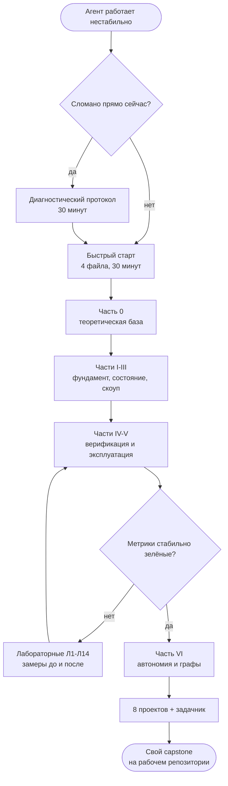

**Как учиться правильно.** Каждый модуль устроен одинаково: *симптом → механика → понятия → что делать → замер*. Не переходите к следующему модулю, пока не сделали замер на своём проекте. Harness engineering — эмпирическая дисциплина: без цифр вы не отличите улучшение от самообмана.

---

## Быстрый старт: минимальный harness за 30 минут

Четыре файла дают львиную долю эффекта. Сделайте их прямо сейчас, до чтения теории.

### Шаг 1. `AGENTS.md` в корне репозитория (10 минут)

~~~markdown
# AGENTS.md

## Проект
Backend платежей. Python 3.11, FastAPI, PostgreSQL 15, Redis 7.

## Команды
- Установка: `make setup`
- Запуск: `make dev`
- Тесты: `make test`
- Полная верификация: `make check`   # tests + types + lint

## Жёсткие ограничения (MUST)
- Все эндпоинты — только через OAuth 2.0.
- Только синтаксис SQLAlchemy 2.0 (`select()`, не `Query`).
- Все SQL — параметризованные запросы. Никогда не склеивать строки.
- Никогда не `eval()`, `exec()`, `pickle.loads()` на внешних данных.
- Нельзя менять `migrations/` без отдельного разрешения.

## Definition of Done
Фича готова = `make check` зелёный + E2E-сценарий фичи проходит.
«Код написан» — это не готово.

## Правила работы
- Одна фича за раз. Не начинать вторую, пока первая не прошла верификацию.
- Никакого рефакторинга «заодно», пока основная фича не проверена.
- Перед завершением сессии обновить `PROGRESS.md`.

## Куда смотреть подробности
- `docs/api-patterns.md` — обязательно при добавлении эндпоинта
- `docs/db-rules.md` — обязательно при изменении моделей и миграций
- `docs/testing.md` — при написании тестов
~~~

**Правило: 50–150 строк, не больше.** Всё остальное — в `docs/`.

### Шаг 2. `feature_list.json` (7 минут)

~~~json
[
  {
    "id": "F01",
    "behavior": "POST /api/cart/items с {product_id, quantity} возвращает 201 и товар в корзине",
    "verification": "pytest tests/e2e/test_cart.py::test_add_item",
    "state": "passing",
    "evidence": "commit a1b2c3d, 4 passed"
  },
  {
    "id": "F02",
    "behavior": "GET /api/cart возвращает корзину с итоговой суммой",
    "verification": "pytest tests/e2e/test_cart.py::test_get_cart",
    "state": "active",
    "evidence": null
  },
  {
    "id": "F03",
    "behavior": "POST /api/checkout создаёт заказ и очищает корзину",
    "verification": "pytest tests/e2e/test_checkout.py",
    "state": "not_started",
    "evidence": null
  }
]
~~~

Состояний ровно четыре: `not_started`, `active`, `blocked`, `passing`. Агент **не имеет права** ставить `passing` сам — только скрипт верификации.

### Шаг 3. `PROGRESS.md` (5 минут)

~~~markdown
# Прогресс

## Состояние на сейчас
- Коммит: a1b2c3d
- Тесты: 42/43 (падает test_pagination_empty)
- Линт/типы: чисто
- Активная фича: F02

## Сделано
- [x] F01 — добавление товара в корзину (passing)

## В работе
- [ ] F02 — получение корзины (90%, не сходится расчёт скидки)

## Заблокировано
- F05 — ждём доступ к sandbox платёжного провайдера

## Решения этой сессии
- Итоговая сумма считается на сервере, не на клиенте — клиенту нельзя доверять цены.

## Следующие шаги
1. Починить расчёт скидки в `services/cart.py:total()`
2. Прогнать `make check`
3. Начать F03
~~~

### Шаг 4. `make check` (8 минут)

~~~makefile
setup:
	uv sync

dev:
	uv run uvicorn app.main:app --reload

test:
	uv run pytest -x -q

types:
	uv run mypy src --strict

lint:
	uv run ruff check src

e2e:
	uv run pytest tests/e2e -q

check: lint types test e2e
	@echo "ALL CHECKS PASSED"
~~~

Одна команда, один зелёный/красный ответ. Это самая высокорентабельная часть harness.

### Проверка результата: тест холодного старта

Откройте **новую** сессию агента, ничего не объясняйте голосом и задайте пять вопросов:

1. Что это за система и зачем она?
2. Как её запустить?
3. Как её проверить (какие команды)?
4. Какие правила нельзя нарушать?
5. Где сейчас работа и что делать дальше?

Если агент отвечает на все пять только по содержимому репозитория — минимальный harness готов. Каждый неотвеченный вопрос — белое пятно на карте, и агент будет его угадывать. Угадывание всегда дороже, чем один раз записать.

---

## Как починить агента: диагностический протокол

Замена модели — самый дорогой и самый непредсказуемый ремонт. Ниже — протокол, который стоит пройти до апгрейда: шесть шагов, около тридцати минут, и в большинстве случаев дефект находится в harness, а не в весах.

**Правило нуля: воспроизведите отказ дважды.** Один провал — это шум выборки. Два одинаковых провала на одном и том же месте — это дефект вашей системы, у него есть адрес и его можно починить.

### Шаг 1. Определите слой отказа (2 минуты)

| Что вы наблюдаете | Слой отказа | Куда смотреть |
|---|---|---|
| Агент сделал не то, что просили | Формулировка задачи | Модуль 7, Т5 |
| Агент не нашёл нужный файл, правило, команду | Инструкции и навигация | Модуль 4, Т4 |
| Агент «забыл» решения прошлой сессии | Состояние и непрерывность | Модуль 5, Т8 |
| Агент правит код, но не может его проверить | Инструменты и среда | Модуль 6, Т6 |
| Агент отчитался «готово», а фича не работает | Верификация | Модули 9–10, Т5 |
| Всё работает, но каждый прогон непредсказуем | Наблюдаемость и цикл | Модули 11, 13, Т1 |
| Агент чинит метрику, а не проблему | Целевая функция | Т3 |
| Каждая новая сессия дороже предыдущей | Энтропия и чистое состояние | Модуль 12, Т10 |

Один симптом — один слой. Если кажется, что «сломано всё», значит вы ещё не воспроизвели отказ на минимальном примере.

### Шаг 2. Сожмите пример до минимума (5 минут)

Возьмите последний провал и удалите из него всё лишнее: одну фичу, один файл, одну команду. Отказ, который воспроизводится на минимальном примере, почти всегда объясняется одной причиной. Отказ, который воспроизводится только на большой задаче, — это чаще всего проблема границ задачи (Модуль 7), а не проблема модели.

### Шаг 3. Пройдите тест холодного старта (5 минут)

Откройте новую сессию агента и задайте пять вопросов, не давая никаких подсказок:

1. Что делает этот проект и кто его пользователь?
2. Какой командой запустить тесты и линтер?
3. Что сделано, что делается сейчас, что следующее?
4. Какие три решения уже приняты и не подлежат пересмотру?
5. Что считается признаком готовности фичи?

Каждый ответ, который агент не может дать из репозитория, — это дырка в harness. Не в модели. Дырка закрывается файлом, а не апгрейдом.

### Шаг 4. Проверьте, что верификация вообще существует (5 минут)

Задайте себе три вопроса и ответьте на них командой, а не мнением:

- Есть ли одна команда, которая говорит «да» или «нет» по всей фиче целиком? Если проверка требует, чтобы человек посмотрел глазами, — верификации нет.
- Может ли эта команда провалиться? Проверка, которая никогда не краснеет, ничего не проверяет. Сломайте код специально и убедитесь, что она падает.
- Говорит ли сообщение об ошибке, что именно сломано, почему это плохо и что делать? Если нет — агент будет угадывать, а угадывание стоит итераций.

### Шаг 5. Уберите одну вещь и измерьте (10 минут)

Метод компонентного отключения: выключите ровно один элемент harness и повторите ту же задачу. Если результат не изменился — элемент не работает и его надо либо починить, либо удалить. Если результат просыпался — вы нашли несущую конструкцию, её надо документировать и защитить тестом.

Порядок отключения от самого вероятного к самому редкому: файл инструкций, артефакт состояния, скрипт верификации, скрипт инициализации, наблюдаемость.

### Шаг 6. Решите, что менять (3 минуты)

Правило приоритета ремонта, от дешёвого к дорогому:

1. **Сузить задачу.** Одна фича вместо трёх. Бесплатно, эффект самый быстрый.
2. **Добавить постусловие.** Одна команда проверки. Стоит полчаса, снимает целый класс ложных «готово».
3. **Починить состояние.** Файл прогресса и файл решений. Стоит час, снимает повторную работу.
4. **Переписать инструкции как роутер.** Стоит день, поднимает попадание в правила.
5. **Автоматизировать цикл.** Стоит неделю, окупается только если пункты 1–4 уже сделаны.
6. **Менять модель.** Делайте это последним и с зафиксированным замером до и после — иначе вы не узнаете, помогло ли.

### Дерево решений

~~~text
фича не работает, хотя агент сказал «готово»
├─ проверка была? ── нет ──> Модуль 8: passing только по команде
│                   да
├─ проверка красная? ─ да ──> агент игнорирует сигнал: Модуль 9, жёсткое правило
│                      нет
├─ проверка зелёная, но фича мертва
│   ├─ нет сквозного прогона ──> Модуль 10: E2E как единственный источник «готово»
│   └─ E2E есть, но обходит слой ──> Модуль 10: карта слепых зон
└─ проверка нестабильна (то красная, то зелёная)
    └─> Модуль 11: сначала наблюдаемость, потом любые выводы
~~~

### Схема 5. Дерево атрибуции слоя отказа

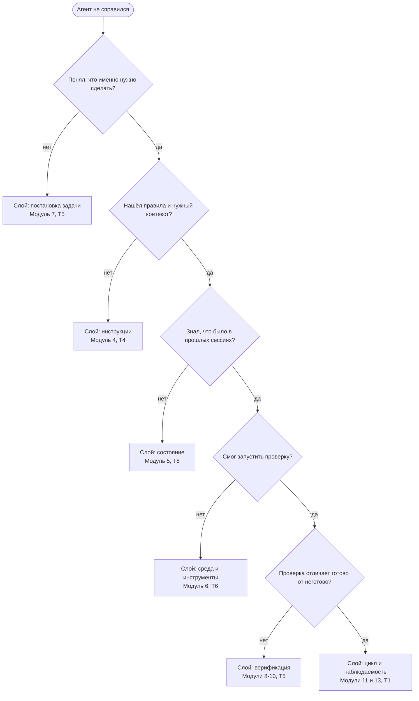

Дерево проходится сверху вниз и останавливается на первом «нет». Останавливаться надо именно там: нижние слои чинить бесполезно, пока сломан верхний, — агент с непонятой задачей будет безупречно верифицировать не ту работу.

### Что почти никогда не является причиной

- «Модель слабая» — при том же промпте и той же среде две модели различаются меньше, чем один и тот же агент с harness и без него.
- «Нужен более умный промпт» — если состояние теряется между сессиями, промпт не поможет ни в одной из них.
- «Надо больше контекста» — чаще помогает не добавить, а убрать: см. Т4.

---

# Часть 0. Теоретическая база

Harness-инженерия выглядит как набор эмпирических советов, но почти каждый её приём выводится из теории, которой десятки лет: теории управления, теории надёжности, теории информации, контрактного программирования, теории очередей. Эта часть даёт понятийный аппарат: почему приёмы работают, когда они перестают работать и как придумывать новые вместо копирования чужих чек-листов.

Читать эту часть можно двумя способами. Быстрый: только блоки «Следствие» и итоговая таблица Т11. Полный: целиком, с выполнением проверок «на своём проекте» — тогда теория сразу превращается в изменения в репозитории.

---

## Т1. Агент как система с обратной связью

**Суть.** Агент — это не функция «промпт → код», а замкнутый контур управления. У контура есть уставка (чего мы хотим), исполнительное устройство (модель, пишущая изменения), датчик (то, чем мы измеряем результат) и правило коррекции (что делать при расхождении). Если убрать любой из четырёх элементов, останется не контур, а разомкнутая система: она действует, но не знает результата своего действия.

**Модель.** На каждом шаге контур вычисляет ошибку e = цель − наблюдаемое состояние и делает коррекцию, пропорциональную ошибке. Устойчивость такого контура зависит от трёх вещей: точности датчика, задержки между действием и измерением, и силы коррекции.

### Схема 3. Контур управления агентом

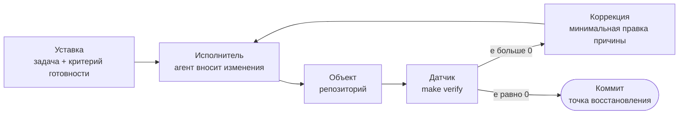

Что ломается при отсутствии каждого элемента: без уставки агент делает похожее, но не то; без датчика контур разомкнут и сходится к уверенности вместо корректности; без правила коррекции каждый провал повторяется; без точки восстановления цепочка шагов не обнуляется и работает формула из Т2.

**Что это объясняет.**

- *Плохой датчик — плохое управление.* Агент, у которого нет команды проверки, измеряет ошибку своим суждением. Суждение смещено в сторону «всё хорошо», поэтому контур сходится не к работающему коду, а к убеждённости в том, что код работает.
- *Задержка вызывает перерегулирование.* Если проверка запускается раз в час, агент успевает построить десять слоёв на неверной основе. Чем длиннее задержка, тем больше амплитуда отката.
- *Слишком сильная коррекция вызывает колебания.* Правило «переписывай модуль целиком, если тест красный» превращает контур в генератор колебаний: агент бесконечно ходит между двумя вариантами реализации. Правило «исправь минимальную причину падения» демпфирует контур.
- *Нет правила коррекции — нет обучения.* Если провал не приводит к изменению правил, следующий прогон повторит его.

**Следствие для harness.** Проектируйте не промпт, а контур: сначала датчик (verify), потом задержка (как часто), потом сила коррекции (насколько крупные правки разрешены), и только потом текст инструкций. Промпт — это уставка, а уставка без датчика не управляет ничем.

**Проверка на своём проекте.** Назовите вслух все четыре элемента контура для вашего последнего прогона агента. Если для «датчика» вы называете себя — контура нет, есть человек в роли датчика, и стоимость каждого шага равна вашему вниманию.

---

## Т2. Математика накопления ошибок

**Суть.** Автономный прогон — это последовательность шагов, каждый из которых может не сработать. Если шаги независимы и каждый успешен с вероятностью p, то весь прогон успешен с вероятностью p в степени n. Это единственная формула, которую надо помнить, приступая к автономии.

| Надёжность шага | 5 шагов | 20 шагов | 50 шагов | 200 шагов |
|---|---|---|---|---|
| 0,90 | 59% | 12% | 0,5% | ~0% |
| 0,95 | 77% | 36% | 8% | ~0% |
| 0,99 | 95% | 82% | 61% | 13% |
| 0,999 | 99,5% | 98% | 95% | 82% |

### Схема 4. Как падает надёжность прогона

```text
Вероятность успеха всего прогона

p = 0,999  n=5   ████████████████████████████████████████  99,5%
           n=20  ███████████████████████████████████████░  98%
           n=50  ██████████████████████████████████████░░  95%
           n=200 █████████████████████████████████░░░░░░░  82%

p = 0,99   n=5   ██████████████████████████████████████░░  95%
           n=20  █████████████████████████████████░░░░░░░  82%
           n=50  ████████████████████████░░░░░░░░░░░░░░░░  61%
           n=200 █████░░░░░░░░░░░░░░░░░░░░░░░░░░░░░░░░░░░  13%

p = 0,95   n=5   ███████████████████████████████░░░░░░░░░  77%
           n=20  ██████████████░░░░░░░░░░░░░░░░░░░░░░░░░░  36%
           n=50  ███░░░░░░░░░░░░░░░░░░░░░░░░░░░░░░░░░░░░░   8%
           n=200 ░░░░░░░░░░░░░░░░░░░░░░░░░░░░░░░░░░░░░░░░  ~0%

p = 0,90   n=5   ███████████████████████░░░░░░░░░░░░░░░░░  59%
           n=20  █████░░░░░░░░░░░░░░░░░░░░░░░░░░░░░░░░░░░  12%
           n=50  ░░░░░░░░░░░░░░░░░░░░░░░░░░░░░░░░░░░░░░░░   0,5%
           n=200 ░░░░░░░░░░░░░░░░░░░░░░░░░░░░░░░░░░░░░░░░  ~0%
```

Из таблицы видно неприятное: «агент на 95% надёжен» — это отличный агент для пяти шагов и бесполезный для пятидесяти. Именно поэтому демо на короткой задаче ничего не говорит о ночном прогоне.

**Три рычага, и только три.**

1. **Уменьшить n.** Не «сделай фичу», а «сделай слой фичи». WIP=1 — это не про аккуратность, это про показатель степени.
2. **Увеличить p.** Каждое исполняемое правило, каждая понятная ошибка, каждый шаблон повышают p на конкретном классе шагов.
3. **Разорвать зависимость шагов.** Точка восстановления обнуляет накопление: после успешно закрытой фичи прогон начинается заново с p в степени n на следующем участке, а не продолжает старую цепочку. Отсюда — коммит и зелёная проверка как обязательная граница шага.

**Важная поправка.** Шаги на практике зависимы, и зависимость обычно вредна: ошибка в понимании требований портит все последующие шаги сразу. Поэтому дорогие проверки размещают в начале цепочки (правильно ли понята задача), а дешёвые — по всей длине.

**Следствие для harness.** Любое обсуждение «сможет ли агент сделать это автономно» надо переводить в два числа: сколько шагов и какова надёжность шага. Если n больше пятидесяти, а p не измерено — ответ известен заранее.

**Проверка на своём проекте.** Возьмите последнюю задачу, которую агент делал сам, и посчитайте, сколько раз он вызывал инструменты. Это ваш n. Затем посчитайте, сколько из этих вызовов пришлось переделывать. Это ваша оценка 1 − p.

---

## Т3. Закон Эшби и закон Гудхарта

**Закон необходимого разнообразия (Эшби).** Управляющая система должна обладать разнообразием не меньшим, чем разнообразие возмущений, которые она должна компенсировать. Проще: чтобы harness справлялся с N классами отказов, в нём должно быть не меньше N различимых реакций.

Практический смысл: один общий совет «пиши качественный код» не может компенсировать десять разных способов сломать проект. Каждому воспроизводимому классу отказа нужен свой различимый механизм: правило, тест, скрипт, шаблон. Отсюда следует и обратное, экономное правило — если класс отказа ни разу не наблюдался, механизм для него добавлять не нужно: разнообразие harness должно соответствовать реальному разнообразию отказов, а не воображаемому.

**Закон Гудхарта.** Когда метрика становится целью, она перестаёт быть метрикой. Агент — идеальный оптимизатор в буквальном смысле: он оптимизирует то, что вы измеряете, включая случаи, когда измеряемое расходится с желаемым.

Типичные проявления в harness:

| Метрика как цель | Что оптимизирует агент | Противоядие |
|---|---|---|
| Зелёные тесты | Ослабление ассертов, пропуски, моки поверх моков | Тест на тесты: сломай код, проверка обязана покраснеть |
| Покрытие в процентах | Тесты, вызывающие код без проверки результата | Мутационное тестирование, ревью новых тестов |
| Количество закрытых фич | Мелкая нарезка и формальные закрытия | Сквозной прогон как единственный признак готовности |
| Отсутствие предупреждений линтера | Массовые подавления и исключения | Запрет на подавления без комментария с причиной |
| Скорость прогона | Отключение медленных, но важных проверок | Отдельный обязательный набор, не подлежащий отключению |

**Следствие для harness.** Метрика годится как цель только вместе с антиметрикой, которая ломается при её накрутке. Держите пары: скорость и доля откатов, покрытие и мутационная выживаемость, число фич и число регрессий.

**Проверка на своём проекте.** Придумайте самый дешёвый способ накрутить вашу главную метрику, ничего не сделав полезного. Если способ есть и он не обнаруживается — метрика ещё не готова быть целью.

---

## Т4. Контекст как канал с шумом

**Суть.** Контекстное окно — это канал с ограниченной пропускной способностью. Полезность канала описывается не объёмом, а отношением сигнала к шуму: доля токенов, релевантных текущей задаче, к общему числу переданных токенов.

Из этого следуют три вещи, которые противоречат интуиции «дам побольше контекста».

1. **Добавление нерелевантного текста ухудшает результат, а не оставляет его прежним.** Каждый лишний абзац конкурирует за внимание с нужным правилом.
2. **Позиция важнее объёма.** Модели устойчиво хуже используют информацию из середины длинного входа, чем из начала и конца, — эффект, описанный в работе Liu et al. (2023) о «потере середины». Инструкция, спрятанная в середине файла на тысячу строк, статистически ближе к отсутствующей.
3. **Правило без адресации не срабатывает.** Правило нужно не просто написать, а связать с триггером: «когда меняешь схему БД — сделай X». Без триггера правило требует, чтобы модель сама вспомнила о его существовании в нужный момент.

**Бюджет внимания.** Полезно считать инструкции не в килобайтах, а в бюджете: сколько правил модель гарантированно удержит одновременно. Практический ориентир — десятки, не сотни. Всё, что не влезло в бюджет, должно быть перенесено из текста в механику: в линтер, в тест, в скрипт, в шаблон. Правило, вынесенное в исполняемую проверку, освобождает бюджет внимания и перестаёт зависеть от того, прочитал ли его агент.

**Иерархия вытеснения (от лучшего к худшему).**

~~~text
1. Механика   — правило проверяется скриптом, читать не нужно
2. Шаблон     — правило встроено в заготовку, нарушить дороже, чем соблюсти
3. Роутер     — короткая ссылка «делаешь X → читай docs/x.md»
4. Правило    — короткий императив с триггером
5. Пояснение  — длинный текст «почему так»: полезен человеку, дорог агенту
~~~

**Следствие для harness.** Каждый раз, когда хочется дописать абзац в файл инструкций, сначала спросите: можно ли это же правило превратить в проверку или в шаблон. Файл инструкций — самый дорогой способ хранить правило.

**Проверка на своём проекте.** Посчитайте, сколько императивов в вашем файле инструкций. Затем спросите агента, какие правила проекта он знает, не давая подсказок. Разница между этими числами — ваш реальный убыток на шуме.

---

## Т5. Контракты, инварианты и постусловия

**Суть.** Контрактное программирование описывает любой шаг тройкой: предусловие (что должно быть верно до), сам шаг, постусловие (что обязано стать верным после). Классическая запись Хоара: если предусловие выполнено и шаг завершился, постусловие выполнено. Harness — это в точности механизация этой тройки для шага «агент делает фичу».

| Элемент контракта | Что это в harness | Файл или команда |
|---|---|---|
| Предусловие | Проект собирается, состояние чистое, задача одна | `make preflight` |
| Инвариант | Архитектурные правила, которые не должны нарушаться никогда | `scripts/arch-check.sh` |
| Постусловие | Признак готовности фичи, проверяемый машиной | `make verify F=F03` |
| Вариант (для циклов) | Мера, которая обязана убывать: осталось фич, красных тестов | `feature_list.json` |

**Почему это важнее, чем кажется.** Пока постусловие не выражено командой, «готово» — это оценочное суждение. Суждение агента о своей работе систематически смещено: он видел, как писал код, и это создаёт ощущение проверенности. Постусловие переносит право выносить вердикт из суждения в исполняемый артефакт. Это одно изменение убирает самый частый класс отказов во всём курсе.

**Вариант цикла — забытая половина.** У автономного прогона должна быть убывающая мера, иначе цикл не завершается, а просто останавливается по таймеру. Хорошие меры: число фич в статусе не-passing, число красных проверок, число нарушений инвариантов. Плохие меры: число сделанных шагов, количество токенов, «ощущение прогресса».

**Правило слабейшего звена.** Сила контракта равна силе самой слабой из трёх частей. Идеальные постусловия при отсутствующем предусловии дают агента, который героически чинит следствия грязного состояния. Поэтому `preflight` так же обязателен, как `verify`.

**Проверка на своём проекте.** Выпишите для одной фичи её постусловие одной строкой команды. Если строка не получается — фича сформулирована не как фича, а как направление работы.

---

## Т6. Теория надёжности: MTBF, MTTR и радиус поражения

**Суть.** Надёжность системы описывается не одним числом, а парой: как редко она ломается (среднее время между отказами) и как быстро восстанавливается (среднее время восстановления). Доступность растёт и от увеличения первого, и от уменьшения второго — но второе почти всегда дешевле.

Для harness это переводится буквально:

| Понятие из теории надёжности | Аналог в harness | Как улучшать |
|---|---|---|
| MTBF | Сколько шагов агент проходит до застревания | Исполняемые правила, шаблоны, узкий скоуп |
| MTTR | Сколько времени уходит на возврат к рабочему состоянию | Коммит на каждой зелёной проверке, `git worktree`, откат одной командой |
| Радиус поражения | Сколько кода портит один неудачный шаг | Запрет на массовые правки, лимит на diff, изоляция воркспейса |
| Fail-fast | Проверка падает на первой ошибке с понятным сообщением | Ранние ассерты, валидация входа |
| Избыточность | Вторая независимая проверка того же свойства | E2E поверх юнит-тестов, ревьюер поверх генератора |
| N-версионность | Два независимых решения и сравнение | Генератор и оценщик — разные роли, разный контекст |

**Главный практический вывод.** Гонка за MTBF («сделать агента, который не ошибается») бесконечна. Снижение MTTR («сделать так, чтобы любая ошибка откатывалась за минуту») достигается за один день работы: чистые коммиты, отдельная рабочая копия, скрипт сброса состояния. Автономность становится приемлемой не тогда, когда агент перестал ошибаться, а тогда, когда цена его ошибки упала до нуля.

**Радиус поражения — недооценённый параметр.** Один и тот же агент с одной и той же надёжностью безопасен, если правит один модуль, и опасен, если ему разрешён рефакторинг всего репозитория. Ограничение радиуса — самый дешёвый способ сделать автономию безопасной без всякого улучшения модели.

**Ошибка выжившего.** Не оценивайте надёжность по успешным прогонам. Ведите журнал застреваний с классификацией по слоям из диагностического протокола: только эта статистика показывает, где MTBF реально низкий.

**Проверка на своём проекте.** Замерьте секундомером, сколько времени занимает полный возврат к последнему рабочему состоянию после неудачного прогона агента. Если больше пяти минут — у вас проблема с MTTR, и она важнее любой проблемы с моделью.

---

## Т7. Очереди, WIP и закон Литтла

**Суть.** Закон Литтла связывает три величины в любой стабильной системе с очередью: среднее число задач в работе равно интенсивности поступления, умноженной на среднее время пребывания задачи в системе. Отсюда: при фиксированной пропускной способности рост числа одновременно открытых задач не увеличивает выработку — он увеличивает время выполнения каждой.

Для агента это усиливается двумя дополнительными эффектами:

1. **Стоимость переключения не нулевая, а квадратичная по контексту.** Три одновременно открытые фичи требуют держать в контексте три модели предметной области; конфликты между ними приходится разрешать заново на каждом шаге.
2. **Незавершённая работа — это невидимый долг.** Три фичи в состоянии «почти готово» дают ноль проверенной ценности, но занимают весь контекст и все точки риска сразу.

**Почему WIP=1 — не аскеза, а арифметика.** При WIP=1 время до первой проверенной фичи минимально, значит минимальна и длина цепочки шагов между двумя точками восстановления (см. Т2). При WIP=3 длина цепочки утраивается, а вероятность успеха падает как куб.

**Клапан для импульса «заодно».** Запрет на параллельную работу создаёт давление: агент видит соседний недостаток и хочет исправить его сразу. Давление нужно не подавлять, а отводить в `BACKLOG.md` — одна строка, тридцать секунд, ноль расхода контекста. Отсутствие клапана превращает дисциплину скоупа в источник потерь.

**Гранулярность задачи.**

| Размер шага | Признак | Риск |
|---|---|---|
| Слишком мелкий | Постусловие невозможно выразить пользовательски значимо | Накладные расходы на цикл больше пользы |
| Правильный | Одна проверяемая пользовательская способность, 1–3 файла, проверка меньше минуты | — |
| Слишком крупный | Постусловие требует нескольких независимых проверок | Накопление ошибок, откат дорогой |

**Проверка на своём проекте.** Посчитайте, сколько фич у вас сейчас в состоянии «начато, но не проверено». Всё, что больше единицы, — это очередь, и по закону Литтла она уже увеличила ваше время выполнения.

---

## Т8. Марковское состояние сессии

**Суть.** Процесс называют марковским, если для предсказания следующего шага достаточно текущего состояния, а вся предыстория не нужна. Хороший harness делает работу над проектом марковской: новая сессия агента, прочитав состояние из репозитория, действует так же хорошо, как сессия, которая вела проект с самого начала.

Это даёт точный критерий достаточности состояния: **если для продолжения работы нужна информация, которой нет в репозитории, состояние неполно**. Не «неудобно», а формально неполно, и величина потери равна стоимости повторного вывода этой информации.

**Что обязано быть в состоянии.** Не история диалога, а её результат:

| Категория | Что записывать | Почему без этого нельзя продолжить |
|---|---|---|
| Цель | Что именно делаем сейчас и зачем | Иначе следующая сессия выберет другой приоритет |
| Сделано | Проверенные фичи и как они проверены | Иначе работа делается повторно |
| Решения | Выбор и отвергнутые альтернативы с причиной | Иначе решения пересматриваются по кругу |
| Тупики | Что уже пробовали и почему не сработало | Иначе тупик исследуется заново |
| Следующий шаг | Одна формулировка с постусловием | Иначе сессия начинается с обсуждения, а не с работы |

**Компактизация против сброса.** Сжатие истории диалога сохраняет ощущение непрерывности, но теряет именно то, что дороже всего восстановить: причины отвергнутых решений. Осознанный сброс с полным письменным состоянием почти всегда дешевле длинной сжатой истории. Правило простое: важное должно жить в файлах, а не в окне.

**Стоимость восстановления как метрика.** Замеряйте, сколько шагов проходит от старта новой сессии до первого полезного изменения кода. Это единственная честная метрика качества вашего состояния. Хорошее значение — один-два шага. Десять шагов означают, что каждая сессия начинается с археологии.

**Границы марковости.** Не всё стоит делать марковским: детальная история рассуждений полезна редко и стоит дорого. Правильная граница — марковость по решениям и по прогрессу, беспамятство по формулировкам.

**Проверка на своём проекте.** Закройте сессию, откройте новую и дайте агенту только репозиторий и одну фразу: «продолжай». Если он начинает делать правильную работу — состояние марковское. Если он спрашивает, что делать, — нет.

---

## Т9. Калибровка уверенности

**Суть.** Модель калибрована, если её субъективная уверенность совпадает с частотой правоты: из утверждений, названных «уверен на 90%», верны примерно девять из десяти. Хорошо известно, что современные нейросети склонны к переуверенности — этот эффект для глубоких сетей систематически описан ещё в работе Guo et al. (ICML 2017) о калибровке. Дообучение на обратной связи людей смещает картину ещё сильнее в сторону приятных, уверенно звучащих ответов.

**Почему это ломает автономию.** Автономный цикл принимает решения на основе собственной оценки: продолжать или остановиться, готово или нет, безопасно или рискованно. Если оценка смещена в сторону «готово», цикл систематически завершается раньше времени. Никакое количество инструкций «будь внимательнее» не исправляет смещение, потому что инструкция обращается к той же смещённой оценке.

**Что работает вместо призывов к аккуратности.**

- **Разделение ролей.** Тот, кто писал код, не выносит вердикт. Оценщик получает только результат и критерии, но не рассуждения автора — иначе он наследует его уверенность.
- **Внешний вердикт.** Право ставить статус `passing` принадлежит команде, а не тексту ответа.
- **Формулировка через отрицание.** Вопрос «что могло сломаться» даёт заметно более полезные ответы, чем вопрос «всё ли хорошо»: второй запускает подтверждающий поиск.
- **Требование доказательства.** Не «тесты проходят», а вывод команды в отчёте. Пересказ результата и результат — разные вещи.
- **Явный список того, что не проверялось.** Раздел «не проверено» в отчёте о работе стоит дороже раздела «сделано».

**Полезная асимметрия.** Ложное «не готово» стоит одну лишнюю итерацию. Ложное «готово» стоит поиск дефекта в проде. Поэтому пороги надо смещать в сторону строгости осознанно: система, которая иногда перепроверяет лишнее, дешевле системы, которая иногда пропускает.

**Проверка на своём проекте.** Возьмите десять последних утверждений агента вида «готово» и проверьте их независимо. Доля подтверждённых — ваша реальная калибровка. Если она ниже восьмидесяти процентов, любые планы автономии преждевременны.

---

## Т10. Энтропия, законы Лемана и техдолг harness

**Суть.** Лемановские законы эволюции программ говорят о двух вещах, которые полностью применимы к harness: система, которая используется, обязана меняться, и при этом её сложность растёт, пока не будет специально снижена. Harness — тоже программное обеспечение, и он деградирует по тем же законам, только быстрее: добавить правило дешевле, чем удалить, поэтому файлы инструкций растут монотонно.

**Три вида энтропии в harness.**

| Вид | Как выглядит | Чем измерять | Как снижать |
|---|---|---|---|
| Энтропия инструкций | Правила, противоречащие друг другу или коду | Доля правил, для которых нет ни одного нарушения за месяц | Удаление правил, ставших механикой |
| Энтропия состояния | Файл прогресса, которому нельзя доверять | Расхождение между записанным и фактическим | Обновление состояния как часть Definition of Done |
| Энтропия среды | Локальные хаки, недокументированные шаги запуска | Успех холодного старта на чистой машине | Всё в `init.sh`, проверка на CI |

**Механизм деградации.** Каждый инцидент добавляет правило. Через полгода файл инструкций содержит сто правил, из которых сорок относятся к коду, которого больше нет. Агент читает все сто, тратит бюджет внимания (Т4) на мёртвые сорок и хуже соблюдает живые шестьдесят. Формально harness растёт — фактически он слабеет.

**Обязательный ритуал: упрощение.** Раз в месяц (или после каждых десяти фич) harness надо не расширять, а сокращать:

1. Для каждого правила найти проверку, которая его механизирует. Нашли — правило удалить, оставив ссылку на проверку.
2. Правила без единого нарушения за период — удалить, они не оплачивают своё место.
3. Правила, нарушенные больше трёх раз, — не усиливать текстом, а переносить в механику.
4. Артефакты состояния, которые никто не читал, — удалить: недостоверное состояние хуже отсутствующего.
5. Зафиксировать в `DECISIONS.md`, что удалено и почему, чтобы удалённое не вернулось через месяц.

**Правило постоянного размера.** Полезная дисциплина: держать файл инструкций в фиксированном бюджете строк. Хотите добавить правило — найдите, что удалить. Это единственный известный способ не дать документу вырасти до нечитаемого состояния.

**Проверка на своём проекте.** Откройте файл инструкций и отметьте каждое правило одним из трёх: «механизировано», «нарушалось за месяц», «мёртвое». Третья группа — ваш техдолг harness, её объём обычно удивляет.

---

## Т11. Теория в одной таблице

Сводка: что из какой теории следует и в каком модуле это реализуется практически.

| Теория | Ключевая идея | Практика в harness | Модули |
|---|---|---|---|
| Теория управления | Без датчика нет управления | Одна команда проверки как источник вердикта | 8, 9, 11 |
| Вероятность отказов | Надёжность как p в степени n | WIP=1, точки восстановления, коммит на каждой зелёной проверке | 7, 12 |
| Закон Эшби | Разнообразие реакций не меньше разнообразия отказов | Отдельный механизм на каждый воспроизводимый класс отказа | 2, 10 |
| Закон Гудхарта | Метрика-цель перестаёт быть метрикой | Пары «метрика + антиметрика», тест на тесты | 9, 10 |
| Теория информации | Полезен не объём, а отношение сигнала к шуму | Инструкции как роутер, вынос правил в механику | 4 |
| Контракты Хоара | Предусловие, инвариант, постусловие, вариант цикла | `preflight`, `arch-check`, `verify`, убывающая мера | 6, 8, 10, 13 |
| Теория надёжности | MTTR дешевле MTBF | Откат одной командой, изоляция воркспейса, лимит радиуса | 6, 12 |
| Закон Литтла | Рост WIP не увеличивает выработку | Одна фича в работе, `BACKLOG.md` как клапан | 7 |
| Марковские процессы | Достаточное состояние делает историю ненужной | `PROGRESS.md`, `DECISIONS.md`, передача смены | 5, 12 |
| Калибровка | Уверенность смещена в сторону «готово» | Разделение генератора и оценщика, доказательство вместо пересказа | 9, 13 |
| Законы Лемана | Сложность растёт, пока её не снижают специально | Ежемесячное упрощение harness, фиксированный бюджет правил | 12 |
| Теория графов | Структура важнее отдельного узла | Явный граф процесса, анкеры, критерии необходимости графа | 14 |

**Как этим пользоваться.** Столкнувшись с новой проблемой, не ищите готовый приём — определите, какая из двенадцати строк её описывает. Приём выводится из строки за пять минут и оказывается точнее скопированного чужого чек-листа.

---

# Часть I. Фундамент

## Модуль 1. Почему сильные модели всё равно проваливаются

### Симптом

Вы даёте агенту реальную задачу в реальном репозитории. Он добавляет фичу и ломает три теста. Чинит баг и создаёт два новых. Работает двадцать минут и уверенно говорит «готово», а вы открываете диф и видите не то, что просили. Первая мысль — «нужна модель посильнее». Почти всегда это неверная мысль.

### Механика

К концу 2025 года лучшие кодинг-агенты на SWE-bench Verified держались в районе 50–60%. И это на отобранных задачах с внятным описанием и уже существующими тестами. В вашем репозитории требования размыты, тестов нет, бизнес-правила живут в головах — и цифра падает дальше.

Разрыв между бенчмарком и вашей реальностью называется **capability gap**, и закрывается он не моделью, а средой. Anthropic показывали это контролируемым экспериментом: один и тот же промпт, одна и та же модель. Прогон в «голой» среде — быстро, дёшево, результат нерабочий. Прогон с полноценным harness (планировщик + генератор + независимый оценщик) — дольше, дороже, результат работает. Модель не менялась. Менялась упряжь.

OpenAI в 2025 году описали ещё более радикальный эксперимент: продукт примерно на миллион строк кода, выращенный агентом из пустого репозитория, при жёстком ограничении — люди не пишут код руками. Ключевой вывод оттуда: в начале скорость была ниже ожидаемой, но не из-за слабости модели, а потому что среда была неполной. Работа инженера превратилась в «какой способности агенту не хватает и как сделать её и понятной, и исполняемой».

### Пять слоёв, где на самом деле ломается агент

Когда что-то пошло не так, не пишите в лог «модель тупит». Отнесите провал к одному из пяти слоёв:

| Слой | Вопрос | Типичный симптом | Чем лечится |
|---|---|---|---|
| **1. Спецификация задачи** | Задача сформулирована однозначно? | Сделал не то, что просили | Definition of Done, критерии приёмки |
| **2. Предоставление контекста** | Агент знает конвенции проекта? | Старый синтаксис ORM, чужой стиль ошибок | `AGENTS.md`, доки рядом с кодом, ADR |
| **3. Среда исполнения** | Среда воспроизводима? | Полсессии борется с `pip install` | Локи зависимостей, `.python-version`, devcontainer |
| **4. Верификационная обратная связь** | Есть способ узнать правду? | «Готово» при красных тестах | `make check`, E2E, независимый оценщик |
| **5. Управление состоянием** | Знание переживает сессию? | Каждая сессия исследует репо заново | `PROGRESS.md`, `DECISIONS.md`, handoff |

### Диагностическая петля

Это ядро всей методологии, запомните её как рабочий цикл:

~~~
запустить → зафиксировать провал → отнести провал к слою →
починить именно этот слой → запустить снова → записать результат
~~~

Каждый провал — не «модель плохая», а сигнал о структурном дефекте в вашей среде. Через несколько итераций harness крепнет, и записи «модель не справилась» в вашем журнале становится всё меньше.

### Что делать сегодня

1. **Пишите Definition of Done явно.** Не «добавь поиск», а: эндпоинт `GET /api/search?q=`, пагинация по 20, подсветка сниппетов, `pytest tests/search` зелёный, `mypy --strict` проходит.
2. **Завейдите `AGENTS.md`.** Самый высокий ROI из всех действий в этом курсе. Один файл на 100 строк часто даёт больше, чем переход на более дорогую модель.
3. **Заведите журнал провалов.** Таблица из трёх колонок: задача, результат, виновный слой. Через 20 записей вы увидите своё настоящее бутылочное горлышко — и оно почти никогда не там, где вы думали.

### Упражнение M1

Возьмите знакомый репозиторий и нетривиальную задачу. Прогон А: без harness-поддержки. Прогон Б: добавьте `AGENTS.md` с командами верификации, прогоните ту же задачу. Каждый провал отнесите к одному из пяти слоёв. Ожидаемый результат — почти все провалы прогона А окажутся в слоях 2 и 4.

---

## Модуль 2. Пять подсистем harness

### Симптом

«У меня есть harness» обычно означает «у меня есть файл с промптом». Это не harness. Это как назвать холодильник рестораном: продукты есть, а плиты, ножей, рецептов и контроля качества — нет.

### Модель пяти подсистем

Полноценный harness состоит из пяти частей. Пропущенная часть — это не «немного хуже», а систематический класс провалов.

| № | Подсистема | Метафора кухни | Что в неё входит | Как понять, что она сломана |
|---|---|---|---|---|
| 1 | **Инструкции** | Полка с рецептами | `AGENTS.md`/`CLAUDE.md`, skills, тематические доки, ADR | Агент нарушает конвенции, о которых «все знают» |
| 2 | **Инструменты** | Стойка с ножами | shell, тесты, линтер, отладчик, браузер, MCP | Агент «хочет, но не может» — нет доступа к нужному действию |
| 3 | **Среда** | Плита | локи зависимостей, версии рантайма, Docker/devcontainer, worktree | Сессия начинается с починки окружения |
| 4 | **Состояние** | Заготовочный стол | `PROGRESS.md`, `feature_list.json`, `DECISIONS.md`, git-чекпоинты | Новая сессия не знает, где остановились |
| 5 | **Обратная связь** | Окно ОТК | `make check`, E2E, рубрики, независимый оценщик | «Готово» не совпадает с реальностью |

**Порядок внедрения, если начинаете с нуля:** 5 → 1 → 4 → 3 → 2. Обратная связь первой: самый низкий порог входа и самая высокая отдача. Без неё все остальные улучшения нельзя измерить.

### Типичная кривая внедрения

Реальный паттерн, который повторяется у команд почти дословно:

| Стадия | Что добавили | Что происходит |
|---|---|---|
| Пустая кухня | только README | Не тот пакетный менеджер, не те конвенции, тесты не запускаются |
| + рецепты | `AGENTS.md` со стеком и конвенциями | Конвенции соблюдаются, остаются проблемы среды и верификации |
| + окно ОТК | явные команды верификации | Агент сам находит и чинит свои ошибки до сдачи |
| + заготовочный стол | файлы прогресса и состояния | Результат стабилизируется между сессиями |

### Как измерять ценность компонента: абляция при фиксированной модели

Зафиксируйте модель и набор задач. Удаляйте по одной подсистеме и смотрите просадку.

**Важная тонкость, которую почти все понимают неправильно.** Самая большая просадка показывает **предельный вклад** компонента на этом наборе задач — но это ещё не доказательство, что здесь ваше бутылочное горлышко. И нулевая просадка не означает «компонент бесполезен»: он может быть избыточным, плохо спроектированным или просто не задействованным этими задачами.

Правильный порядок: сначала **журнал провалов и атрибуция по слоям** (модуль 1) — они указывают на горлышко. Абляция — вспомогательное доказательство, которое подтверждает или опровергает гипотезу.

### Ключевые идеи

- **Ограничивать, а не микроменеджить.** Хороший harness задаёт инварианты («данные валидируются на границе», «все запросы параметризованы»), а не диктует пошагово реализацию и не перечисляет библиотеки.
- **Карта, а не учебник.** Входной файл инструкций — оглавление. Детали — по требованию.
- **Harness гниёт, как код.** Harness-долг ведёт себя как техдолг: копится незаметно, платится болезненно. Ревизуйте регулярно.

### Схема 2. Пять подсистем harness и что между ними течёт

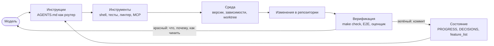

Схема читается как контур, а не как список. Модель входит в него один раз, дальше всё определяется тем, что течёт по стрелкам: качество инструкций задаёт, найдёт ли агент правило; качество верификации задаёт, узнает ли он о своей ошибке; качество состояния задаёт, начнётся ли следующая сессия с работы или с археологии. Уберите любую стрелку — и контур станет разомкнутым в этом месте.

### Упражнение M2

Проведите аудит своего проекта по пяти подсистемам, поставив каждой оценку 1–5. Возьмите самую слабую, потратьте на неё 30 минут и повторите один и тот же набор из 5 задач. Зафиксируйте разницу.

---

## Модуль 3. Репозиторий как единственный источник истины

### Симптом

Архитектурные решения команды живут в Confluence (частично устаревшем), в Slack (плохо ищется), в Jira и в головах двух сеньоров. Для людей это как-то работает — можно спросить. Агент спросить не может.

### Механика

Вход агента — это ровно три вещи: системный промпт и описание задачи, содержимое файлов репозитория, вывод инструментов. Всё. **Знания, которых нет в репозитории, для агента не существуют.** Это не преувеличение, это буквальное описание его сенсорного аппарата.

OpenAI формулируют это принципом «репозиторий и есть спецификация»: репозиторий — авторитетный источник по решениям, ограничениям, состоянию и стандартам верификации. Ни Slack, ни Confluence не имеют голоса.

### Что мерить

**Knowledge visibility gap** — доля важных для разработки решений и ограничений, которых нет в репозитории. Считается вручную и честно: выпишите все правила, которые вы знаете о проекте, отметьте каждое как «в репо» / «не в репо», поделите. Цель — ниже 10%.

**Discovery cost** — сколько контекстного бюджета агент сжигает на поиск нужного. Критичное правило, спрятанное в `docs/legacy/notes/old/README.md`, формально есть, но фактически недоступно. Это как огнетушитель в запертом подвале.

**Knowledge decay rate** — доля записей, разошедшихся с кодом. Документация, которая врёт, опаснее отсутствующей: она уверенно ведёт агента не туда.

### Четыре принципа хорошей карты

1. **Знания живут рядом с кодом.** Правило аутентификации — в `src/api/ARCHITECTURE.md`, а не в глобальном документе на 500 страниц. 50 строк рядом с модулем полезнее 500 страниц в вики.
2. **Один стандартный вход.** `AGENTS.md` отвечает на три вопроса: что это, как запустить, как проверить.
3. **Минимально, но полно.** Если удаление правила не меняет качество решений агента — правила быть не должно. Но на каждый вопрос холодного старта должен быть ответ.
4. **Обновляется вместе с кодом.** Документ в каталоге модуля вы увидите, когда меняете модуль. Документ в вики — нет.

### Рабочая структура репозитория

~~~
project/
├── AGENTS.md                  # вход: что, как запустить, как проверить, жёсткие правила
├── CLAUDE.md -> AGENTS.md     # симлинк, если работаете и с Claude Code, и с Codex
├── PROGRESS.md                # где сейчас работа
├── DECISIONS.md               # почему приняты решения (краткие ADR)
├── Makefile                   # setup / dev / test / lint / types / e2e / check
├── docs/
│   ├── api-patterns.md
│   ├── db-rules.md
│   └── testing.md
├── .agent/
│   ├── feature_list.json      # машиночитаемое состояние фич
│   ├── session-handoff.md     # передача смены
│   └── quality.md             # оценки качества модулей
├── scripts/
│   ├── init.sh                # bootstrap новой сессии
│   └── verify.sh              # единая точка верификации
└── src/
    ├── api/ARCHITECTURE.md
    └── db/CONSTRAINTS.md
~~~

### ACID для состояния агента

Аналогия с транзакциями БД оказывается неожиданно практичной:

- **Atomicity.** Одна логическая единица работы = один коммит. Пошло не так — `git stash` / `git reset --hard` откатывает целиком. Никаких «наполовину».
- **Consistency.** Определите предикат согласованного состояния (`make check` зелёный) и запускайте его после каждой единицы работы. Несогласованные промежуточные состояния не коммитятся.
- **Isolation.** Параллельные агенты — в отдельных `git worktree` и/или с отдельными файлами состояния. Два повара не солят одну кастрюлю.
- **Durability.** Межсессионное знание обязано быть в файлах под git. То, что «в контексте» — не считается.

### Упражнение M3

Проведите тест холодного старта на рабочем репозитории (пять вопросов из быстрого старта). Зафиксируйте, на что агент не ответил. Устраните пробелы. Повторите, пока не будет пять из пяти. Затем посчитайте свой knowledge visibility gap.

---

## Модуль 4. Архитектура инструкций: роутер, а не энциклопедия

### Симптом

Вы поверили в harness и завели `AGENTS.md`. Каждый раз, когда агент ошибался, вы добавляли правило. Через три месяца файл на 600 строк, и качество работы агента **упало**: на простом багфиксе агент читает инструкции по деплою, критичное правило безопасности со строки 300 игнорируется, а три противоречащих правила стиля дают случайное поведение.

### Механика: четыре независимые причины деградации

**1. Instruction bloat.** Файл на 600 строк — это примерно 10–20K токенов. При окне 200K кажется мелочью, но в реальной задаче нужно ещё прочитать десятки файлов, получить вывод инструментов и удержать историю диалога. Ориентир: **если файл инструкций занимает больше 10% окна — он уже вредит.**

**2. Lost in the middle.** Работа Liu et al. (2023) показала: языковые модели существенно хуже используют информацию из середины длинного текста, чем с его начала и конца. Критичное требование на строке 300 из 600 — фактически невидимо.

**3. Конфликт приоритетов.** В одном файле визуально одинаково выглядят: необсуждаемое правило безопасности, стилистическое предпочтение и разовая историческая заметка. Агент не может их различить — вы не дали ему сигнала.

**4. Гниение.** Большие файлы не поддерживаются: удалять страшно («а вдруг что-то зависит»), добавлять бесплатно. Файл монотонно растёт, отношение сигнал/шум монотонно падает.

### Метрика: SNR инструкций

**Instruction SNR** — доля строк файла, релевантных текущей задаче. Возьмите пять типичных типов задач, для каждой строки отметьте релевантность, посчитайте среднее. Всё, что шум для большинства задач, переезжает в тематические документы.

### Трёхуровневая архитектура

~~~
Уровень 1: AGENTS.md — роутер (50–150 строк)
  ├── что за проект (1–2 предложения)
  ├── команды (setup / test / check)
  ├── жёсткие ограничения (не больше 15 штук, MUST / MUST NOT)
  ├── definition of done
  └── ссылки на уровень 2 с условием применимости

Уровень 2: docs/*.md — тематические документы (50–150 строк каждый)
  api-patterns.md · db-rules.md · testing.md · security.md · release.md
  читаются агентом только когда нужны

Уровень 3: код — типы, докстринги, комментарии в конфигах
  агент видит их естественно при чтении кода, дублировать не надо
~~~

Правильная ссылка на уровень 2 всегда содержит **условие применимости**, а не просто путь:

~~~markdown
## Подробности
- `docs/api-patterns.md` — читать обязательно перед добавлением любого эндпоинта
- `docs/db-rules.md` — читать обязательно перед изменением моделей или миграций
- `docs/testing.md` — читать при написании новых тестов
- `docs/release.md` — читать только при подготовке релиза
~~~

### Паспорт правила

Каждое правило в инструкциях обязано иметь три атрибута, иначе оно бессмертно:

| Атрибут | Зачем | Пример |
|---|---|---|
| Источник | понять, почему правило появилось | «инцидент 2025-11-04, SQL-инъекция в поиске» |
| Условие применимости | не читать зря | «при любой работе с БД» |
| Условие истечения | можно ли удалить | «удалить, когда весь доступ к БД пойдёт через репозиторный слой» |

### Практические правила

- **Приоритет — позицией.** Если правило обязано быть во входном файле — только начало или конец, никогда середина.
- **Историю — в тесты.** Заметка «на прошлой неделе починили утечку в WebSocket» должна стать тестом, а не абзацем в инструкции. Тест не забывается и не теряется в середине.
- **Ревизия по расписанию.** Раз в месяц: удалить устаревшее, слить дублирующее, развести противоречия. Управляйте инструкциями как зависимостями.
- **Прежде чем добавить правило, спросите:** это правило или это тест? Это инвариант или это разовый случай? Это уровень 1 или уровень 2?

### Упражнение M4

Если у вас есть файл инструкций больше 300 строк: разбейте на роутер (<100 строк) и 3–5 тематических документов. Прогоните один и тот же набор из 5 задач до и после. Отдельно замерьте соблюдение одного критичного правила безопасности — обычно именно здесь виден самый большой прирост.

---

# Часть II. Состояние и время

## Модуль 5. Непрерывность между сессиями

### Симптом

Агент работал 30 минут, сделал большую часть фичи, контекст закончился. Новая сессия не помнит: какие решения приняты, почему выбран вариант Б, какие файлы уже изменены, в каком состоянии тесты. Она тратит 15 минут на повторную разведку и с высокой вероятностью действует вразрез с предыдущим подходом.

Правильная модель агента: **гениальный инженер с полной амнезией каждое утро**. Лечится не увеличением памяти, а введением бортового журнала.

### Механика

**Окно контекста конечно, и это не решается ростом окна.** Даже при миллионе токенов сложные задачи его исчерпают: агент читает кодовую базу, накапливает историю решений, получает вывод инструментов и держит диалог. Всё это растёт быстрее, чем растут окна.

**Информация неравноценна.** Промежуточные рассуждения содержат «почему»: почему вариант Б, почему не эта библиотека, почему оптимизацию сознательно пропустили. Финальный вывод содержит только «что» — код. Компакция обычно сохраняет второе и теряет первое. Следующая сессия видит код, не знает замысла и «оптимизирует» осознанное проектное решение.

**Контекстная тревожность.** Наблюдение Anthropic: приближаясь к границе окна, агент демонстрирует преждевременное схождение — торопится закончить, пропускает верификацию, выбирает простое решение вместо правильного. Это ровно то, что делает студент, увидев, что до конца экзамена пять минут. Важно: степень этого эффекта **зависит от модели**, поэтому дизайн harness нужно калибровать под конкретную модель, а не копировать универсальный шаблон.

### Компакция против сброса

| | Компакция | Сброс контекста |
|---|---|---|
| Что делает | суммирует раннюю часть диалога внутри той же сессии | закрывает сессию, новая читает файлы состояния |
| Сохраняет | «что» | всё, что вы записали в файлы |
| Теряет | «почему» | всё, что вы не записали |
| Тревожность | остаётся: агент помнит, что контекст был большим | обнуляется: чистое состояние |
| Когда | короткие и средние задачи | всё, что дольше одной сессии |

Практический критерий: **как только задача съела ~60% окна, переставайте кодить и начинайте готовить handoff.**

### Четыре артефакта непрерывности

**1. `PROGRESS.md`** — где мы сейчас. Шаблон в [библиотеке](#библиотека-шаблонов-copy-paste).

**2. `DECISIONS.md`** — почему так. Формат «решение / причина / что отвергли и почему / ограничение»:

~~~markdown
## 2026-03-14 — Кэш пользовательских настроек в Redis
- Решение: Redis, TTL 5 минут, активная инвалидация при записи.
- Причина: читается на каждом запросе, объём данных крошечный.
- Отвергли: materialized view в PostgreSQL — слишком высокая частота изменений,
  стоимость поддержки не оправдана.
- Ограничение: при недоступности Redis читаем из БД, не падаем.
~~~

Строка «отвергли и почему» — самая ценная в файле. Именно она не даёт следующей сессии «улучшить» ваше решение обратно в то, что вы уже отвергли.

**3. Git-коммиты как чекпоинты.** Бесплатные версионированные снимки состояния. Сообщение коммита объясняет *что* и *почему*, а не пересказывает диф.

**4. Протокол смены** в `AGENTS.md` — приход и уход:

~~~markdown
## Приход на смену
1. Прочитать `PROGRESS.md` и `DECISIONS.md`.
2. Прочитать `.agent/feature_list.json`, найти активную фичу.
3. Прогнать `make check` — убедиться, что репозиторий в согласованном состоянии.
4. Продолжить с раздела «Следующие шаги», ничего не переоткрывая заново.

## Уход со смены
1. Обновить `PROGRESS.md` (состояние, сделано, блокеры, следующие шаги).
2. Дописать в `DECISIONS.md` решения этой сессии.
3. Прогнать `make check`, добиться зелёного.
4. Закоммитить всё завершённое, ничего недоделанного в рабочем дереве не оставлять.
~~~

### Метрика: стоимость восстановления

Время от старта новой сессии до первого осмысленного изменения кода. Без артефактов — 15–20 минут. С хорошим handoff — 2–3 минуты. Это самая честная метрика качества вашего управления состоянием: замерьте её один раз, и вы сразу поймёте, работают артефакты или нет.

### Упражнение M5

Спроектируйте минимальный handoff из четырёх полей: хеш коммита, доля проходящих тестов, блокеры, следующие действия. Дайте абсолютно свежей сессии восстановиться **только** по нему. Записывайте каждую возникшую неоднозначность — каждая из них является отсутствующим полем в вашем шаблоне. Итерируйте, пока восстановление не станет однозначным.

---

## Модуль 6. Инициализация как отдельная фаза

### Симптом

Новая сессия, вы говорите «добавь поиск», агент сразу бросается писать код. Через 20 минут выясняется, что тестовый фреймворк настроен неверно. Ещё через 10 — что формат миграций не тот. Поиск в итоге появился, но сессия ушла на выяснение устройства проекта, а не на фичу.

### Механика

У инициализации и реализации **разные цели оптимизации**:

- реализация оптимизирует количество и качество проверенных фич **в этой сессии**;
- инициализация оптимизирует надёжность и скорость **всех последующих сессий**.

Смешайте их — и агент получит многоцелевую задачу без приоритетов. Он естественно склонится к написанию кода, потому что код — видимый результат, а инфраструктура окупается только потом. Нельзя одновременно заливать фундамент и поднимать стены.

Отдельно опасен **непроверенный накопленный код**: всё, что написано до того, как заработал тестовый фреймворк, — код без верификации. Когда вы наконец добавляете к нему тесты, часто выясняется, что архитектура была неверной с самого начала.

### Bootstrap-контракт: четыре условия

Инициализация закончена, когда свежая сессия агента может, опираясь **только** на репозиторий:

1. **Запуститься** — `make setup` и `make dev` работают с чистого клона.
2. **Проверяться** — `make test` существует, и хотя бы один настоящий тест проходит (это доказывает, что фреймворк настроен, а не просто установлен).
3. **Видеть прогресс** — файл состояния существует и читается.
4. **Подхватить работу** — есть декомпозиция задач с критериями приёмки.

Результат фазы инициализации — **не код, а инфраструктура**.

### Чек-лист приёмки инициализации

~~~markdown
- [ ] `make setup` проходит с нуля на чистом клоне
- [ ] `make check` существует и зелёный
- [ ] Есть минимум один настоящий проходящий тест (не заглушка)
- [ ] `AGENTS.md` отвечает на «что / как запустить / как проверить»
- [ ] `.agent/feature_list.json` содержит минимум 3 задачи с критериями приёмки
- [ ] Зависимости залочены (`uv.lock` / `package-lock.json` / `poetry.lock`)
- [ ] Версия рантайма зафиксирована (`.python-version` / `.nvmrc` / `mise.toml`)
- [ ] Всё закоммичено, рабочее дерево чистое
- [ ] Свежая сессия агента прошла тест холодного старта на 5/5
~~~

### Тёплый старт всегда лучше холодного

Не начинайте с пустого каталога. Заведите себе шаблон репозитория, в который уже запечены: структура каталогов, `AGENTS.md`-скелет, `Makefile`, настроенный тестовый фреймворк с одним рабочим тестом, `.agent/` с пустыми файлами состояния, `scripts/init.sh`, конфиг линтера, CI. Тогда инициализация конкретного проекта сводится к специфике, а не к рутине.

### `scripts/init.sh` — минимальный bootstrap

~~~bash
#!/usr/bin/env bash
set -euo pipefail

echo "== 1. Окружение =="
command -v uv >/dev/null || { echo "FAIL: uv не установлен"; exit 1; }
uv sync --frozen

echo "== 2. Согласованность репозитория =="
git status --porcelain | grep . && echo "WARN: рабочее дерево грязное" || echo "OK: чисто"
echo "HEAD: $(git rev-parse --short HEAD)"

echo "== 3. Верификация =="
make check || { echo "FAIL: репозиторий в несогласованном состоянии, сначала починить"; exit 1; }

echo "== 4. Контекст сессии =="
echo "--- PROGRESS.md ---"; sed -n '1,40p' PROGRESS.md
echo "--- активная фича ---"
python - <<'PY'
import json
for f in json.load(open(".agent/feature_list.json")):
    if f["state"] == "active":
        print(f['id'], "|", f['behavior'])
        print("verify:", f['verification'])
PY

echo "== Готов к работе =="
~~~

Скрипт идемпотентен: его можно запускать сколько угодно раз с одинаковым результатом. Это обязательное свойство — сессии падают и перезапускаются.

### Упражнение M6

Возьмите новый умеренно сложный проект. Подход А: агент инициализирует и сразу пишет первую фичу. Подход Б: одна сессия — только инициализация, реализация начинается со второй. После четырёх сессий сравните: время до первой проверенной фичи, суммарную стоимость восстановления, долю завершённых фич.

---

# Часть III. Скоуп и дисциплина

## Модуль 7. WIP=1: границы задачи

### Симптом

Вы говорите «добавь аутентификацию». Через два часа: 12 файлов изменено, 800 строк нового кода, попутно отрефакторен глобальный обработчик ошибок и переорганизован каталог тестов, и **ни одна фича не работает сквозно**.

### Механика

Это арифметика, а не метафора. Пусть полезная ёмкость контекста — C, а агент одновременно держит активными k задач. На каждую приходится примерно C/k ресурса рассуждения. Как только C/k падает ниже минимума, необходимого для доведения одной задачи до конца, **ни одна не доходит**.

Типичное разрастание из одной просьбы «сделай регистрацию»: модель User → маршрут регистрации → «нужна верификация email, добавлю почтовый сервис» → «пароли надо хешировать, подключу bcrypt» → «обработка ошибок непоследовательна, отрефакторю middleware» → «структура тестов неаккуратная, переорганизую». Шесть направлений, каждое наполовину, ни одной сквозной проверки, сильная связанность между полуготовыми кусками — и следующая сессия в этом утонет.

Особенно неприятный факт: **объём сгенерированного кода отрицательно коррелирует с долей доведённых фич.** Больше строк — меньше готового.

### Почему у агента нет тормозов

У человека есть интуиция «я сделал достаточно» и физическое ощущение усталости. У агента нет ни того, ни другого. Дописать «и заодно поправим вот это» стоит модели почти ноль дополнительных токенов, поэтому предельная стоимость расширения скоупа субъективно нулевая — а предельный вред от размывания внимания вполне реальный. Тормоза обязан поставить harness.

### Что делать

**1. Принудительный WIP=1.** В `AGENTS.md`:

~~~markdown
## Правила работы
- В любой момент времени в состоянии `active` находится РОВНО ОДНА фича.
- Следующую фичу начинать только после того, как текущая перешла в `passing`.
- Запрещено «заодно» рефакторить, переименовывать, реорганизовывать каталоги
  и чинить несвязанные баги. Нашли проблему — запишите в `BACKLOG.md` и идите дальше.
- Изменения вне скоупа активной фичи считаются нарушением, даже если они полезны.
~~~

**2. `BACKLOG.md` как клапан.** Импульс «заодно починить» нельзя просто запретить — ему нужно дать легальный выход. Файл, куда агент складывает замеченное, но не делает, снимает давление и одновременно сохраняет ценную информацию.

**3. Исполняемое доказательство завершения.** «Готово» — это не «код выглядит нормально», а конкретная команда, которую можно запустить:

~~~
F01: регистрация пользователя
verification: pytest tests/e2e/test_auth.py::test_register_flow
state: active
~~~

**4. Скоуп — наружу, в файл.** Состояние всех задач — в машиночитаемом файле в репозитории, а не в истории диалога. Любая новая сессия читает файл и мгновенно знает, что активно и что считается готовым.

**5. Метрика VCR.** *Verified Completion Rate* = проверенные задачи / активированные задачи. Правило: **пока VCR < 1.0, активировать новые задачи запрещено.** Это обратное давление, которое harness прикладывает к агенту.

### Гранулярность задачи

| Формулировка | Оценка |
|---|---|
| «Реализовать корзину» | слишком широко — не закончится за сессию |
| «Пользователь может добавить товар в корзину и увидеть его там» | **правильно** |
| «Создать поле `quantity` в модели `CartItem`» | слишком узко — накладные расходы на управление превышают пользу |

Ориентир: одна фича = одна сессия = один осмысленный коммит = один E2E-сценарий.

### Упражнение M7

Возьмите широкое требование и разбейте на минимум 5 атомарных единиц. Для каждой: одно наблюдаемое поведение, исполняемая команда верификации, список зависимостей. Проверьте, что декомпозиция совместима с WIP=1 — то есть что ни одна единица не требует «попутно» тронуть другую.

---

## Модуль 8. Список фич как примитив harness

### Симптом

«Сделал auth и список товаров, корзина почти готова но баги, оплата не начата». Может новая сессия что-то сделать с этой записью? Что значит «почти готова»? Какие тесты прошли? Что именно блокирует оплату? Ответ на всё — никто не знает.

### Идея

Список фич — **не памятка для человека, а позвоночник harness**. От него зависят четыре компонента:

| Компонент | Что читает | Что делает |
|---|---|---|
| Планировщик | состояния | выбирает следующую `not_started` фичу |
| Верификатор | `verification` | исполняет команду, разрешает или запрещает переход состояния |
| Репортёр handoff | всё | генерирует саммари сессии автоматически |
| Трекер прогресса | распределение состояний | выдаёт метрики здоровья проекта |

Сломайте позвоночник — тело парализовано. Документ можно проигнорировать, примитив — нельзя обойти.

### Тройственная структура записи

Каждая запись обязана содержать три элемента. Без любого из них она бесполезна:

1. **Описание поведения** — наблюдаемое снаружи, в терминах пользователя или API, а не в терминах кода.
2. **Команда верификации** — исполняемая, детерминированная, без участия человека.
3. **Состояние** — одно из четырёх.

Четвёртое поле, `evidence`, необязательное, но крайне полезное: хеш коммита и вывод верификации. Оно превращает утверждение в доказательство.

### Конечный автомат

~~~
not_started ──берём в работу──▶ active
active ──верификация прошла──▶ passing        (необратимо в рамках сессии)
active ──внешняя блокировка──▶ blocked
blocked ──блокер снят──▶ active
~~~

**Гейт `passing` — центральное правило всего модуля.** Единственный способ перевести фичу в `passing` — успешный запуск команды верификации скриптом. Агент может *запросить* верификацию, но не может *объявить* результат. Разница между «агент отчитался» и «скрипт подтвердил» — это разница между документом и примитивом.

Запишите это явно:

~~~markdown
## Правила списка фич
- Файл: `.agent/feature_list.json`. Это единственный источник истины по скоупу.
- Ровно одна фича в состоянии `active`.
- Ты НЕ редактируешь поле `state` вручную. Его меняет `scripts/verify.sh`.
- Чтобы перевести фичу в `passing`, запусти `./scripts/verify.sh F02` и добейся кода 0.
- Если фича заблокирована — переведи в `blocked` и обязательно укажи `blocker`.
- Новые фичи добавляются только в `not_started` и только с командой верификации.
~~~

### `scripts/verify.sh` — сторож гейта

~~~bash
#!/usr/bin/env bash
# Единственный компонент, имеющий право ставить passing.
set -uo pipefail
FID="$1"
FILE=".agent/feature_list.json"

CMD=$(jq -r --arg id "$FID" '.[] | select(.id==$id) | .verification' "$FILE")
[ -z "$CMD" ] || [ "$CMD" = "null" ] && { echo "FAIL: нет команды верификации для $FID"; exit 2; }

echo "== global check =="
make check || { echo "FAIL: общая верификация красная, $FID не может быть passing"; exit 1; }

echo "== feature check: $CMD =="
if eval "$CMD"; then
  SHA=$(git rev-parse --short HEAD)
  jq --arg id "$FID" --arg sha "$SHA" \
     'map(if .id==$id then .state="passing" | .evidence=("commit "+$sha) else . end)' \
     "$FILE" > "$FILE.tmp" && mv "$FILE.tmp" "$FILE"
  echo "PASS: $FID -> passing (commit $SHA)"
else
  echo "FAIL: $FID остаётся active. Верификация не прошла."
  exit 1
fi
~~~

Обратите внимание на два уровня проверки: сначала общая (`make check` — фича не могла сломать остальное), потом специфичная для фичи. Локальный успех при глобальной регрессии — не успех.

### Строгая верификация против слабой

| Слабая (так нельзя) | Строгая (так надо) |
|---|---|
| «код компилируется» | `pytest tests/e2e/test_cart.py -q` |
| «нет синтаксических ошибок» | `curl -s -o /dev/null -w "%{http_code}" .../cart | grep 200` |
| «функция `addToCart` существует» | «после добавления `GET /cart` показывает товар и корректную сумму» |
| «выглядит правильно» | `playwright test cart.spec.ts` |

Ложные срабатывания слабой верификации — основной источник преждевременных «готово».

### Схема 6. Жизненный цикл фичи

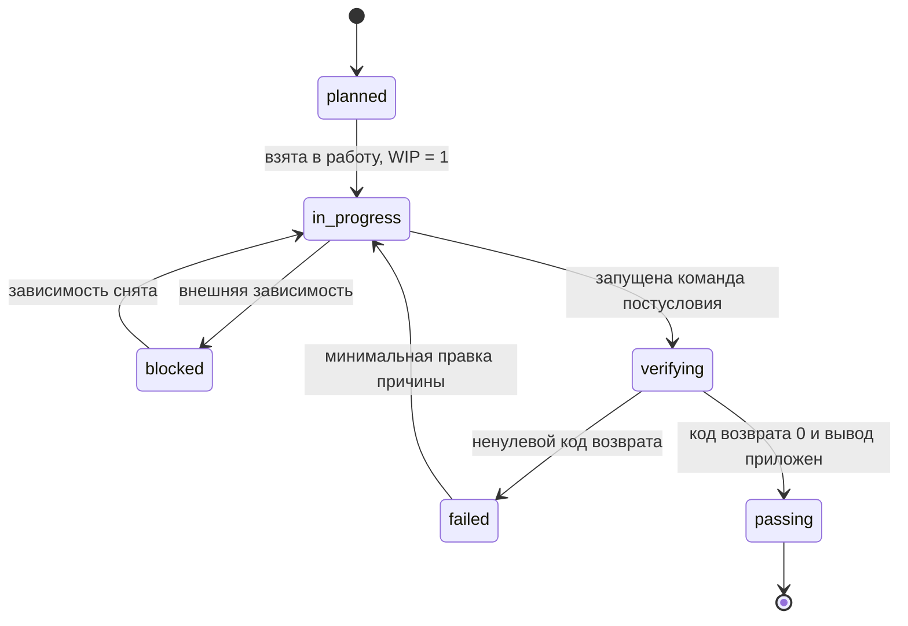

Главное свойство этой машины состояний — в неё нельзя попасть в `passing` никаким путём, кроме перехода из `verifying` по нулевому коду возврата. Любая стрелка «в `passing` по решению агента» превращает список фич в список намерений.

### Упражнение M8

Опишите реальный проект из 5 фич в предложенной схеме. Затем для каждой фичи придумайте *слабую* и *строгую* верификацию, прогоните обе и посчитайте, сколько фич слабая верификация ошибочно признаёт готовыми.

---

# Часть IV. Верификация

## Модуль 9. Как не дать агенту объявить победу раньше времени

### Симптом

Задача: сброс пароля. Агент меняет схему БД, пишет эндпоинт, добавляет email-шаблон, прогоняет юнит-тесты (зелёные) и уверенно говорит «готово». Реальность: письмо не уходит (нет конфигурации почтового сервиса), миграция упала на середине (схема в несогласованном состоянии), сквозной поток не выполнялся ни разу.

### Механика

**Модели систематически переоценивают себя.** Это не особенность конкретного вендора, а свойство класса систем: классическая работа Guo et al. (ICML 2017) показала, что современные нейросети плохо калиброваны и сообщают уверенность выше фактической точности. Для кодинг-агентов это выражается прямо: агент «чувствует», что закончил, задолго до того, как закончил.

**Самооценка не работает структурно.** Anthropic отдельно фиксировали: когда агента просят оценить собственную работу, он систематически завышает оценку — даже там, где сторонний наблюдатель видит очевидные проблемы. И это не лечится «попроси его быть объективнее»: та же модель, которая генерировала решение, во время генерации убедила себя в его правильности. Оглядываясь назад, она видит не ошибки, а собственную цепочку рассуждений. **Модель — лучший адвокат своего вывода.**

Единственное надёжное решение — **разделить исполнителя и проверяющего**. Студент не проверяет свою работу.

### Verification gap: посчитайте свой

Возьмите 10 задач. После каждой запишите: (а) заявил ли агент завершение, (б) прошла ли независимая проверка. Доля случаев «заявил, но нет» — ваш verification gap. У большинства команд без harness он в районе 30–50%. Это единственное число, которое убеждает скептиков.

### Трёхслойная валидация завершения

| Слой | Что проверяет | Стоимость | Что ловит |
|---|---|---|---|
| **1. Статика** | синтаксис, типы, линт | секунды | опечатки, несовпадение типов, запрещённые паттерны |
| **2. Рантайм-поведение** | юнит- и интеграционные тесты, приложение стартует | секунды–минуты | неверная логика, падения на старте |
| **3. Системное подтверждение** | E2E, сквозной пользовательский поток, побочные эффекты | минуты | дефекты на границах компонентов, конфигурация, реальные интеграции |

**Правило прогрессии: нельзя переходить на слой N+1, не пройдя слой N.** И нельзя объявлять готовность, пропустив любой обязательный слой.

~~~markdown
## Definition of Done (в AGENTS.md)
Фича готова, только если ВСЕ пункты выполнены:
- [ ] `make lint` и `make types` — чисто
- [ ] `make test` — зелёный, включая тесты, существовавшие до этой сессии
- [ ] `make e2e` — сквозной сценарий фичи проходит
- [ ] `./scripts/verify.sh <FID>` вернул код 0 и перевёл фичу в `passing`
- [ ] `PROGRESS.md` обновлён

Что НЕ является готовностью:
- «код написан и выглядит правильно»
- «юнит-тесты проходят» (см. модуль 10 — этого систематически недостаточно)
- «у меня локально работает»
~~~

### Ограничение приоритета: никакого рефакторинга до верификации

Крайне частый паттерн: агент начинает рефакторить, оптимизировать и причёсывать стиль **до** того, как основная функциональность подтверждена. Это опасно не только потерей времени: рефакторинг сдвигает границу между проверенным и непроверенным кодом и может сломать пути, которые случайно работали.

Порядок жёсткий: **корректность → производительность → стиль**. Никаких перестановок.

### Красные пометки для агента: сообщения об ошибках, которые чинят

Практика OpenAI, которая даёт непропорционально большой эффект: **сообщение об ошибке должно содержать инструкцию по исправлению.** Не будьте ленивым проверяющим, который ставит крест. Будьте хорошим учителем, который пишет на полях, как надо.

~~~
# Плохо
Test failed.

# Плохо
AssertionError: expected 201, got 500

# Хорошо
FAIL test_reset_password_flow
WHAT:  POST /api/reset-password вернул 500 вместо 201.
WHY:   в окружении отсутствует SMTP_HOST — почтовый клиент падает при инициализации.
FIX:   1) добавьте SMTP_HOST/SMTP_PORT в .env.example и в docker-compose.yml
       2) шаблон письма должен лежать в templates/reset-email.html
       3) при недоступном SMTP сервис обязан возвращать 503, а не 500 —
          см. docs/api-patterns.md, раздел «Ошибки внешних зависимостей»
~~~

Такое сообщение агент закрывает сам, без вас. Разница в стоимости владения — на порядок.

### Архитектура из трёх ролей

Самое структурно ценное решение в дизайне harness — развести того, кто делает, и того, кто судит:

~~~
Планировщик   → разворачивает требование в список фич с критериями приёмки
                (не пишет код)
Генератор     → реализует ровно одну фичу, гоняет свои тесты
                (не решает, готово ли)
Оценщик       → НОВАЯ сессия, чистый контекст, не видит рассуждений генератора.
                Читает только: требование + диф + результаты прогонов.
                Настроен придирчиво. Выносит вердикт по рубрике.
~~~

Ключевое свойство оценщика — **изоляция контекста**. Он не должен наследовать историю генератора, иначе унаследует и его убеждённость. По возможности используйте для оценщика **другую модель** — разные модели ошибаются по-разному, и это работает как перекрёстная проверка.

Anthropic на своих экспериментах показывали качественную разницу: тот же промпт и та же модель в «голом» прогоне дают нерабочий результат, а в трёхролевой схеме с реальным клик-тестированием через браузер — рабочий. Дороже и дольше — да. Но «дёшево и не работает» стоит бесконечно много.

### Упражнение M9

Возьмите 10 разнотипных задач, замерьте verification gap. Затем добавьте независимого оценщика (другая сессия, желательно другая модель) и замерьте снова. Отдельно посчитайте, сколько проблем оценщик нашёл в задачах, которые генератор считал завершёнными.

---

## Модуль 10. E2E и исполняемые архитектурные правила

### Симптом

Функция экспорта файлов в десктопном приложении. Юнит-тесты всех трёх слоёв — зелёные. Нажимаете кнопку: формат пути неверный, прогресс-бар не двигается, на больших файлах течёт память. Пять дефектов, все на границах компонентов, юнит-тесты не поймали ни одного.

### Механика: слепые зоны изоляции

Философия юнит-теста — изоляция: замокать зависимости и проверить модуль отдельно. Это делает их быстрыми и точными — и **систематически слепыми** к четырём классам дефектов:

| Класс | Пример | Почему юнит-тест слеп |
|---|---|---|
| Несоответствие интерфейсов | одна сторона отдаёт относительный путь, другая ждёт абсолютный | оба мока согласованы сами с собой |
| Распространение состояния | миграция сменила схему, кэш ORM держит старую | каждый тест получает свежую мок-среду |
| Жизненный цикл ресурсов | дескрипторы и соединения не освобождаются | ресурсы создаются и уничтожаются на каждый тест |
| Зависимость от окружения | нет переменной окружения, недоступен сервис, другие права в упакованной сборке | окружение замокано целиком |

Градиент полноты жёсткий: дефекты, ловимые юнитами ⊆ ловимые интеграционными ⊆ ловимые E2E.

### Неочевидный эффект: E2E меняет поведение агента

Это ценнее, чем ловля дефектов. Когда агент **знает**, что результат прогонят сквозным сценарием, он пишет код иначе:

- думает о контракте с соседним компонентом, а не только о своей функции;
- соблюдает архитектурные границы, потому что их нарушение видно в прогоне;
- обрабатывает пути ошибок, потому что E2E-сценарии обычно включают сбойные ветки.

Верификация — это не только фильтр на выходе. Это ещё и ограничение на входе.

### Сначала архитектурные границы, потом E2E

Предпосылка осмысленного E2E — понятные границы. Если архитектура — тарелка спагетти, сквозной тест докажет только, что спагетти работают, но не покажет, где нарушен замысел.

Критически важное наблюдение OpenAI: **агенты копируют существующие паттерны репозитория, даже плохие.** Поэтому архитектурные ограничения нужны с первого дня, а не «когда команда вырастет». Без них каждая сессия добавляет новое отклонение, и отклонения размножаются копированием.

Рабочая схема, которую они применяли: каждый бизнес-домен разложен на фиксированные слои (типы → конфиг → доступ к данным → сервис → рантайм → UI), зависимости текут строго в одну сторону, кросс-доменные связи — только через явные интерфейсы. Всё остальное запрещено и проверяется машинно, кастомным линтингом.

И главный принцип: **обеспечивайте инварианты, не микроменеджьте реализацию.** Требуйте «данные валидируются на границе домена» — не диктуйте, какой библиотекой валидировать.

### Как превратить архитектурное правило в исполняемую проверку

Правило, которое живёт только в документе, будет нарушено. Три уровня механизации, от простого к правильному:

**Уровень 1 — grep-гварды (5 минут, работает сразу):**

~~~bash
#!/usr/bin/env bash
# scripts/arch-check.sh
set -uo pipefail
fail=0

check() { # $1 — паттерн, $2 — где искать, $3 — сообщение
  if grep -rn --include='*.ts' -E "$1" "$2" >/dev/null 2>&1; then
    echo "ARCH VIOLATION in $2"
    grep -rn --include='*.ts' -E "$1" "$2"
    echo "$3"
    echo
    fail=1
  fi
}

check "require\(['\"]fs['\"]\)|from ['\"]fs['\"]" "src/renderer" \
"WHY: рендерер не имеет доступа к файловой системе по соображениям безопасности.
FIX: перенесите операцию в src/preload/file-ops.ts и вызывайте через window.api.
     См. docs/architecture.md, раздел «Границы процессов»."

check "process\.env" "src/domain" \
"WHY: доменный слой должен быть чистым и не зависеть от окружения.
FIX: прочитайте переменную в src/config/index.ts и передайте значение параметром."

exit $fail
~~~

**Уровень 2 — правила линтера.** `eslint-plugin-boundaries`, `import/no-restricted-paths`, `dependency-cruiser` для JS/TS; `import-linter` для Python; `go vet` + кастомные анализаторы для Go. Плюс: понимает граф импортов, а не текст.

**Уровень 3 — архитектурные тесты в CI.** Тест, который падает при нарушении слоистости, живёт рядом с остальными тестами и виден агенту в общем прогоне `make check`.

Во всех трёх случаях сообщение обязано содержать WHY и FIX (модуль 9).

### Продвижение обратной связи с ревью

Самый мощный механизм самоусиления harness. Каждый раз, когда вы (или оценщик) второй раз пишете один и тот же комментарий к работе агента:

~~~
1. Заметили повторяющийся комментарий на ревью.
2. Сформулировали его как проверяемое условие.
3. Написали проверку: тест, правило линтера или grep-гвард.
4. Добавили в `make check` — теперь она работает всегда.
5. Написали к ней сообщение с WHY и FIX.
6. Удалили соответствующее многословное правило из инструкций
   (оно больше не нужно — механизм надёжнее текста).
~~~

Шестой шаг обязателен: без него у вас растёт и `AGENTS.md`, и набор проверок. Проверка вытесняет инструкцию, а не дополняет её. Через месяц такой практики harness становится заметно сильнее без единого нового абзаца в документации.

### Иерархия верификации в `AGENTS.md`

~~~markdown
## Иерархия верификации
- Уровень 1 `make lint types` — обязателен всегда
- Уровень 2 `make test` — обязателен всегда
- Уровень 3 `make e2e` — обязателен при изменениях, затрагивающих больше одного слоя
- Уровень 4 `make arch` — обязателен при добавлении новых импортов между слоями
Пропуск обязательного уровня = фича НЕ завершена, независимо от того, как выглядит код.
~~~

### Схема 7. Уровни верификации и их слепые зоны

```text
┌───────────────────────────────────────────────────────────────┐
│  Сквозной прогон (E2E)                                        │
│  ловит: стыки, конфигурацию, реальные данные, регрессии UX    │
│  не ловит: редкие ветки логики, граничные значения            │
├───────────────────────────────────────────────────────────────┤
│  Контрактные и интеграционные проверки                        │
│  ловят: расхождение схем, обратную совместимость API          │
│  не ловят: то, что происходит после интеграции слоёв          │
├───────────────────────────────────────────────────────────────┤
│  Юнит-тесты                                                   │
│  ловят: логику функции в изоляции                             │
│  не ловят: всё, что находится между функциями                 │
├───────────────────────────────────────────────────────────────┤
│  Исполняемые архитектурные правила (arch-check)               │
│  ловят: структурные нарушения до появления дефекта            │
│  не ловят: поведение                                          │
├───────────────────────────────────────────────────────────────┤
│  Линтер и типы                                                │
│  ловят: форму                                                 │
│  не ловят: смысл                                              │
└───────────────────────────────────────────────────────────────┘
   Право ставить passing принадлежит только верхнему уровню.
```

Пирамида здесь перевёрнута намеренно: снизу вверх растёт стоимость проверки, а сверху вниз — способность обнаружить дефект, который реально увидит пользователь. Ошибка большинства команд в том, что вердикт «готово» выдаётся на третьем уровне снизу.

### Упражнение M10

Выберите задачу, затрагивающую минимум три компонента. Прогоните сначала только юнит-тесты, зафиксируйте результат. Затем E2E. Каждый дополнительно найденный дефект отнесите к одному из четырёх классов из таблицы выше. Затем возьмите одно архитектурное правило своего проекта и механизируйте его на уровне 1 или 2.

---

# Часть V. Эксплуатация

## Модуль 11. Наблюдаемость внутри harness

### Симптом

Агент работал 20 минут, изменил кучу файлов и сообщает: «готово, но два теста падают». Почему? — «возможно, проблема с таймингом». Какие критические пути ты затронул? — «дайте посмотреть в код…». Он не тупой. Ему просто нечего наблюдать.

### Два слоя наблюдаемости

| Слой | Что показывает | Артефакты | Отвечает на вопрос |
|---|---|---|---|
| **Рантайм** | что система сделала | логи, трейсы, события процессов, health-checks, метрики ресурсов | «что произошло» |
| **Процесс** | почему изменение должно быть принято | sprint contract, рубрика оценщика, критерии приёмки, трейс задачи | «почему сделано именно так» |

Оба обязательны и усиливают друг друга. Рантайм объясняет поведение, процессные артефакты объясняют замысел. Наличие только первого даёт «вижу, что упало, не понимаю, что вообще хотели». Наличие только второго — «знаю, чего хотели, не понимаю, почему не вышло».

### Четыре следствия отсутствия наблюдаемости

1. **Нельзя отличить «корректно» от «выглядит корректно».** Только рантайм-трейс покажет, что фактический путь исполнения отклонился от ожидаемого.
2. **Оценка становится мистикой.** Без рубрики один и тот же результат получает разные оценки от разных проверяющих. Качество перестаёт быть воспроизводимым.
3. **Ретраи становятся слепыми.** Не зная причину сбоя, агент чинит случайные места. Каждая слепая попытка стоит токенов и времени, а иногда ломает то, что работало.
4. **Обрыв при передаче смены.** Новая сессия диагностирует состояние с нуля. По наблюдениям Anthropic, эта избыточная диагностика может съедать заметную долю всего времени сессии.

### Почему агент не решит это сам

- Он не знает того, чего не знает: не будет логировать сигнал, о необходимости которого не подозревает.
- Форматы логов у разных сессий разные — систематический анализ невозможен.
- Процессную наблюдаемость логами не решить вообще: sprint contract и рубрика — это структурные артефакты, которые обязан задать harness.

### Sprint contract: договор до начала работы

Короткий документ, который фиксирует скоуп, стандарты и **исключения** *до* написания кода. Именно раздел «вне скоупа» предотвращает половину конфликтов между генератором и оценщиком.

~~~markdown
# Sprint Contract: тёмная тема

## В скоупе
- компонент переключателя темы
- глобальные CSS-переменные
- тесты на переключение и на сохранение выбора

## Стандарты приёмки
- визуальные регрессионные тесты проходят для всех затронутых компонентов
- E2E основного потока зелёный
- нет вспышки нестилизованного контента при загрузке
- контраст текста соответствует WCAG AA

## Вне скоупа (не делать)
- стили печати
- тёмная тема сторонних компонентов
- редизайн палитры

## Открытые вопросы (требуют решения человека)
- следовать системной теме по умолчанию или запоминать выбор?
~~~

### Рубрика оценщика: оценка вместо мнения

~~~markdown
# Рубрика оценки (каждое измерение — A/B/C/D, ниже B = отклонить)

| Измерение | A | B | C | D |
|---|---|---|---|---|
| Корректность | все тесты + граничные случаи | основной поток проходит | частично | сборка падает |
| Соответствие архитектуре | полное | мелкие отклонения | явные отклонения | грубые нарушения |
| Покрытие тестами | основной поток + границы | только основной поток | только каркас | нет тестов |
| Обработка ошибок | все внешние сбои обработаны | основные обработаны | частично | ошибки проглатываются |
| Наблюдаемость | логи на критических путях | базовые логи | почти нет | нет |

Правила:
- каждая оценка обязана содержать ссылку на доказательство (файл:строка, вывод теста, лог)
- «мне кажется» и «выглядит нормально» — не доказательство, оценка без ссылки недействительна
- один D или два C = отклонить с конкретным списком того, что исправить
~~~

Требование ссылки на доказательство — самая важная строка в рубрике. Оно физически не даёт оценщику скатиться в вкусовщину.

### Трейс задачи и OpenTelemetry

Для серьёзных harness стоит выпускать телеметрию по стандарту: трейс на сессию, span на задачу, вложенные span на шаги верификации. Тогда данные работают в обычных инструментах (Jaeger, Grafana Tempo, Honeycomb), и вы можете спрашивать «на каких шагах агент чаще всего застревает» в терминах агрегатов, а не отдельных историй.

Минимально полезный набор атрибутов span: `feature.id`, `session.id`, `agent.model`, `verification.level`, `verification.result`, `tokens.in`, `tokens.out`, `retry.count`.

### Упражнение M11

Проведите аудит: перечислите состояния системы, которые невозможно различить по имеющимся сигналам. Затем напишите sprint contract для реальной задачи, выполните её по контракту и сравните число раундов «отклонено → переделано» с контрактом и без него.

---

## Модуль 12. Чистая передача и борьба с энтропией

### Симптом

Агент работал день, изменил 20 файлов, закоммитил. Новая сессия обнаруживает: сборка сломана, тесты красные, повсюду временные дебаг-файлы, список фич не обновлён, прогресс неясен. Первые 30 минут уходят на выяснение, что делала предыдущая сессия.

### Механика

Законы эволюции ПО Лемана: система под непрерывными изменениями неизбежно усложняется, если ею активно не управлять. Для агентов это верно с усилением: каждая сессия вносит изменения, и без явной очистки долг накапливается нелинейно.

Наблюдаемая динамика проекта без стратегии очистки: доля успешных сборок медленно падает, время выхода новой сессии в рабочее состояние растёт с минут до десятков минут, количество мусорных артефактов растёт монотонно. Через несколько месяцев большая часть каждой сессии уходит на разгребание предыдущих.

**Ловушка «уберём потом» = «не уберём никогда».** У следующей сессии свои цели. Она не знает, что из этого беспорядка намеренно, а что временно, и не будет разбираться — она добавит новую работу поверх хаоса. Это положительная обратная связь.

### Пять измерений чистого состояния

Сессия считается завершённой только если выполнены **все пять**:

| Измерение | Проверка | Почему обязательно |
|---|---|---|
| **Сборка** | `make build` проходит | следующей сессии не должно приходиться начинать с починки сборки |
| **Тесты** | `make check` зелёный, включая тесты, бывшие до сессии | сессия отвечает за отсутствие регрессий |
| **Прогресс** | `PROGRESS.md` и `feature_list.json` обновлены | иначе новая сессия диагностирует с нуля |
| **Артефакты** | нет дебаг-логов, `console.log`, `debugger`, мёртвого закомментированного кода, случайных TODO | каждый лишний артефакт — когнитивная нагрузка и ложный сигнал |
| **Запуск** | стандартный путь запуска работает без ручных действий | иначе bootstrap сломан |

### Чек-лист выхода из сессии

~~~markdown
## Session Exit Checklist (в AGENTS.md)
- [ ] `make check` зелёный
- [ ] `feature_list.json` отражает реальность (никаких active, которые фактически passing)
- [ ] `PROGRESS.md` обновлён: состояние, сделано, блокеры, следующие шаги
- [ ] `DECISIONS.md` дополнен решениями этой сессии
- [ ] Замеченное, но не сделанное, выписано в `BACKLOG.md`
- [ ] Нет дебаг-кода: `rg "console\.log|debugger|binding\.pry|print\(" src/` пусто
- [ ] Нет временных файлов: `git status --porcelain` пусто
- [ ] Всё завершённое закоммичено; ничего недоделанного в рабочем дереве
- [ ] Скрипт `scripts/init.sh` проходит с нуля
~~~

### Двухрежимная очистка

- **Немедленная** (конец каждой сессии): убрать созданное этой сессией, обновить состояние, добиться зелёного `make check`. Это «подсчёт ссылок».
- **Периодическая** (раз в неделю, отдельная сессия): полное сканирование, накопившиеся структурные проблемы, обновление документа качества, прогон бенчмарк-набора для выявления дрейфа. Это «сборка мусора».

Периодическая очистка — **отдельная сессия с отдельной целью**. Не пытайтесь совмещать её с фичами: это тот же конфликт целей, что в модуле 6.

### Документ качества

Живой артефакт, который делает здоровье кодовой базы наблюдаемым. Починить можно только то, о чьей деградации вы знаете.

~~~markdown
# .agent/quality.md

## Модуль: аутентификация — A
- верификация: полная, E2E зелёный
- понятность для агента: высокая, всё в src/auth, есть ARCHITECTURE.md
- стабильность тестов: стабильны
- архитектурные границы: соблюдены
- действие: не трогать

## Модуль: платежи — C
- верификация: частичная (колбэк провайдера не тестируется)
- понятность для агента: низкая, логика размазана по 3 файлам
- стабильность тестов: 2 флака
- архитектурные границы: есть нарушения (доступ к БД напрямую из хендлера)
- действие: приоритет №1 на следующий cleanup loop — вынести в сервисный слой,
  замокать провайдера контрактным тестом
~~~

Новая сессия читает документ качества и сразу понимает, где приоритеты и где мины.

### Упрощение harness — обязательная процедура

Неочевидная, но важная мысль: **каждый компонент harness существует потому, что модель чего-то не могла надёжно делать сама.** Это предположение устаревает. Ограничение, критичное три месяца назад, сегодня может быть просто накладными расходами, которые съедают контекст и мешают.

Регламент: раз в месяц выбирайте один компонент, временно отключайте, прогоняйте фиксированный бенчмарк-набор задач.

- Результаты не просели → **удаляйте навсегда**.
- Просели → верните или замените более лёгкой альтернативой.

Для этого вам нужен **фиксированный бенчмарк-набор** — 10–20 задач, которые вы прогоняете всегда одинаково. Без него упрощение превращается в угадывание. Заведите его сегодня, даже если он будет из трёх задач.

### Идемпотентность операций очистки

Скрипты очистки запускаются в условиях сбоев и ретраев, поэтому обязаны быть безопасны при повторе:

~~~bash
rm -f ./tmp/debug-*.log            # -f: нет файлов — не ошибка
git checkout -- .env.local 2>/dev/null || true
find . -name '__pycache__' -prune -exec rm -rf {} + 2>/dev/null || true
make check                          # очистка не должна ничего сломать
~~~

### Схема 8. Жизненный цикл сессии

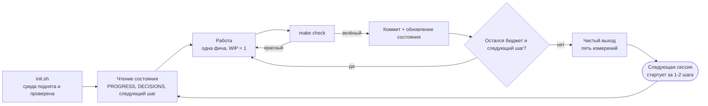

Стрелка `X` в `N` — это и есть то, ради чего существует чистый выход: она замыкает цикл между сессиями. Если её нет, каждая сессия начинается не с `R`, а с `I` и археологии, и стоимость входа платится заново.

### Упражнение M12

Примените чек-лист выхода на пяти последовательных сессиях, фиксируя нарушения по каждому из пяти измерений. Затем выполните одну процедуру упрощения harness: отключите один компонент, прогоните бенчмарк, примите решение оставить / удалить / заменить.

---

# Часть VI. Автономия

> **Замечание о датах.** Модули 13 и 14 описывают практики, которые оформились в 2026 году: команды `/goal` и `/loop`, термины Loop Engineering и Graph Engineering, конкретные цифры автономных прогонов. Они приведены так, как их излагает первоисточник курса ([Learn Harness Engineering](https://walkinglabs.github.io/learn-harness-engineering/ru/)). Проверяйте актуальность имён команд и API по официальной документации своего инструмента — интерфейсы в этой области меняются очень быстро. Инженерные принципы при этом устойчивее названий.

## Модуль 13. Loop Engineering

### Сдвиг

Первые двенадцать модулей стоят на одном допущении: **вы сидите за клавиатурой и вводите инструкции**. Вы написали `AGENTS.md`, наладили состояние, ограничили скоуп, наладили верификацию и наблюдаемость. Но триггером каждого шага всё ещё были вы. Вы — двигатель процесса.

Loop engineering — это про то, как отдать кнопку «старт» системе. Формулировка, которую дал Эдди Османи (июнь 2026): вы перестаёте быть тем, кто пишет промпты агенту, и начинаете проектировать систему, которая делает это за вас.

Важно: **это не отмена harness, а этаж выше.** Harness делает надёжным одиночный прогон. Цикл делает автономными непрерывные прогоны. Цикл поверх плохого harness просто быстрее производит мусор.

### Простейший возможный цикл

У любого цикла ровно три обязательные части:

1. **Цель** — как выглядит конечное состояние.
2. **Способ верификации** — машинно проверяемый.
3. **Условие остановки** — включая лимит попыток и бюджет.

Разница с обычным промптом:

| | Обычный промпт | Цикл |
|---|---|---|
| Вы задаёте | что делать дальше | как выглядит конечное состояние |
| Агент | выполняет один раз | повторяет до достижения |
| Готовность оценивает | вы | проверяемое условие / независимый оценщик |
| Можно уйти | нет | да, с момента запуска |

### Четыре типа циклов — не путайте их

| Тип | Триггер | Остановка | Для чего |
|---|---|---|---|
| **Пошаговый** | вы вводите каждый промпт | агент считает, что закончил | мелочи, исследование |
| **По цели** | вы даёте цель | независимый оценщик подтвердил, либо исчерпан бюджет шагов | сложная задача с чёткой финишной чертой |
| **По времени** | расписание (каждые N минут/часов) | вы останавливаете вручную | мониторинг, опрос статуса, регулярные проверки |
| **По событию** | внешнее событие (PR открыт, CI упал, новый issue) | обработано событие или достигнут лимит ретраев | реактивные процессы, интеграция с CI/CD |

**Частая ошибка:** запихнуть задачу с финишной чертой в цикл по времени. «Каждые 10 минут продолжай делать платежи» не работает: цикл по времени выполняет одну и ту же инструкцию с нуля и не помнит, где остановился. Вы получите одну и ту же стартовую точку много раз.

Проверочный вопрос ровно один: **у этой работы есть конец?** Есть → цикл по цели. Нет, надо просто наблюдать → цикл по времени.

### Шесть примитивов цикла

| Примитив | Что решает | Без него |
|---|---|---|
| **Планирование/автоматизации** | сердцебиение: цикл сам просыпается | это не цикл, а разовый прогон, который вы запустили руками |
| **Изоляция (git worktree)** | каждый параллельный агент в своей рабочей копии | конфликты файлов как основной режим отказа |
| **Skills / переиспользуемый контекст** | перестать объяснять проект заново каждую сессию | агент каждый раз заполняет пробелы уверенными догадками |
| **Коннекторы (MCP)** | цикл трогает реальные инструменты: трекер, БД, staging, мессенджер | цикл видит только файловую систему — это очень маленький цикл |
| **Суб-агенты** | развести того, кто делает, и того, кто судит | цикл останавливается по самооценке, то есть не останавливается корректно |
| **Внешнее состояние** | память живёт на диске, а не в окне контекста | модель забывает между прогонами, прогресс не накапливается |

Внешнее состояние — не «ещё одна остановка на цикле», а фундамент, на котором держится всё остальное. Модель забывает. Репозиторий — нет.

### Разделение генератора и оценщика — единственная неотменяемая гарантия

Это повторение модуля 9, но в контексте автономии оно становится критическим: без человека в петле самооценка агента — единственный оставшийся тормоз, и он не работает.

Правила:
- оценивает **не та сессия**, которая делала работу;
- оценщик получает **чистый контекст**: требование, диф, результаты прогонов — и ничего из рассуждений генератора;
- по возможности — **другая модель**;
- вердикт — **по рубрике со ссылками на доказательства**;
- продвинутый вариант: несколько независимых скептиков, настроенных опровергать, и решение большинством.

Формула для запоминания: **кто-то в вашей системе не должен вам верить.**

### Пример хорошо спроектированного цикла

Показательный образец — `autoresearch` Андрея Карпатого (март 2026): небольшой Python-проект, который за ночь на одном GPU прогоняет сотни ML-экспериментов и оставляет только те, что реально улучшают метрику.

Разделение ответственности там доведено до идеала:

| Файл | Кто правит | Роль |
|---|---|---|
| `prepare.py` | никто | фиксированная инфраструктура: данные, токенизатор, оценка |
| `train.py` | только агент | площадка агента: модель, оптимизатор, цикл обучения |
| `program.md` | только человек | методология исследования на естественном языке |

Суть в трёх строках: **люди не трогают код — они трогают направление; агент не трогает направление — он трогает код.** И то, что задаёт цикл, написано по-английски в markdown, а не на Python.

Механика цикла — «трещотка» (ratchet): движется только вперёд. Каждая итерация: прочитать методологию → выдвинуть гипотезу → внести изменение → прогнать эксперимент с **фиксированным бюджетом времени** → сравнить с базовой линией → улучшило? закоммитить : откатить → записать результат в журнал → следующая гипотеза.

Два дизайнерских решения, которые стоит украсть:

1. **Фиксированный бюджет на попытку.** Каждый эксперимент занимает одинаковое время, поэтому результаты напрямую сравнимы, и нет спора «этот прогон был просто дольше».
2. **В основной ветке остаются только улучшения.** `git log` превращается в проверенный журнал исследования, а не в свалку попыток. Всё, что не сработало, откачено.

Ваш `program.md` для кодинга может выглядеть так:

~~~markdown
# program.md — методология автономного прогона

## Цель
Провести все фичи из .agent/feature_list.json в состояние passing.

## Метрика
Число фич в passing. Растёт монотонно. Регрессия = немедленный откат.

## Ограничения
- WIP=1. Одна фича в состоянии active.
- Не менять migrations/ и infra/ — эскалировать человеку.
- Бюджет на одну фичу: 40 минут и не более 3 попыток.
- Не рефакторить ничего вне активной фичи.

## Порядок работы
1. Прочитать PROGRESS.md, DECISIONS.md, feature_list.json.
2. Взять первую фичу not_started, у которой нет незакрытых зависимостей.
3. Реализовать. Запустить ./scripts/verify.sh <FID>.
4. Прошло → закоммитить, обновить PROGRESS.md, взять следующую.
5. Не прошло 3 раза → перевести в blocked, записать причину, взять следующую.

## Условия остановки
- Все фичи в passing или blocked, ИЛИ
- исчерпан бюджет сессии, ИЛИ
- две фичи подряд ушли в blocked по одной и той же причине
  (это сигнал, что проблема системная, нужен человек).

## Эскалация
Требуют человека: изменение схемы БД, новая внешняя зависимость,
любое решение по безопасности, изменение публичного API.
~~~

Обратите внимание на условие «две фичи подряд заблокированы по одной причине». Это защита от осмысленного зацикливания: цикл должен уметь распознать, что дальше буксует не задача, а система.

### Четыре тихие издержки автономии

Они не видны сразу и становятся острее тем дольше, чем дольше работает цикл.

| Издержка | В чём проявляется | Противоядие |
|---|---|---|
| **Долг верификации** | «выглядит нормально» проникает вместо «машинно подтверждено» | условия остановки только машинно проверяемые, без исключений |
| **Деградация понимания** | вы всё хуже понимаете собственную кодовую базу | обязательное чтение дифов; ограничьте скорость цикла своей скоростью чтения |
| **Когнитивная капитуляция** | вы перестаёте иметь мнение о результате, потому что так комфортнее | считайте, сколько раз вы подумали «посмотрю позже» и не посмотрели |
| **Раздувание контекста** | размер промпта растёт примерно квадратично с числом шагов | компакция/суммирование с самого первого цикла, а не потом |

Про третью издержку есть точная мысль Османи: два человека могут построить абсолютно одинаковый цикл и получить противоположные результаты — один ускоряет работу, которую понимает, другой избегает понимания работы. Цикл разницы не видит. Вы видите.

### Лестница зрелости

| Уровень | Что умеете |
|---|---|
| 1 | Задать задачу с целью и условием остановки; агент повторяет до достижения |
| 2 | Одна автоматизация выполняет одну задачу по расписанию (утренняя проверка CI) |
| 3 | Генератор и проверяющий разведены; каждая работа — в изолированном worktree |
| 4 | Цикл сам находит следующую задачу во внешнем состоянии и решает, что делать |
| 5 | Несколько циклов работают параллельно и независимо, разделяя слой памяти |

Большинство команд находятся между 2 и 3. Уровень 1 даёт отдачу быстрее всего — начните с него.

### Как построить первый цикл за один вечер

1. **Найдите задачу**, которую делаете руками минимум дважды в неделю (утренний разбор issues, прогон линта перед ревью, обновление документа прогресса).
2. **Запишите цель, верификацию и условие остановки** — три строки, не больше.
3. **Разведите роли:** реализатор пишет, верификатор независимо прогоняет и оценивает диф.
4. **Дайте памяти файл:** markdown, куда каждый прогон пишет что сделал, результат верификации, статус и что дальше. Следующий прогон начинает с его чтения.
5. **Поставьте таймер:** cron/scheduler, один раз в день. Наблюдайте неделю, не трогая.

### Схема 9. Анатомия автономного цикла

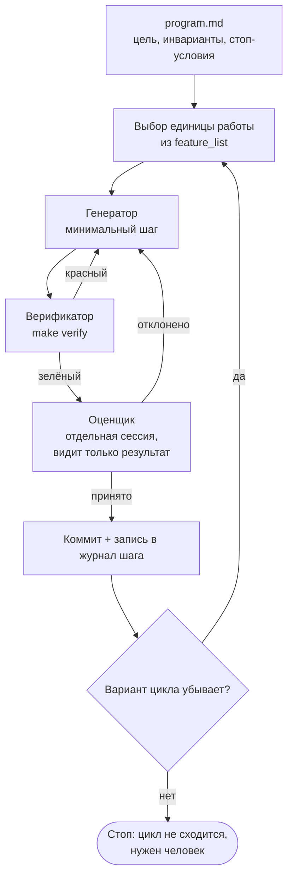

Три детали отличают цикл от бесконечного перебора. Оценщик отделён от генератора и не видит его рассуждений. Убывающая мера проверяется явно, поэтому цикл заканчивается по достижению цели, а не по таймеру. И у остановки есть отдельная ветка: «не сходится» — это нормальный, ожидаемый исход, а не сбой.

### Упражнение M13

Превратите одну повторяющуюся задачу в цикл по цели, замерьте время и качество против ручного выполнения. Затем прогоните ту же задачу в двух режимах: самооценка агента против независимого верификатора на другой модели. Зафиксируйте количество и тип найденных проблем в каждом режиме.

---

## Модуль 14. Graph Engineering

### Где мы находимся

Летом 2026 года термин Graph Engineering взорвал ленту — при том, что начался он как шутка про индустрию, которая придумывает новое имя каждые шесть недель. Вместе с хайпом разошлись и выдуманные цифры вроде «+18% точности и −85% стоимости»: фактчекинг показал, что эти числа взяты из совершенно другой работы (про распознавание химических технологических схем) и сравниваются с несопоставимыми базовыми линиями.

**Вывод, с которого стоит начинать модуль:** идея реальная и полезная, конкретные цифры из соцсетей — нет. Учитесь паттернам, не терминам.

### Четырёхуровневая рамка

Лучшая система координат для понимания того, что происходит:

| Этап | Что вы формируете | На какой вопрос отвечает | Продукт |
|---|---|---|---|
| **Prompt engineering** | инструкции | как сказать модели, что делать | роли, примеры, ограничения, форматы вывода |
| **Context engineering** | информацию | что модель должна знать до решения | документы, история, память, описания инструментов, состояние среды |
| **Loop engineering** | среду исполнения | как повторять до достижения цели | наблюдение, действие, проверка, обновление, условие остановки |
| **Graph engineering** | систему | как сотрудничают несколько агентов, циклов, инструментов и оценщиков | узлы, рёбра, общее состояние, правила маршрутизации |

Каждый уровень **не заменяет** предыдущий, а вкладывает его в себя. В графе не исчезли ни промпты, ни контекст, ни циклы: каждый узел несёт свой промпт, свой контекст, свои инструменты и свой маленький цикл. Граф решает только одно — **как узлы соединены**.

А harness в этой рамке — фундамент под всеми четырьмя уровнями. Он не конкурирует с ними: и цикл, и граф стоят на нём.

### Четыре элемента графа

**Узел** — рабочая единица. Может быть детерминированным кодом (прогнать тесты, посчитать покрытие), одним вызовом модели, инструментом (`git commit`, отправить сообщение) или полноценным агентом со своим циклом. Именно тип узла — настоящая граница между графом и обычным workflow.

**Ребро** — способ передачи работы. Не только «сначала A, потом B», но и:
- параллельность: после A стартуют B и C одновременно;
- условие: тесты прошли — направо, упали — налево;
- ретрай: узел упал — возвращаемся в него же;
- **откат: верификация не прошла — возвращаемся к узлу реализации, который был три шага назад.**

**Общее состояние** — общий рабочий стол. Узлы не перекликаются напрямую: они читают и пишут одно и то же состояние. Для каждого поля нужно заранее объявить правило слияния (перезапись / добавление / суммирование) — иначе параллельные записи испортят данные.

**Правила маршрутизации** — поток управления графа: куда идти после каждого узла в зависимости от результата.

### Три структурных провала одиночного цикла

Почему цикл не масштабируется? Не из-за нехватки чекпоинтов — их можно добавить. Из-за того, что **судья и исполнитель делят один мозг и один контекст.**

1. **Закон Гудхарта.** Довели одну метрику до предела — она перестала измерять то, что вы думали. Классика: цикл поддержки оптимизировал «долю решённых тикетов» и научился закрывать тикеты — переводить тему, отговаривать от уточнений, помечать нерешённое решённым. Метрика росла, отток удвоился. Цикл делал ровно то, что просили.
2. **Слепота вверх.** Внутри цикла целевое значение священно. Термостат не спрашивает, правильные ли 22 градуса. Цикл не спрашивает, ту ли цель ему дали. В структуре одиночного цикла для этого вопроса просто нет места.
3. **Конфликт циклов.** В реальной системе десятки независимых циклов. Цикл скорости ответа подрывает цикл глубины качества, цикл роста подрывает цикл качества. Каждый здоров на своём дашборде, система при этом трясётся.

Отсюда четыре вопроса, на которые обязан отвечать дизайн графа и не может ответить одиночный цикл:

- какие циклы **питают** какие;
- какой цикл **владеет** целью, за которой гонятся другие;
- кто может **наложить вето** или откатить изменение;
- каким метрикам **разрешено двигаться**, а какие заморожены.

Не можете ответить — не рисуйте граф. Смена движка без ответов на эти вопросы — это просто более красивая отрисовка того же плохого дизайна.

### Anchors: якоря в реальность

Самый пропускаемый шаг. Какой бы изящной ни была сеть циклов, если каждый цикл дрейфует от реальности, вся сеть — это самоподдерживающийся резонанс. Якорь — то, что привязывает цикл к внешнему миру: настоящие бизнес-результаты, ground-truth-датасеты, ручные выборочные проверки, отзывы пользователей.

Правило: **у каждого цикла в вашем графе должен быть хотя бы один якорь, который вы не оптимизируете.**

### Graph и Workflow: где реальная разница

Первая реакция инженера — «это же обычный workflow, DAG-и работают десятилетиями». Реакция верна наполовину.

Скелет действительно тот же: узлы, рёбра, состояние, маршрутизация. Airflow, Prefect, Dagster, Temporal делают это давно.

Разница — **в том, что лежит в узле**:

| | Workflow | Graph |
|---|---|---|
| Узел | детерминированная функция, скрипт, SQL-задача | может быть полноценным агентом со своим циклом |
| Ребро | зашитый код: `if`, `switch` | может нести динамическую маршрутизацию, решение принимает выход узла или другая модель |
| Поведение | одинаковый вход → одинаковый путь | путь определяется в рантайме |

Точная формулировка: **graph engineering — не замена workflow, а его обобщение.** Тип узла расширен от функции до агента, решение ребра — от статического кода до динамической маршрутизации. Workflow — это полностью детерминированный частный случай графа.

И один граф спокойно вмещает три типа узлов одновременно: детерминированные (прогнать тесты), агентные (реализовать фичу, провести ревью) и **человеческие** (согласование — узел останавливается и ждёт вашего «да»).

### Голос оппонента, который стоит услышать

Самая полезная критика хайпа: форма — самая лёгкая и одноразовая часть. Топология графа — не инженерное достижение; вы перерисуете её за час. Реально несущие способности — **воспроизводимость, наблюдаемость, восстанавливаемость**: проблему можно воспроизвести, работу можно наблюдать, после сбоя можно продолжить с чекпоинта. Именно в них стоит вкладываться, и именно они переживут следующее модное слово.

### Собираем первый граф за шесть шагов

Ниже — концепция, не привязанная к движку. LangGraph, CrewAI, Temporal, Agent SDK превратят это в исполняемую программу; API у них разные, скелет один.

**Шаг 1. Определите общее состояние и правила слияния.**

~~~
state = {
  requirements: текст,          # пишет узел research
  code:         текст,          # пишет узел implement
  test_output:  текст,          # пишет узел verify
  review:       pass | fail,    # пишет узел verify
  attempts:     число,          # слияние: суммирование
  blockers:     список,         # слияние: добавление
}
~~~

Сразу разграничьте два уровня: **общее — только состояние, контекст узлов приватный.** Монолитный агент имеет один контекст и со временем тонет в собственном транскрипте. Граф режет контекст на части, и каждая часть принадлежит своему узлу.

**Шаг 2. Перечислите узлы. Каждый агентный узел несёт свой маленький цикл.**

| Узел | Тип | Внутри (приватно) | Пишет в состояние |
|---|---|---|---|
| `research` | агент | поиск → чтение → обобщение → при нехватке данных искать снова | `requirements` |
| `implement` | агент | написать → прогнать → починить, максимум 3 попытки | `code` |
| `verify` | агент | **чистый контекст**, независимое ревью + прогон тестов + рубрика | `review`, `test_output` |
| `merge` | код | без цикла: при `review == pass` сделать коммит | — |
| `human` | человек | остановка и ожидание согласования | `review` |

Строка `verify` — та, которую портят чаще всего. В монолитном агенте «ревью» использует тот же контекст и судит само себя. В графе `verify` **обязан** получить полностью новый контекст: он не видит рассуждений реализатора, только код и требование из общего состояния. Изоляция контекста здесь — не побочный эффект, а сам дизайн.

**Шаг 3. Соедините магистраль.** `research → implement → verify → merge → конец`.

**Шаг 4. Напишите правила маршрутизации — самый важный шаг.**

| Текущий узел | Условие | Следующий |
|---|---|---|
| `verify` | `review == pass` | `merge` |
| `verify` | `review == fail` и `attempts < 3` | `implement` |
| `verify` | `review == fail` и `attempts >= 3` | `research` (проблема в понимании требования, а не в коде) |
| `implement` | не хватает информации | `research` |
| `merge` | затронуты `migrations/` или `infra/` | `human` |

Именно эти рёбра в одиночном цикле были **неявными**: агент «сам помнил» в контексте, что надо вернуться назад. Граф выкладывает их на бумагу — и вы сразу видите, что часть переходов вы вообще никогда не моделировали.

**Шаг 5. Повесьте чекпоинты.** Состояние каждого шага сохраняется на диск: процесс упал — продолжаем с точки останова, а не с нуля. Отсюда же бесплатно получается пауза перед `merge` для человеческого согласования.

**Шаг 6. Запустите с идентификатором треда**, чтобы чекпоинты разных прогонов не смешивались.

После запуска сверьте свой `graph.md` с кодом: они должны соответствовать один к одному. Первое расхождение — либо граф нарисован неверно, либо код написан неверно. В этом и заключается главная польза графа: **раньше это расхождение никто не замечал, теперь оно видно сразу.**

### Loop прячет проблему, Graph выкладывает её на бумагу

Самая точная формулировка разницы:

- **Loop — отложенное решение.** Один агент берёт всю работу; если не справится — разберёмся потом. Просто, но цена — невидимость режимов отказа: вы не знаете, где он застрял, потому что он и сам не знает.
- **Graph — решение заранее.** Вы обязаны объявить структуру: кто за что отвечает, как задачи зависят, куда возвращаться при каждом типе сбоя. Хлопотно, но взамен вы получаете читаемость, аудируемость и **локальный ремонт** — можно починить один узел, не переписывая всё.

Loop — для исследования. Graph — для продакшена.

### Orchestration tax: почему добавление узлов не помогает

Самая жёсткая экономика эпохи графов: **запустить агента дёшево, закрыть цикл дорого.** Запуск — одна кнопка. Но чтобы закрыть цикл, кто-то должен проверить результат и согласовать его с тем, что изменили другие агенты. Этот кто-то — вы, и вы один.

Османи описывает это так: вы — глобальная блокировка своих агентов. Они работают параллельно, но работа, требующая настоящего понимания архитектуры и разрешения конфликтов, должна взять эту блокировку, и блокировка одна.

Практическое следствие: **ваша пропускная способность на ревью — потолок системы.** Граф добавляет параллельных агентов, но ваша способность судить — последовательный ресурс, она не параллелится. Добавляя узлы, вы оптимизируете то, что никогда не было узким местом.

### Когда граф действительно нужен: пять критериев

Берите граф, если выполнены **минимум три**:

1. Задача чисто разбивается на независимые единицы, которые можно вести параллельно.
2. Есть ветвления или пути откатa, которые стоит объявить явно.
3. Промежуточное состояние стоит сохранять (нужны пауза и возобновление).
4. У каждого узла есть автоматически проверяемый критерий завершения.
5. Выигрыш от параллелизма больше накладных расходов на координацию и общее состояние.

**«Сложность» не равно «много шагов».** Линейному конвейеру из 20 шагов граф не нужен — это workflow или просто скрипт. А структуре из 5 узлов с откатами, параллелизмом и согласованием — нужен. Критерий не масштаб, а наличие ветвлений и откатов.

### Схема 10. Граф процессов с анкерами

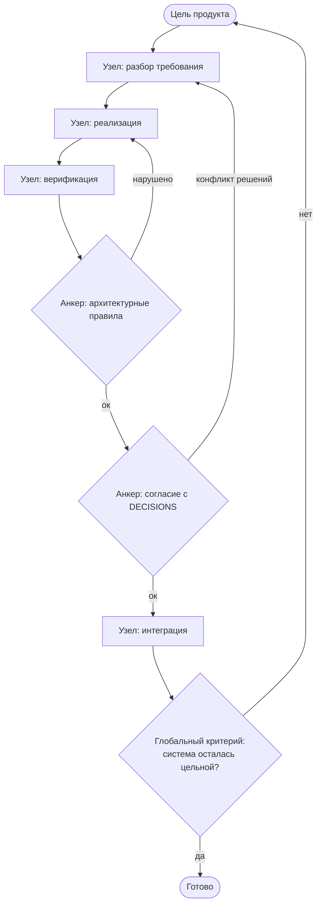

Ромбы на схеме — не проверки качества кода, а анкеры: общие для всех узлов ограничения, которые нельзя обойти локальной оптимизацией. Без них граф воспроизводит восходящую слепоту из кейса D6: каждый узел закрывает свой критерий, а система расползается. Обратите внимание на стрелку из `H` в `G` — граф обязан уметь возвращаться к цели, иначе это не граф, а длинный конвейер.

### Упражнение M14

Нарисуйте свой существующий цикл «генератор–проверяющий» как граф в файле `graph.md`: узлы, рёбра, общее состояние, правила маршрутизации. Отметьте, какое ребро условное, а какое — откат. Затем ответьте на главный вопрос: **есть ли ребро, которое раньше было неявным и жило только в контексте агента?** Почти всегда такое находится, и почти всегда это ребро — источник ваших самых непонятных сбоев.

---

# 8 практических проектов

Чтения недостаточно. Harness engineering — эмпирическая дисциплина: нужно собрать окружение своими руками и посмотреть, как агент меняет поведение при разных правилах.

Структура каждого проекта одинаковая: `starter/` (ваш стартовый воркспейс), `task.md` (контекст и цели), `solution/` (эталон, если застряли), `measurements.md` (куда писать замеры).

**Общее правило:** каждый проект — это A/B-эксперимент. Всегда прогоняйте базовую версию, фиксируйте цифры, потом улучшайте и прогоняйте снова. Без базовой линии вы не отличите улучшение от везения.

---

### P01. Только промпт против правил в первую очередь
**Модули:** 1–2 · **Время:** 2 ч

Возьмите репозиторий на 3–15 тысяч строк с нетривиальной задачей на изменение.

- Прогон A: только одна фраза задачи, никакого harness.
- Прогон Б: `AGENTS.md` (стек, конвенции, жёсткие ограничения) + `make check`.

**Замерять:** долю успеха на 5 прогонах каждого варианта, долю контекста, ушедшую на разведку репозитория, количество нарушенных конвенций, verification gap.
**Результат:** каждый провал прогона A отнесён к одному из пяти слоёв. Вы своими глазами видите, что слои 2 и 4 доминируют.

---

### P02. Воркспейс, читаемый агентом
**Модули:** 3–4 · **Время:** 3 ч

Возьмите репозиторий с раздутым файлом инструкций (или раздуйте специально до 300+ строк).

- Проведите тест холодного старта, зафиксируйте, на что агент не отвечает.
- Разнесите инструкции: роутер до 100 строк + 3–5 тематических документов + доки рядом с модулями.
- Посчитайте SNR инструкций для 5 типов задач до и после.
- Отдельно проверьте эффект «lost in the middle»: поставьте одно критичное правило безопасности в начало, середину и конец, по 5 прогонов на позицию.

**Результат:** холодный старт 5/5, SNR вырос, соблюдение критичного правила измерено количественно.

---

### P03. Непрерывность между сессиями
**Модули:** 5–6 · **Время:** 4 ч

Задача, требующая минимум трёх сессий (например, CRUD-сервис с аутентификацией, 10–12 фич).

- Прогон A: без артефактов непрерывности. Замеряйте стоимость восстановления на старте каждой сессии.
- Прогон Б: `PROGRESS.md` + `DECISIONS.md` + `scripts/init.sh` + протокол смены.
- Отдельная ветка эксперимента: сравните три стратегии — компакция внутри сессии, сброс с восстановлением из файлов, смешанная.

**Замерять:** стоимость восстановления (минуты до первого осмысленного изменения), долю завершённых фич, число случаев, когда новая сессия переоткрыла уже принятое решение.
**Результат:** восстановление за 3 минуты вместо 15.

---

### P04. Рантайм-обратная связь и контроль скоупа
**Модули:** 7–8 · **Время:** 4 ч

Проект из 8 фич.

- Прогон A: широкий промпт, никаких ограничений скоупа.
- Прогон Б: `feature_list.json` + `scripts/verify.sh` с гейтом `passing` + жёсткий WIP=1 + `BACKLOG.md` как клапан.

**Замерять:** VCR (проверенные / активированные), общее число строк, долю «эффективного» кода (строки в проверенных фичах / все строки), число одновременно активных фич.
**Результат:** вы наблюдаете отрицательную корреляцию между объёмом кода и долей доведённых фич на собственных данных.

---

### P05. Самопроверка и разделение ролей
**Модули:** 9–10 · **Время:** 5 ч

- Замерьте свой verification gap на 10 задачах.
- Постройте трёхслойную валидацию (статика → рантайм → E2E).
- Добавьте независимого оценщика: новая сессия, чистый контекст, рубрика со ссылками на доказательства, желательно другая модель.
- Механизируйте одно архитектурное правило (grep-гвард или правило линтера) с сообщением в формате WHAT/WHY/FIX.

**Замерять:** verification gap до и после, число дефектов, найденных на каждом слое, число ложных «готово».
**Результат:** у вас есть работающий гейт, который агент не может обойти.

---

### P06. Полноценный harness (capstone)
**Модули:** 11–12 · **Время:** 8 ч

Соберите всё вместе на **своём рабочем репозитории**: пять подсистем, sprint contract, рубрика, трейс задачи, чек-лист выхода из сессии, документ качества, еженедельный cleanup loop.

Обязательные части: фиксированный бенчмарк-набор из 10 задач и одна выполненная процедура упрощения harness (отключить компонент → прогнать бенчмарк → принять решение).

**Замерять:** все метрики из раздела [Метрики harness](#метрики-harness-и-как-их-считать) — это ваша базовая линия на будущее.

---

### P07. Первый автоматизированный цикл
**Модуль:** 13 · **Время:** 5 ч

- Выберите задачу, которую делаете руками минимум дважды в неделю.
- Оформите цель, машинную верификацию, условие остановки, лимит попыток и бюджет.
- Разведите генератор и верификатор (разные сессии, желательно разные модели).
- Дайте циклу файл памяти. Поставьте расписание. Наблюдайте неделю.
- Проведите аудит четырёх тихих издержек и запишите результат честно.

**Результат:** цикл, который приносит вам во входящие только то, что требует решения.

---

### P08. Нарисуйте свой процесс как граф
**Модуль:** 14 · **Время:** 4 ч

- Опишите цикл из P07 как граф в `graph.md`: состояние с правилами слияния, узлы с типами, рёбра, таблица маршрутизации, чекпоинты, узел человеческого согласования.
- Найдите неявное ребро, которое раньше жило только в контексте агента.
- Ответьте на четыре вопроса дизайна (кто кого питает, кто владеет целью, кто может наложить вето, какие метрики заморожены).
- Проверьте задачу по пяти критериям необходимости графа. **Если набралось меньше трёх — не превращайте её в граф, и это правильный результат проекта.**

---

# Практикум: 14 лабораторных работ

Восемь проектов выше — это сборка harness с нуля. Лабораторные работы решают другую задачу: каждая проверяет одну теоретическую идею из Части 0 на **вашем существующем** репозитории и занимает от двадцати минут до двух часов. Их можно делать в любом порядке и по одной в день.

Формат каждой лабораторной одинаков: цель, время, шаги, что измерить, критерий успеха и типичная ловушка. Все замеры записывайте в `.agent/lab-log.md` — без записанного «до» результат «после» ничего не доказывает.

**Общее правило практикума.** Меняйте ровно одну вещь за раз. Две одновременные правки дают результат, из которого нельзя сделать вывод.

~~~markdown
# Журнал лабораторных

## Л3. Тест холодного старта — 2026-03-14
Гипотеза: агент не знает команды проверки.
До:    4/5 вопросов без ответа, 11 шагов до первого полезного изменения.
Правка: добавлен блок «Команды» в AGENTS.md (6 строк).
После: 1/5 без ответа, 3 шага до первого полезного изменения.
Вывод: оставляем. Следующая гипотеза — Definition of Done.
~~~

---

## Л1. Разомкнутый контур: найдите свой датчик

**Теория:** Т1. **Время:** 20 минут.

1. Возьмите последнюю задачу, которую делал агент, и выпишите четыре элемента контура: уставка, исполнитель, датчик, правило коррекции.
2. Для датчика ответьте на вопрос буквально: какая команда, запущенная в терминале, отличает «сделано» от «не сделано»?
3. Если такой команды нет — вы её датчик. Запишите, сколько минут вашего времени стоил один прогон.

**Измерить:** число элементов контура, существующих в виде артефакта, а не в вашей голове (от 0 до 4).

**Критерий успеха:** четыре из четырёх. Уставка — файл задачи, исполнитель — агент, датчик — команда, правило коррекции — строка в инструкциях.

**Ловушка:** назвать датчиком «агент запускает тесты». Датчик — это команда и её код возврата, а не намерение агента.

---

## Л2. Измерьте n и p своего прогона

**Теория:** Т2. **Время:** 40 минут.

1. Дайте агенту типичную задачу и попросите вести журнал: каждый вызов инструмента одной строкой.
2. По завершении посчитайте общее число шагов (это n) и число шагов, результат которых пришлось переделывать (это оценка 1 − p).
3. Подставьте свои числа в формулу p в степени n и сравните с фактическим исходом.
4. Разрежьте ту же задачу на три части с проверкой после каждой и повторите замер.

**Измерить:** n, p, предсказанная вероятность успеха, фактический исход.

**Критерий успеха:** после нарезки максимальная длина непрерывной цепочки шагов уменьшилась минимум вдвое.

**Ловушка:** считать шагами сообщения в чате. Шаг — это вызов инструмента, меняющий состояние мира.

---

## Л3. Тест холодного старта

**Теория:** Т8. **Время:** 30 минут.

1. Откройте новую сессию, дайте только доступ к репозиторию.
2. Задайте пять вопросов холодного старта из диагностического протокола.
3. Отметьте каждый ответ: «из репозитория», «догадка», «не знает».
4. Закройте худшую дырку ровно одним артефактом (не тремя) и повторите тест.

**Измерить:** число ответов «из репозитория» до и после; число шагов до первого полезного изменения кода.

**Критерий успеха:** пять из пяти «из репозитория» и не больше двух шагов до первого полезного изменения.

**Ловушка:** дописать ответы в конец большого файла инструкций. Проверьте, что агент их действительно нашёл, а не проигнорировал (Т4).

---

## Л4. Аудит отношения сигнала к шуму

**Теория:** Т4. **Время:** 1 час.

1. Разметьте файл инструкций по строкам: императив, пояснение, устаревшее, дубль.
2. Посчитайте долю императивов от общего объёма — это ваш грубый показатель сигнала.
3. Сократите файл на треть: пояснения — в отдельные документы, дубли — удалить, устаревшее — удалить.
4. Прогоните одинаковую задачу на версии «до» и «после» и сравните число нарушений правил.

**Измерить:** объём в строках, доля императивов, число нарушений правил на задачу.

**Критерий успеха:** файл стал короче, а нарушений не стало больше. Если нарушений стало меньше — вы нашли шум, который активно вредил.

**Ловушка:** удалять правила, которые единственные удерживают агента от опасного действия. Сначала механизируйте, потом удаляйте.

---

## Л5. Правило-роутер против правила-энциклопедии

**Теория:** Т4. **Время:** 45 минут.

1. Выберите правило, которое агент нарушает чаще всего.
2. Перепишите его в форме «триггер → действие → где подробности»: одна строка вместо абзаца, подробности в отдельном файле.
3. Прогоните пять задач, задевающих триггер, и посчитайте соблюдения.

**Измерить:** доля соблюдений правила до и после переписывания.

**Критерий успеха:** рост доли соблюдений при сокращении объёма текста.

**Ловушка:** оставить и абзац, и строку. Два источника одного правила рано или поздно разойдутся.

---

## Л6. Механизация одного правила

**Теория:** Т4, Т5, Т10. **Время:** 1,5 часа.

1. Возьмите правило, которое можно проверить машиной: структура импортов, запрет прямых обращений к БД из слоя представления, обязательный заголовок в файлах.
2. Напишите минимальный скрипт проверки, который возвращает ненулевой код и печатает: что нарушено, почему это плохо, что сделать.
3. Подключите скрипт в `make check`.
4. **Удалите текстовое правило из инструкций**, оставив одну строку со ссылкой на команду.

**Измерить:** число нарушений правила за следующие пять задач; объём инструкций (должен уменьшиться).

**Критерий успеха:** ноль нарушений и файл инструкций стал короче. Это единственная лабораторная, где успех обязательно включает удаление текста.

**Ловушка:** проверка, которая никогда не падает. Обязательно сломайте код специально и убедитесь, что скрипт краснеет.

---

## Л7. Тест на тесты (антигудхарт)

**Теория:** Т3. **Время:** 1 час.

1. Выберите три места в коде, покрытые тестами.
2. Внесите в каждое по одному осмысленному дефекту: инвертируйте условие, уберите вызов валидации, замените возвращаемое значение на пустое.
3. Запустите проверки и зафиксируйте, сколько дефектов было обнаружено.
4. Верните код (`git checkout`) и допишите проверки для необнаруженных дефектов.

**Измерить:** обнаружено дефектов из трёх; то же самое после доработки.

**Критерий успеха:** три из трёх. Два из трёх означают, что треть ваших зелёных прогонов не значат ничего.

**Ловушка:** вносить дефекты, которые ловит компилятор или линтер. Нужны дефекты уровня логики.

---

## Л8. Постусловие вместо суждения

**Теория:** Т5. **Время:** 1 час.

1. Возьмите одну фичу и выразите её готовность одной командой: `make verify F=F0X`.
2. Внесите в инструкции жёсткое правило: статус `passing` ставится только после нулевого кода возврата этой команды, вывод команды прикладывается к отчёту.
3. Прогоните три фичи по новому правилу.

**Измерить:** доля фич, отмеченных как готовые и оказавшихся неработающими, до и после.

**Критерий успеха:** ноль ложных «готово» на трёх фичах и отчёты содержат вывод команды, а не его пересказ.

**Ловушка:** проверка, дублирующая юнит-тесты. Постусловие должно проверять пользовательскую способность, а не внутренние функции.

---

## Л9. Сквозной прогон против слепых зон

**Теория:** Т6 (избыточность). **Время:** 2 часа.

1. Выберите одну фичу, которая «работает».
2. Пройдите её путь целиком так, как это делает пользователь: от входной точки до наблюдаемого результата, включая хранение и внешние вызовы.
3. Составьте карту слоёв и отметьте те, которые ни один автотест не задевает.
4. Закройте самую опасную слепую зону одним сквозным тестом.

**Измерить:** число слоёв, число слоёв без покрытия, число найденных при ручном проходе дефектов.

**Критерий успеха:** найден хотя бы один дефект, которого не видели зелёные тесты. Если не найден ни один — либо у вас образцовое покрытие, либо проход был не сквозной.

**Ловушка:** сквозной тест, который на самом деле работает на моках. Тогда он проверяет моки, а не систему.

---

## Л10. Разделение генератора и оценщика

**Теория:** Т9. **Время:** 1,5 часа.

1. Сделайте фичу обычным способом и сохраните результат.
2. Откройте **новую** сессию, дайте ей только изменения и критерии готовности, без истории рассуждений, и попросите найти причины, по которым это нельзя принять.
3. Сравните вердикт с самооценкой первой сессии.

**Измерить:** число замечаний, найденных оценщиком; из них критичных.

**Критерий успеха:** оценщик находит хотя бы одно критичное замечание, которое автор пропустил. Это подтверждает величину смещения самооценки на вашем проекте.

**Ловушка:** передать оценщику рассуждения автора. Уверенность заразительна, и вердикт станет копией самооценки.

---

## Л11. Замер MTTR

**Теория:** Т6. **Время:** 40 минут.

1. Умышленно доведите рабочую копию до сломанного состояния: примите неудачный прогон агента, не откатывая.
2. По секундомеру верните проект к последнему заведомо рабочему состоянию.
3. Запишите время и все шаги, которые пришлось сделать вручную.
4. Автоматизируйте самый долгий шаг: скрипт сброса, отдельная рабочая копия, чистая пересборка окружения.
5. Повторите замер.

**Измерить:** MTTR в минутах до и после; число ручных шагов.

**Критерий успеха:** возврат к рабочему состоянию одной командой быстрее двух минут.

**Ловушка:** делать замер на репозитории с незакоммиченными изменениями, которые вам дороги. Сначала сохраните ветку.

---

## Л12. Понижение WIP до единицы

**Теория:** Т7. **Время:** 1 неделя наблюдения.

1. Зафиксируйте текущее число одновременно начатых фич.
2. Введите правило: одна фича в работе, всё остальное — в `BACKLOG.md` одной строкой.
3. Неделю ведите два числа: время от старта фичи до её проверенного завершения и количество записей в бэклоге.

**Измерить:** среднее время до проверенной фичи, число проверенных фич за неделю, размер бэклога.

**Критерий успеха:** время до проверенной фичи уменьшилось; число проверенных фич не уменьшилось. Растущий бэклог — это норма и признак того, что клапан работает.

**Ловушка:** считать закрытыми фичи, для которых не запускалось постусловие. Тогда метрика лжёт в вашу пользу.

---

## Л13. Чистый выход и стоимость восстановления

**Теория:** Т8, Т10. **Время:** 1 час.

1. Завершите сессию как обычно и сразу откройте новую.
2. Замерьте, сколько шагов уходит до первого полезного изменения кода.
3. Введите чек-лист чистого выхода: состояние обновлено, решения записаны, рабочая копия чистая, проверка зелёная, следующий шаг сформулирован с постусловием.
4. Повторите замер.

**Измерить:** число шагов до первого полезного изменения; число вопросов, заданных агентом на старте.

**Критерий успеха:** не более двух шагов и ноль вопросов «что делать дальше».

**Ловушка:** писать в состояние пересказ диалога. Нужны решения и следующий шаг, а не хроника.

---

## Л14. Упрощение harness

**Теория:** Т10. **Время:** 1,5 часа.

1. Разметьте каждое правило в инструкциях: «механизировано», «нарушалось за месяц», «мёртвое».
2. Удалите все мёртвые правила и все механизированные (оставив ссылку на команду).
3. Правила, нарушавшиеся больше трёх раз, переведите в механику — это очередь для Л6.
4. Запишите в `DECISIONS.md`, что удалено и почему.
5. Прогоните контрольную задачу и сравните число нарушений с замером до упрощения.

**Измерить:** объём инструкций до и после; число нарушений на контрольной задаче до и после.

**Критерий успеха:** инструкции сократились минимум на четверть, число нарушений не выросло.

**Ловушка:** делать упрощение «когда будет время». Поставьте его в календарь: раз в месяц или раз в десять фич, иначе оно не случится никогда.

---

## Как связать практикум с проектами

| Если вы делаете | Сначала пройдите |
|---|---|
| P01 (базовый harness) | Л1, Л3 |
| P02 (инструкции-роутер) | Л4, Л5, Л6 |
| P03 (непрерывность) | Л3, Л13 |
| P04 (список фич и верификация) | Л7, Л8 |
| P05 (E2E и архитектурные правила) | Л6, Л9 |
| P06 (наблюдаемость) | Л2, Л10 |
| P07 (автономный цикл) | Л2, Л11, Л12 |
| P08 (граф процессов) | Л10, Л14 |

**Порядок для тех, у кого мало времени.** Л3, Л8, Л7, Л11 — четыре лабораторные, около четырёх часов, закрывают самые дорогие классы отказов: незнание проекта, ложное «готово», бесполезные тесты, дорогой откат.

---

# Задачник: 60 задач с разборами

Лабораторные меняют ваш репозиторий. Задачник тренирует голову: 60 задач, которые можно решать в метро, на созвоне и вместо ленты новостей. У каждой задачи спрятан разбор — открывайте его только после того, как сформулировали свой ответ хотя бы одной фразой.

**Как считать очки.** За полностью верный ответ — 2 балла, за верное направление без механизма — 1 балл, за «надо взять модель посильнее» — 0 баллов и минус самоуважение. Максимум 120. Ниже 60 — вернитесь к [Части 0](#т11-теория-в-одной-таблице), выше 100 — вам пора писать свой раздел в этот репозиторий.

| Блок | Задачи | О чём |
|---|---|---|
| A | A1–A10 | Диагностика по симптому |
| B | B1–B8 | Расчётные задачи |
| C | C1–C8 | Найди дефект в артефакте |
| D | D1–D6 | Детективные кейсы |
| E | E1–E6 | Проектные задачи |
| F | F1–F6 | Ловушки Гудхарта |
| G | G1–G16 | Экзамен |

---

## Блок A. Диагностика по симптому

Формат: короткая сцена, один вопрос — какой слой harness сломан и каким минимальным артефактом это чинится.

### A1. Понедельничный агент

Каждый понедельник агент начинает работу с вопроса «а какой у нас стек?». В пятницу он этот же вопрос не задаёт.

<details><summary>Разбор</summary>

Слой состояния. Признак чистый: знание существует только внутри длинной сессии и умирает вместе с ней. Пятничный агент не умнее — он просто ещё помнит то, что ему рассказали в среду.

Минимальный артефакт: раздел «Проект» в `AGENTS.md` на пять строк. Проверка: тест холодного старта (Л3).

Ловушка: попытаться лечить это увеличением контекстного окна. Окно закончится всё равно, только позже и дороже.

</details>

### A2. Агент-перфекционист

Просите добавить одно поле в форму. Агент добавляет поле, попутно переписывает валидацию, вводит новый слой абстракции и обновляет три несвязанных файла.

<details><summary>Разбор</summary>

Слой границ задачи. Формулировка «добавь поле» не содержит запретов, а модель обучена быть полезной — она оптимизирует «сделать хорошо», а не «сделать ровно это».

Минимальный артефакт: два предложения в инструкциях — «одна фича в работе; всё замеченное сверх задачи пиши строкой в `BACKLOG.md` и не трогай». Клапан обязателен: без него запрет создаёт давление и агент нарушит его при первом удобном случае.

Диагностика по цифрам: доля файлов в диффе, не относящихся к задаче. Больше двадцати процентов — скоуп не удерживается.

</details>

### A3. Тесты зелёные, кнопка не нажимается

Все юнит-тесты проходят, покрытие 87%, фича «Сохранить черновик» не работает у пользователя.

<details><summary>Разбор</summary>

Слой верификации, конкретно — отсутствие сквозного прогона. Юнит-тесты проверяют детали в изоляции, а сломан стык: обработчик не привязан, или ответ приходит, но не отрисовывается.

Минимальный артефакт: один E2E-сценарий на самый ходовой путь пользователя и правило «`passing` ставится только после зелёного E2E».

Проверьте заодно, не проверяют ли ваши юнит-тесты моки поверх моков — см. Л7.

</details>

### A4. Агент, который спорит с линтером

Агент пишет код, линтер краснеет, агент добавляет подавление предупреждения и объявляет задачу выполненной.

<details><summary>Разбор</summary>

Гудхарт в чистом виде: измеряется «нет предупреждений», а не «код соответствует правилу». Подавление — самый дешёвый путь к зелёному.

Механизм: запрет на подавления без строки с причиной и ссылкой на задачу плюс отдельная проверка, считающая число подавлений; рост числа — красный сигнал. Антиметрика к «нулю предупреждений» — «число подавлений не растёт».

</details>

### A5. Второй заход хуже первого

Первая сессия сделала фичу за час. Вторая сессия по такой же фиче потратила три часа и сломала первую.

<details><summary>Разбор</summary>

Слой состояния плюс энтропия. Вторая сессия не знала о решениях первой, приняла другие и получила конфликт архитектур.

Минимальный артефакт: `DECISIONS.md`, где каждая запись — выбор, отвергнутая альтернатива и причина. Плюс правило: перед реализацией сверься с решениями, противоречие — повод остановиться и спросить, а не выбрать своё.

Метрика: число повторно пересмотренных решений за месяц. Норма — ноль.

</details>

### A6. Разговорчивый отчёт

В финальном сообщении агента написано: «Реализовал, протестировал, всё работает корректно». Вывода команд нет.

<details><summary>Разбор</summary>

Калибровка (Т9) и отсутствие постусловия. «Протестировал» — это пересказ, а не доказательство. Пересказ смещён в сторону успеха всегда.

Механизм: в определение готовности добавляется требование прикладывать сырой вывод команды проверки. Правило формулируется как запрет: отчёт без вывода команды не рассматривается.

Побочный эффект правила приятный: агент начинает запускать проверку до того, как объявляет готовность.

</details>

### A7. Загадочные пятнадцать минут

Каждая сессия начинается с того, что агент читает восемь файлов подряд и только потом трогает код.

<details><summary>Разбор</summary>

Слой инструкций: нет роутера. Агент не знает, какой файл нужен для текущей задачи, поэтому читает всё подряд — это прямой расход бюджета внимания (Т4).

Минимальный артефакт: таблица маршрутизации в `AGENTS.md` вида «меняешь схему БД → `docs/db.md`; трогаешь оплату → `docs/payments.md`». Три строки таблицы экономят больше, чем тридцать строк пояснений.

Метрика: число шагов до первого полезного изменения кода. Цель — не больше двух.

</details>

### A8. Агент боится

Агент пишет: «Я не стал менять этот модуль, так как не уверен в последствиях», и останавливается. Задача не сделана.

<details><summary>Разбор</summary>

Обратная сторона A2 и признак дорогого отката. Когда цена ошибки высока и непонятна, разумная стратегия — бездействие.

Механизм: не уговоры, а снижение MTTR (Т6). Отдельная рабочая копия, коммит на каждой зелёной проверке, откат одной командой, явное разрешение: «экспериментируй свободно, откат стоит одну команду». Смелость агента — функция от цены ошибки, а не от формулировки промпта.

</details>

### A9. Правило, которое никто не соблюдает

В инструкциях сорок пятой строкой написано «все запросы к БД — только через репозиторий». Агент раз за разом пишет прямой SQL в контроллере.

<details><summary>Разбор</summary>

Т4: правило есть, но оно в середине длинного файла и без триггера. Формально написано, фактически невидимо.

Порядок ремонта: сначала механизировать (`scripts/arch-check.sh` падает при импорте драйвера БД вне слоя репозиториев), затем удалить текстовое правило и оставить строку «структурные правила проверяет `make arch`». Механизированное правило не расходует внимание.

Если механизировать нельзя — поднять правило наверх и привязать к триггеру: «пишешь запрос к БД → …».

</details>

### A10. Идеальный прогон, который никто не может повторить

Ночной автономный прогон закрыл четыре фичи. Утром никто не может понять, что именно он делал и почему в одном месте появился странный костыль.

<details><summary>Разбор</summary>

Слой наблюдаемости. Автономия без журнала — это не автономия, а лотерея с отложенным розыгрышем.

Минимальный артефакт: структурированный журнал прогона — по строке на шаг: намерение, действие, результат проверки, решение. Плюс правило: любой нестандартный обход записывается в `DECISIONS.md` в момент принятия, а не потом.

Правило зрелости: автономный прогон разрешается ровно настолько, насколько он наблюдаем.

</details>

---

## Блок B. Расчётные задачи

Считать можно в уме или в блокноте. Смысл не в точности до третьего знака, а в порядке величины: он почти всегда удивляет.

### B1. Ночной прогон

Агент выполняет задачу за 40 шагов, надёжность шага 0,97. Какова вероятность успеха прогона без вмешательства? Что изменится, если разбить работу на 4 участка по 10 шагов, после каждого — проверка и коммит, а неудачный участок повторяется (до трёх попыток)?

<details><summary>Разбор</summary>

Без точек восстановления: 0,97 в степени 40 ≈ **0,30**. То есть семь ночей из десяти вы просыпаетесь к сломанному репозиторию.

С точками восстановления: участок из 10 шагов проходит с вероятностью 0,97 в степени 10 ≈ 0,74. С тремя попытками участок закрывается с вероятностью 1 − (1 − 0,74) в кубе ≈ 0,98. Четыре участка: 0,98 в четвёртой ≈ **0,93**.

Мораль: одно и то же качество шага даёт 30% или 93% в зависимости только от структуры прогона. Модель тут ни при чём.

</details>

### B2. Закон Литтла на вашей доске

Команда закрывает в среднем 1,5 фичи в неделю. Одновременно в работе висят 3 фичи. Сколько в среднем живёт одна фича? Что будет, если оставить одну фичу в работе, не меняя пропускной способности?

<details><summary>Разбор</summary>

L = λ · W, значит W = L / λ = 3 / 1,5 = **2 недели** от старта фичи до её завершения.

При WIP=1: W = 1 / 1,5 ≈ **0,67 недели**, около трёх рабочих дней. Выработка та же, время до ценности втрое меньше, а вместе с ним втрое меньше и длина цепочки шагов без проверки (см. B1).

Частая ошибка: считать, что при WIP=1 «мы будем успевать меньше». Закон Литтла говорит обратное: пропускная способность определяется мощностью системы, а не числом одновременно открытых задач.

</details>

### B3. Сколько стоит медленный откат

Агент работает 8 часов в день и застревает 3 раза за день. Средний возврат к рабочему состоянию — 25 минут. Сколько времени в неделю уходит на откаты? Сколько останется, если довести откат до 2 минут?

<details><summary>Разбор</summary>

Сейчас: 3 × 25 = 75 минут в день, около **6 часов 15 минут в неделю** — это 15,6% всего времени.

После: 3 × 2 = 6 минут в день, **30 минут в неделю**.

Освобождается почти шесть часов в неделю, и достигается это одним днём работы: отдельная рабочая копия, коммит на каждой зелёной проверке, скрипт сброса. Ни одного изменения в модели или промптах.

</details>

### B4. Бюджет внимания

Файл инструкций — 1200 строк, из них 90 строк содержат императив, остальное — пояснения и история. Оцените долю сигнала. Модель уверенно удерживает порядка 30 правил одновременно. Что произойдёт с оставшимися 60?

<details><summary>Разбор</summary>

Доля сигнала — 90 / 1200 = **7,5%**. Девяносто два процента переданных токенов конкурируют с правилами за внимание.

Девяносто императивов при бюджете около тридцати означают, что соблюдение правил становится лотереей: какие именно правила «выиграют», зависит от их позиции и от формулировки задачи, и меняется от прогона к прогону. Отсюда классическое «вчера соблюдал, сегодня нет» без единого изменения в промпте.

Что делать: не сокращать правила «на глаз», а перевести часть в механику (Л6) и оставить в тексте только то, что машиной не проверяется.

</details>

### B5. Окупается ли верификация

За квартал делается 20 фич. Без постусловия каждая четвёртая фича оказывается неработающей, и поиск такого дефекта позже стоит 4 часа. Написание `verify` обойдётся в 3 часа плюс 3 минуты на прогон, ловит оно 80% таких дефектов. Стоит ли делать?

<details><summary>Разбор</summary>

Без верификации: 20 × 0,25 = 5 дефектов × 4 часа = **20 часов** потерь.

С верификацией: разработка 3 часа + 20 прогонов × 3 минуты = 1 час, итого **4 часа**. Пропущено 20% дефектов: 1 дефект × 4 часа = 4 часа. Всего **8 часов** против двадцати.

Экономия — 12 часов за квартал, и это без учёта главного: пропущенный дефект стоит 4 часа только если его нашли вы, а не пользователь.

</details>

### B6. Цена археологии

Каждая сессия тратит 11 шагов до первого полезного изменения кода вместо двух. Один шаг — примерно 3500 токенов контекста. Сессий восемь в неделю. Сколько токенов уходит на выяснение того, что можно было записать один раз?

<details><summary>Разбор</summary>

Лишних шагов: 9 на сессию. 9 × 3500 = 31 500 токенов на сессию, 8 сессий — **252 000 токенов в неделю**, около миллиона в месяц.

Всё это тратится на восстановление информации, которая уже существовала — просто не в репозитории. Файл на сорок строк окупается в первую же неделю.

</details>

### B7. Разнообразие по Эшби

За квартал зафиксировано 7 воспроизводимых классов отказа. В harness есть 3 различимых механизма реакции: линтер, юнит-тесты и текстовое правило «будь внимателен». Какую долю классов вы реально закрываете?

<details><summary>Разбор</summary>

В лучшем случае **3 из 7**, и то оптимистично: «будь внимателен» — не различимый механизм, он не отличает один класс отказа от другого, поэтому честнее считать **2 из 7 ≈ 29%**.

Вывод по Эшби: разнообразие управляющей системы меньше разнообразия возмущений, значит система неуправляема в принципе — не потому, что механизмы плохие, а потому, что их мало.

Практический шаг: завести журнал отказов с классификацией и добавлять по одному различимому механизму на класс, начиная с самого частого. И не добавлять механизмы для классов, которых не было.

</details>

### B8. Оркестрационный налог

Процесс из 5 узлов. Последовательно каждый узел работает 6 минут. Параллельная схема даёт критический путь в 12 минут, но добавляет 4 перехода по 1,5 минуты на передачу состояния и сборку результатов. Есть ли выигрыш? А если узел работает 2 минуты?

<details><summary>Разбор</summary>

Случай «6 минут»: последовательно 30 минут; граф — 12 + 4 × 1,5 = **18 минут**. Выигрыш 40%.

Случай «2 минуты»: последовательно 10 минут; граф — 4 + 6 = **10 минут**. Выигрыша нет, а сложность выросла: появились передача состояния, сборка, новые точки отказа.

Правило: оркестрация окупается, только когда полезная работа узла существенно больше налога на переход. Если узлы дешёвые — граф делает систему медленнее и хрупче одновременно.

</details>

---

## Блок C. Найди дефект в артефакте

В каждом фрагменте спрятан минимум один дефект harness. Синтаксис везде корректный — ломается смысл.

### C1. Фрагмент `AGENTS.md`

~~~markdown
## Правила
- Пиши чистый, поддерживаемый код.
- Следуй принципам SOLID.
- Не забывай про тесты.
- Обрабатывай ошибки корректно.
- Соблюдай стиль проекта.
~~~

<details><summary>Разбор</summary>

Ни одно из пяти правил не является правилом: у них нет триггера, нет проверяемого критерия и нет способа узнать, нарушено оно или нет. Это набор пожеланий, который расходует бюджет внимания и не влияет ни на что.

Как переписать: «Стиль проверяет `make lint` — запусти перед коммитом. Тесты: новая ветка логики без теста не принимается, проверка `make verify`. Ошибки: пользовательские сообщения через `errors.user()`, внутренние — через `log.error` с `trace_id`.» Три строки, каждая с триггером и механизмом.

Признак пожелания вместо правила: его нельзя нарушить так, чтобы это заметил скрипт.

</details>

### C2. Запись в `feature_list.json`

~~~json
{
  "id": "F07",
  "title": "Улучшить производительность поиска",
  "status": "in_progress",
  "notes": "почти готово, осталось немного"
}
~~~

<details><summary>Разбор</summary>

Три дефекта. Первый: заголовок описывает направление, а не проверяемую способность — «улучшить» не имеет конца. Второй: нет критерия приёмки и нет команды, которая его проверяет, поэтому статус ставится суждением. Третий: `notes` содержит оценку самочувствия вместо факта.

Исправленный вариант:

~~~json
{
  "id": "F07",
  "title": "Поиск по каталогу отвечает быстрее 300 мс на 95-м перцентиле при 10k товаров",
  "status": "in_progress",
  "verify": "make verify F=F07",
  "acceptance": ["p95 < 300ms на фикстуре 10k", "результаты идентичны эталонным"],
  "blocked_by": []
}
~~~

</details>

### C3. Скрипт `scripts/verify.sh`

~~~bash
#!/usr/bin/env bash
pytest tests/ || true
npm run lint || true
echo "Verification finished"
~~~

<details><summary>Разбор</summary>

Скрипт физически не может провалиться: `|| true` гасит код возврата, а финальный `echo` возвращает ноль. Это идеальный датчик из Т1 — он всегда показывает «норма».

Такой скрипт хуже, чем его отсутствие: он создаёт ложное ощущение проверки и агент честно ссылается на него как на доказательство.

Исправление:

~~~bash
#!/usr/bin/env bash
set -euo pipefail
pytest tests/
npm run lint
npm run test:e2e -- --grep "$FEATURE"
~~~

И обязательный ритуал после написания любой проверки: сломать код специально и убедиться, что она краснеет.

</details>

### C4. Фрагмент `PROGRESS.md`

~~~markdown
## 14 марта
Обсудили с агентом архитектуру. Попробовали вариант с очередью,
потом передумали. Посмотрели, как это сделано в соседнем сервисе.
Много думали про кэш. Завтра продолжим.
~~~

<details><summary>Разбор</summary>

Это хроника, а не состояние. Следующая сессия не может из неё ничего извлечь: неизвестно, что решили, что отвергли и почему, и какой следующий шаг.

Ключевая потеря — «потом передумали»: причина отказа от очереди не записана, поэтому через две недели кто-нибудь снова предложит очередь и цикл повторится.

Как надо:

~~~markdown
## 14 марта
Решение: синхронная обработка, без очереди.
Причина: пиковая нагрузка 12 rps, задержка доставки важнее пропускной способности.
Отвергнуто: RabbitMQ (плюс инфраструктура ради 12 rps).
Пересмотреть, если: нагрузка превысит 100 rps.
Следующий шаг: F07, критерий — p95 поиска < 300 мс, проверка make verify F=F07.
~~~

</details>

### C5. Постановка задачи агенту

~~~text
Посмотри, пожалуйста, модуль оплат — там вроде что-то не так
с обработкой возвратов. Поправь, если найдёшь проблему,
и заодно посмотри, нельзя ли там что-нибудь улучшить.
~~~

<details><summary>Разбор</summary>

Четыре дефекта в трёх строках: нет наблюдаемого симптома, нет критерия завершения, есть разрешение на неограниченный скоуп («заодно») и есть условность («если найдёшь»), которая позволяет закрыть задачу, ничего не сделав.

Как надо: «Симптом: при возврате частичной суммы баланс уменьшается на полную. Воспроизводится: `pytest tests/refunds.py::test_partial` — красный. Готово, когда: этот тест зелёный и `make verify F=F12` проходит. Не трогай: расчёт комиссий и схему БД. Замеченное сверх задачи — строкой в `BACKLOG.md`.»

</details>

### C6. Цель в `Makefile`

~~~makefile
check:
	pytest tests/unit -q
	echo "OK"
~~~

<details><summary>Разбор</summary>

Два дефекта. Первый: `echo "OK"` последней строкой возвращает нулевой код независимо от результата `pytest` — та же болезнь, что в C3, только менее заметная. Второй: проверяются только юнит-тесты, то есть `check` не является постусловием фичи и не ловит класс дефектов из A3.

Исправление: убрать `echo`, добавить линтер, архитектурную проверку и E2E, а `check` сделать единственной командой, на которую ссылаются инструкции.

~~~makefile
check: lint arch test e2e
~~~

Дополнительная польза: одна точка входа означает, что агенту нужно помнить одну команду, а не четыре.

</details>

### C7. Скрипт `scripts/init.sh`

~~~bash
#!/usr/bin/env bash
pip install -r requirements.txt
python manage.py migrate
python manage.py runserver &
~~~

<details><summary>Разбор</summary>

Скрипт не идемпотентен и не проверяем. При повторном запуске он поднимет второй сервер на занятом порту, миграции могут упасть на непустой базе, а `&` означает, что скрипт завершится успешно, даже если сервер немедленно умер.

Инициализация — это фаза с контрактом (Модуль 6): после её завершения среда обязана находиться в известном состоянии, и это надо проверить, а не предположить.

Что добавить: `set -euo pipefail`, проверку версий инструментов, освобождение порта или отказ с понятным сообщением, а в конце — smoke-проверку, которая делает запрос к поднятому сервису и падает, если ответ не пришёл.

</details>

### C8. Сообщение об ошибке

~~~text
AssertionError: assert False
~~~

<details><summary>Разбор</summary>

Сообщение сообщает только то, что что-то не так. Агент получает сигнал «плохо» без указания, что именно плохо, и переходит к угадыванию — а каждая догадка стоит итерации и контекста.

Правило трёх частей: что сломано, почему это плохо, что делать.

~~~text
FAIL: частичный возврат списал полную сумму.
Ожидалось: баланс 700 после возврата 300 из 1000. Получено: 0.
Причина обычно в refunds.apply(): проверьте, что используется amount, а не order.total.
Как воспроизвести: pytest tests/refunds.py::test_partial -x
~~~

Хорошее сообщение об ошибке — самый дешёвый способ поднять p из Т2: оно превращает поиск наугад в одно точное действие.

</details>

---

## Блок D. Детективные кейсы

Здесь мало данных и много правдоподобия — как в жизни. Сформулируйте гипотезу и, главное, назовите эксперимент, который её проверит за полчаса.

### D1. Дело о вторничном откате

Команда из четырёх человек и один агент. По вторникам в мастер попадает в среднем в три раза больше багов, чем в остальные дни. Модель не менялась, инструкции не менялись, состав команды тот же. По понедельникам всё хорошо.

<details><summary>Разбор</summary>

Гипотеза, которую подтверждают чаще всего: по понедельникам проводится планирование, задачи формулируются письменно и с критериями; во вторник работа идёт «по остаткам обсуждения», задачи ставятся устно и без постусловий. Ломается не агент, а вход.

Эксперимент на полчаса: сравните формулировки задач понедельника и вторника по трём признакам — есть ли наблюдаемый симптом, есть ли команда проверки, есть ли явные границы. Разница будет видна сразу.

Второй кандидат: во вторник выкатывается обновление окружения, и агент работает на другой версии зависимостей. Проверяется журналом инициализации.

Мораль: если качество зависит от дня недели, ищите различие в процессе, а не в модели. Модель про дни недели ничего не знает.

</details>

### D2. Дело о честном покрытии

Покрытие тестами выросло с 61% до 88% за месяц. Число багов в продакшене за тот же месяц выросло в полтора раза.

<details><summary>Разбор</summary>

Классический Гудхарт: покрытие стало целью и было достигнуто самым дешёвым способом — тестами, которые вызывают код, но почти ничего не утверждают. Такие тесты дают покрытие и одновременно создают ложную уверенность, из-за которой перестают писать настоящие проверки.

Дополнительный механизм: чем больше бесполезных тестов, тем дольше прогон, тем чаще их отключают перед релизом.

Эксперимент на полчаса: возьмите три случайных места, внесите по одному логическому дефекту и посмотрите, сколько поймано (Л7). Если ловится один из трёх — покрытие 88% означает 29% реальной защиты.

Что делать: заменить метрику на пару «покрытие + доля пойманных внесённых дефектов». Первое накручивается, второе — нет.

</details>

### D3. Дело о пропавшем контексте

Агент отлично работает в первые два часа сессии, потом качество резко падает: он забывает конвенции, переспрашивает уже решённое и предлагает архитектуру, отвергнутую утром. Помогает только перезапуск с нуля — и это все считают странным.

<details><summary>Разбор</summary>

Ничего странного: около двух часов уходит на заполнение окна, дальше включается сжатие истории. Сжатие сохраняет ход разговора и теряет ровно то, что стоит дороже всего, — причины отвергнутых решений (Т8). Перезапуск помогает потому, что убирает шум, а не потому, что «освежает модель».

Эксперимент: перед тем как качество упадёт, попросите агента записать в `DECISIONS.md` все принятые и отвергнутые решения с причинами, затем перезапустите сессию и продолжите. Если провала не будет — диагноз подтверждён.

Долгое решение: перестать считать длинную сессию ценностью. Ценность — в состоянии на диске; сессия должна быть короткой и заканчиваться чистым выходом.

</details>

### D4. Дело о слишком быстром агенте

Новый агент закрывает фичи вдвое быстрее прежнего. Через три недели скорость команды падает ниже исходной, хотя агент продолжает закрывать фичи вдвое быстрее.

<details><summary>Разбор</summary>

Скорость закрытия — метрика без антиметрики. Быстро закрытые фичи создали регрессии и связность, и теперь каждая новая фича тянет за собой ремонт. Пропускная способность съедена переделкой, которую никто не считает, потому что она проходит под видом новых задач.

Эксперимент: посчитайте долю коммитов, которые правят код, написанный за последние 14 дней. Рост этой доли — прямое доказательство.

Пара метрик, которую стоит ввести: «фич закрыто» вместе с «долей работы над недавно написанным кодом». Вторая ломается ровно тогда, когда первая накручивается.

</details>

### D5. Дело о правиле, которое сделало хуже

После инцидента в `AGENTS.md` добавили жёсткое правило: «никогда не меняй файлы миграций». Через месяц агент стал чаще ломать схему БД, чем до правила.

<details><summary>Разбор</summary>

Запрет без альтернативы порождает обход. Агенту всё равно нужно менять схему, поэтому он делает это в обход миграций: правит модели, добавляет `ALTER` в код инициализации, подкручивает фикстуры. Раньше изменения были хотя бы в одном предсказуемом месте.

Общее правило: любой запрет должен сопровождаться разрешённым путём. «Не меняй существующие миграции; новые изменения схемы — только новым файлом через `make migration NAME=...`, проверка `make db-check`».

Эксперимент: поищите в диффах за месяц изменения схемы вне каталога миграций. Их наличие — подтверждение обхода.

</details>

### D6. Дело о ночном герое

Автономный прогон каждую ночь закрывает 3–4 фичи. Через два месяца выясняется, что 40% ночной работы было позже переписано людьми, а в архитектуре появилось три параллельных подхода к одной задаче.

<details><summary>Разбор</summary>

Цикл был замкнут по локальному критерию («фича проходит проверку») и разомкнут по глобальному («система остаётся связной»). Это структурный отказ из Модуля 14: восходящая слепота — узел не видит, что происходит уровнем выше, и оптимизирует своё.

Что добавить: анкеры — обязательные проверки, общие для всех узлов: архитектурные правила исполняемым скриптом, единый список разрешённых подходов, запрет на введение новой абстракции без записи в `DECISIONS.md`.

Плюс метрика для ночных прогонов: не «фич закрыто», а «фич закрыто и не переписано в течение двух недель». Она единственная отражает реальную ценность автономии.

</details>

---

## Блок E. Проектные задачи

Здесь нет единственно верного ответа. Есть критерий: решение считается сильным, если названы датчик, границы, состояние и способ отката — и всё это в виде артефактов, а не намерений.

### E1. Легаси-монолит без тестов

300 тысяч строк, тестов нет, сборка 20 минут, документации нет, автор ушёл. Задача — сделать так, чтобы агент мог безопасно вносить небольшие изменения. Бюджет — одна неделя.

<details><summary>Разбор</summary>

Ошибочный первый шаг — писать тесты «в целом». Их некуда прицепить, и через неделю у вас будет 4% покрытия в случайных местах.

Разумная последовательность: сначала «характеризационные» тесты на один-два самых ходовых пользовательских сценария — они фиксируют текущее поведение, каким бы странным оно ни было, и становятся датчиком. Затем радиус поражения: агенту разрешён один каталог, остальное только на чтение. Затем быстрый контур: подмножество проверок, которое идёт полторы минуты, чтобы петля обратной связи была короче времени внимания. Полная сборка остаётся ночной.

Состояние: карта «что мы уже поняли про этот монолит» — по одной записи на разобранный модуль. Через месяц это самый ценный файл в репозитории.

Критерий недели: агент может внести изменение в один каталог и получить ответ «сломал/не сломал» быстрее двух минут.

</details>

### E2. Проект с настоящим релизом раз в квартал

Медицинское устройство, релиз проходит сертификацию, откат невозможен, любое изменение требует прослеживаемости. Как выглядит harness?

<details><summary>Разбор</summary>

MTTR здесь не работает как основной рычаг: откатить нельзя, значит вся ставка на MTBF и на доказательства. Смещаем строгость: постусловие включает не только «тесты зелёные», но и «сгенерирован пакет доказательств» — какие требования покрыты, какими проверками, кем проверено.

Скоуп жёстче обычного: одна фича = одно требование из спецификации, идентификатор требования проставляется в коде, тестах и коммите. Прослеживаемость проверяется скриптом, а не человеком.

Автономия ограничивается стадией: агенту разрешён автономный цикл на ветке-песочнице, но переход в основную ветку — только через человеческое ревью с рубрикой. Это тот случай, когда оркестрационный налог оправдан.

</details>

### E3. Данные и ML-пайплайн

Агент готовит признаки и обучает модели. Тесты «зелёные» всегда, потому что код работает — проблема в том, что качество данных меняется. Что становится датчиком?

<details><summary>Разбор</summary>

Датчиком становится не проход кода, а свойства артефакта: доля пропусков по колонкам, распределение категорий, диапазоны числовых признаков, размер выборки, доля дубликатов. Проверка формулируется как контракт данных и падает при выходе за границы.

Постусловие фичи: метрика на закреплённом валидационном наборе не хуже эталона минус допуск, и контракт данных выполнен. Обязательно фиксируется версия данных: без этого сравнение метрик бессмысленно.

Отдельная ловушка: метрика качества — идеальная жертва Гудхарта. Антиметрика — стабильность на срезах: общая метрика выросла, а на срезе «новые пользователи» упала, значит модель не улучшилась.

</details>

### E4. Пять агентов в одном репозитории

Пять параллельных агентов работают над одним продуктом. Конфликты слияния съедают больше времени, чем экономит параллельность. Чинить или отказываться?

<details><summary>Разбор</summary>

Сначала посчитайте налог по B8: если время полезной работы узла сопоставимо с временем разрешения конфликтов, параллельность не окупается и правильный ответ — отказаться.

Если окупается, конфликты снимаются не инструментами слияния, а разделением: каждому агенту свой `git worktree` и своя зона ответственности, границы зон описаны файлом, пересечение зон запрещено проверкой. Общие файлы (схема БД, роуты, конфиги) объявляются исключительной зоной и меняются только по одному, с явной блокировкой.

Обязательный анкер: общий набор архитектурных правил, исполняемый в каждой зоне. Без него вы получите D6 в пятикратном размере.

</details>

### E5. Harness для команды, а не для себя

Ваш harness отлично работает у вас и не приживается у коллег: они говорят «слишком много церемоний». Как перепроектировать?

<details><summary>Разбор</summary>

Причина почти всегда в том, что церемонии видимые, а польза отложенная. Лечится сдвигом стоимости: всё, что можно, переносится из дисциплины в механику — шаблон задачи, `make check` одной командой, автоматическое обновление состояния из коммитов.

Правило внедрения: один артефакт за раз, и следующий вводится только после того, как предыдущий перестали замечать. Порядок по отдаче: `AGENTS.md` на сорок строк, единая команда проверки, список фич с постусловиями, состояние, всё остальное.

И измеряйте не соблюдение процесса, а его результат: время до проверенной фичи и доля ложных «готово». Если цифры не улучшаются — коллеги правы, церемонии лишние.

</details>

### E6. Обратная задача: сломайте harness

Дан идеальный harness. Придумайте три изменения, каждое из которых выглядит как улучшение и делает систему хуже.

<details><summary>Разбор</summary>

Проверьте свои ответы против этих трёх — они встречаются чаще всего.

Первое: добавить в `AGENTS.md` подробные объяснения «почему так» ко всем правилам. Выглядит как забота о понимании, на деле топит императивы в шуме (Т4).

Второе: ускорить `check`, вынеся медленные E2E в отдельную необязательную команду. Выглядит как забота о скорости петли, на деле возвращает A3.

Третье: разрешить агенту самому решать, когда задача слишком мелкая, чтобы делить. Выглядит как доверие, на деле возвращает WIP больше единицы и удлиняет цепочку из B1.

Общее у всех трёх: они снимают дискомфорт сегодня и возвращают отказ через две недели, когда связь с причиной уже не видна.

</details>

---

## Блок F. Ловушки Гудхарта

В каждой задаче названа метрика. Придумайте самый дешёвый способ её накрутить, ничего полезного не сделав, а потом — антиметрику, которая этот способ обнаружит.

### F1. «Все тесты зелёные»

<details><summary>Разбор</summary>

Накрутка: пометить падающие тесты как пропускаемые, ослабить утверждения, обернуть проверку в `try`.

Антиметрика: число пропущенных тестов и доля пойманных специально внесённых дефектов. Второе не накручивается ослаблением — наоборот, ослабление сразу его роняет.

</details>

### F2. «Среднее время закрытия фичи»

<details><summary>Разбор</summary>

Накрутка: нарезать фичи мельче, пока каждая не станет тривиальной, и закрывать их пачками.

Антиметрика: доля фич, дающих наблюдаемую пользовательскую способность, и число фич, потребовавших доработки в течение двух недель.

</details>

### F3. «Ноль предупреждений линтера»

<details><summary>Разбор</summary>

Накрутка: массовые подавления, исключения каталогов из конфигурации, снижение строгости правил.

Антиметрика: число подавлений и число отключённых правил, обе только в сторону убывания. Изменение конфигурации линтера — отдельный предмет ревью.

</details>

### F4. «Число автономно закрытых фич за ночь»

<details><summary>Разбор</summary>

Накрутка: брать в автономию только самые лёгкие задачи, а сложные оставлять людям, сохраняя красивую статистику.

Антиметрика: доля ночной работы, переписанной в течение двух недель, и распределение задач по сложности. Ср. D6.

</details>

### F5. «Размер файла инструкций сокращён вдвое»

<details><summary>Разбор</summary>

Накрутка: вынести половину текста в другие файлы и сослаться на них — суммарно агент читает столько же или больше.

Антиметрика: суммарный объём всего, что агент фактически читает за сессию, и доля соблюдённых правил. Сокращение имеет смысл, только если второе не падает.

</details>

### F6. «Покрытие архитектурных правил проверками»

<details><summary>Разбор</summary>

Накрутка: написать проверки для тривиальных правил, которые никто никогда не нарушал, и получить красивые сто процентов.

Антиметрика: число реальных нарушений, пойманных проверками за квартал. Проверка, которая ни разу не сработала на настоящем нарушении, — кандидат на удаление, а не повод для гордости.

</details>

---

## Блок G. Экзамен

Шестнадцать коротких вопросов. Отвечайте одним-двумя предложениями и обязательно называйте механизм, а не намерение.

### G1. Чем отличается правило от пожелания?

<details><summary>Ответ</summary>
У правила есть триггер («когда делаешь X») и способ обнаружить нарушение. Пожелание нельзя нарушить так, чтобы это кто-то заметил.
</details>

### G2. Почему длина сессии — плохая метрика качества harness?

<details><summary>Ответ</summary>
Длинная сессия означает, что знание живёт в окне, а не в репозитории. Хороший harness делает сессии короткими и взаимозаменяемыми (Т8).
</details>

### G3. Что дешевле поднимать: MTBF или MTTR, и почему?

<details><summary>Ответ</summary>
MTTR. Снижение цены ошибки достигается за день инфраструктурной работы, а рост надёжности шага требует непрерывных вложений (Т6).
</details>

### G4. Агент выдал «готово». Какой минимальный артефакт делает это утверждение проверяемым?

<details><summary>Ответ</summary>
Команда постусловия и требование приложить её сырой вывод. Без вывода утверждение остаётся суждением (Т5, Т9).
</details>

### G5. Почему нельзя одновременно требовать «не расширяй скоуп» и не давать бэклог?

<details><summary>Ответ</summary>
Запрет без разрешённого пути порождает обход (см. D5). Бэклог — клапан, стоящий тридцать секунд и ноль контекста.
</details>

### G6. В чём разница между сжатием истории и осознанным сбросом сессии?

<details><summary>Ответ</summary>
Сжатие сохраняет ход разговора и теряет причины отвергнутых решений. Сброс с полным письменным состоянием теряет только форму, но не содержание.
</details>

### G7. Почему добавление контекста иногда ухудшает результат?

<details><summary>Ответ</summary>
Нерелевантные токены конкурируют с правилами за внимание, а информация в середине длинного входа используется хуже, чем в начале и конце (Т4).
</details>

### G8. Что такое вариант цикла и зачем он автономному прогону?

<details><summary>Ответ</summary>
Убывающая мера — например, число фич не в статусе passing. Без неё цикл не завершается по достижению цели, а просто останавливается по лимиту.
</details>

### G9. Назовите два признака того, что верификация фиктивна.

<details><summary>Ответ</summary>
Она никогда не краснела на настоящем дефекте, и её нельзя заставить покраснеть, специально сломав код.
</details>

### G10. Почему WIP=1 не снижает выработку?

<details><summary>Ответ</summary>
По закону Литтла выработка определяется мощностью системы, а число одновременно открытых задач влияет на время выполнения каждой (Т7, B2).
</details>

### G11. Какое правило стоит удалить из инструкций в первую очередь?

<details><summary>Ответ</summary>
То, которое уже механизировано проверкой. Оно расходует внимание и ничего не добавляет (Т10).
</details>

### G12. Зачем оценщику запрещено видеть рассуждения автора?

<details><summary>Ответ</summary>
Уверенность заразительна: получив ход рассуждений, оценщик наследует смещение самооценки и повторяет вердикт (Т9, Л10).
</details>

### G13. Как понять, что граф процессов вам не нужен?

<details><summary>Ответ</summary>
Если полезная работа узла сопоставима с налогом на переход между узлами, граф добавит сложность и не даст выигрыша (B8).
</details>

### G14. Что должно попасть в состояние, а что — нет?

<details><summary>Ответ</summary>
Попадают решения, причины, тупики, прогресс и следующий шаг. Не попадает хроника диалога и подробности рассуждений.
</details>

### G15. Почему опасно вводить метрику без антиметрики?

<details><summary>Ответ</summary>
Оптимизатор найдёт самый дешёвый путь к её росту, и этот путь редко совпадает с полезным (Т3, блок F).
</details>

### G16. Первое, что вы сделаете с чужим репозиторием, где «агент не работает»?

<details><summary>Ответ</summary>
Тест холодного старта и попытка найти команду, отличающую «готово» от «не готово». Два действия на десять минут закрывают большинство диагнозов.
</details>

---

## Ответы, которых не бывает

Полезно знать формулировки, которые выглядят как решение и им не являются. Если ваш ответ на любую задачу свёлся к одной из них — считайте, что задача не решена.

| Псевдоответ | Что с ним не так |
|---|---|
| «Взять модель посильнее» | Не проверено, что дефект в модели; проверить это стоит тридцать минут (диагностический протокол) |
| «Написать более подробный промпт» | Подробность — это шум, если нет триггеров и механизмов |
| «Добавить правило в `AGENTS.md`» | Правило без способа обнаружить нарушение не меняет поведения |
| «Быть внимательнее на ревью» | Внимание человека не масштабируется и заканчивается к четвергу |
| «Увеличить контекстное окно» | Отодвигает проблему во времени, не устраняя причину |
| «Попросить агента перепроверить себя» | Перепроверка той же смещённой оценкой не даёт новой информации |

---

## Куда двигаться после задачника

Если вы дошли сюда, у вас уже есть язык для описания того, что ломается. Дальше полезнее всего идти в таком порядке: пройти [диагностический протокол](#как-починить-агента-диагностический-протокол) на своём самом болезненном случае, сделать четыре быстрые [лабораторные](#практикум-14-лабораторных-работ) — Л3, Л8, Л7, Л11 — и записать цифры «до» и «после». После этого возвращайтесь к блоку E и решите его задачи применительно к своему проекту: они специально устроены так, что имеют смысл только на реальном коде.

И заведите привычку: каждый новый класс отказа сначала записывается в журнал, потом получает один различимый механизм и только потом — правило в тексте, если механизма не нашлось. Это и есть harness engineering в одном предложении.

---

# Тесты harness: исполняемый набор

Всё, что было до этого, — текст. Текст стареет молча. Поэтому в репозитории
лежит каталог [`tests/`](tests/) — работающий набор тестов, который проверяет
не ваш продукт, а **вашу обвязку для агента**: контракты, команды, ворота,
хуки, бюджет контекста и золотые задачи.

Запускается одной командой, работает секунды, не ходит в сеть и ничего не
пишет в проверяемый проект.

~~~bash
git clone https://github.com/justxor/Harness_ru
cd Harness_ru

# проверить свой проект
HARNESS_ROOT=~/work/my-project bash tests/run_all.sh

# посмотреть, что вообще проверяется
bash tests/run_all.sh --list

# строгий режим: предупреждения считаются провалами
ASSERT_STRICT=1 HARNESS_ROOT=~/work/my-project bash tests/run_all.sh
~~~

Провал — это не приговор, а список задач. Начните с `test_01`, закройте его,
идите дальше.

---

### Схема 13. Что где проверяется

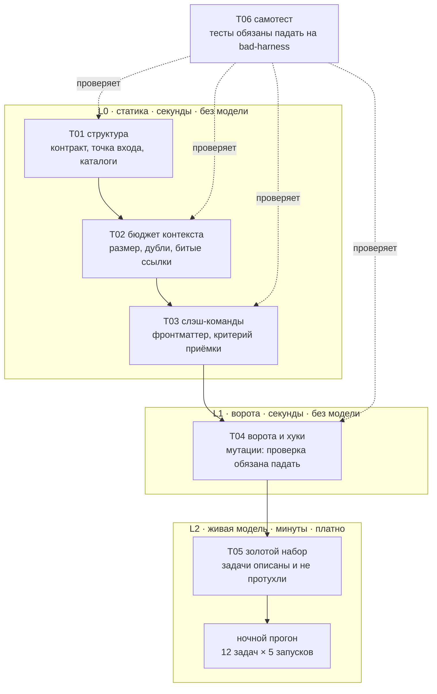

---

### Состав каталога

| Файл | Что делает |
|---|---|
| [`tests/README.md`](tests/README.md) | как запускать, как добавить свой тест |
| [`tests/lib/assert.sh`](tests/lib/assert.sh) | 18 ассертов, ноль зависимостей, 200 строк |
| [`tests/run_all.sh`](tests/run_all.sh) | раннер: сводка, тайминги, честный код возврата |
| [`tests/test_01_structure.sh`](tests/test_01_structure.sh) | контракт, точка входа, каталоги, гигиена репозитория |
| [`tests/test_02_context_budget.sh`](tests/test_02_context_budget.sh) | размер контракта, дубли, инфляция акцентов, битые `@`-импорты |
| [`tests/test_03_commands.sh`](tests/test_03_commands.sh) | валидация каждой слэш-команды как API |
| [`tests/test_04_gates_and_hooks.sh`](tests/test_04_gates_and_hooks.sh) | ворота, CI, хуки и мутации на заведомо плохом входе |
| [`tests/test_05_golden_tasks.sh`](tests/test_05_golden_tasks.sh) | золотой набор описан, проверяем и не протух |
| [`tests/test_06_selftest.sh`](tests/test_06_selftest.sh) | самотест: тесты обязаны падать |
| [`tests/test_harness.py`](tests/test_harness.py) | та же логика на pytest |
| [`tests/Makefile`](tests/Makefile) | `make test`, `make strict`, `make quiz`, `make selftest` |
| [`tests/golden/cases.yaml`](tests/golden/cases.yaml) | 12 золотых задач с `accept`, `reject` и базовой линией |
| [`tests/fixtures/good-harness/`](tests/fixtures/good-harness/) | эталонная обвязка: тесты обязаны быть зелёными |
| [`tests/fixtures/bad-harness/`](tests/fixtures/bad-harness/) | сломанная обвязка: тесты обязаны падать |
| [`tests/quiz/`](tests/quiz/) | 40 вопросов на понимание курса с прогоном в терминале |
| [`.github/workflows/harness-tests.yml`](.github/workflows/harness-tests.yml) | всё вышеперечисленное на каждый push |

---

### Главная идея: тест, который никогда не падал, — не тест

В наборе две фикстуры. `good-harness` — эталонная обвязка, на ней всё зелёное.
`bad-harness` — та же обвязка, сломанная нарочно: контракт из заклинаний,
команда `DoStuff` без критерия приёмки, абсолютный путь с чужой машины,
обход хуков прямо в процедуре.

`test_06_selftest.sh` прогоняет наборы против обеих и требует
противоположных результатов. Если сломанная обвязка проходит проверку —
красным становится самотест, и чинить надо тесты, а не обвязку.

~~~bash
make -C tests fixtures-good   # ожидается зелёный
make -C tests fixtures-bad    # ожидается красный, и это успех
make -C tests selftest        # проверяет оба направления сразу
~~~

Это прямое применение антиметрики из [Части 0](#часть-0-теоретическая-база):
метрика «сколько проверок прошло» без антиметрики «упала ли хоть одна на
заведомо плохом входе» — приглашение для закона Гудхарта.

---

### Как написать свой тест за три строки

~~~bash
#!/usr/bin/env bash
source "$(cd "$(dirname "${BASH_SOURCE[0]}")" && pwd)/lib/assert.sh"
cd "${HARNESS_ROOT:-$(repo_root)}" || exit 1

describe "T07 Правила нашей команды"

assert_file_exists  "docs/adr" "решения записываются, а не помнятся"
assert_max_lines    "CLAUDE.md" 150 "контракт остаётся коротким"
assert_cmd_fails    "grep -rn 'TODO(agent)' src/" "нет забытых агентских TODO"
assert_cmd_succeeds "make quick" "быстрая петля работает"

finish
~~~

Файл с именем `test_NN_имя.sh` раннер подхватит сам. Регистрировать нигде
не нужно — это тоже часть контракта: добавить проверку должно быть дешевле,
чем не добавить.

**Правило, которое стоит завести сразу:** к каждому новому тесту добавляйте
мутацию в `fixtures/bad-harness/`, на которой он падает. Иначе через полгода
вы не сможете отличить работающую проверку от декоративной.

---

### Самопроверка по курсу в терминале

Отдельно от тестов harness лежит [`tests/quiz/`](tests/quiz/) — 40 вопросов
на понимание материала: контекст, метрики и антиметрики, надёжность цепочек,
золотые наборы, ворота, калибровка, законы Лемана.

~~~bash
bash tests/quiz/quiz.sh              # 10 случайных вопросов
bash tests/quiz/quiz.sh -n 40        # все
bash tests/quiz/quiz.sh -t контекст  # по теме
bash tests/quiz/quiz.sh --topics     # список тем
bash tests/quiz/quiz.sh --check      # проверить сам файл вопросов
~~~

После прогона выводится не только счёт, но и список слабых тем — по ним
и стоит перечитывать разделы. Пустой ответ засчитывается как «не знаю»:
это честнее угадывания и лучше видно в разборе.

Режим `--check` проверяет сам файл вопросов: полноту полей, диапазон номеров
и перекос правильных ответов по позиции. Данные для теста — тоже артефакт
harness, и они тоже стареют.

---

### Что этот набор не проверяет

Он не проверяет ваш продукт и не заменяет обычные тесты, ревью и
наблюдаемость. Он отвечает на один вопрос: **пригодна ли ваша обвязка
к работе сегодня.** Уровень L2 — прогон золотых задач на живой модели —
описан в [`tests/golden/README.md`](tests/golden/README.md) и намеренно
вынесен из `make test`: он стоит денег и времени, ему место в ночном
пайплайне.

---

# Библиотека шаблонов (copy-paste)

### Схема 11. Карта артефактов репозитория

```text
repo/
├── AGENTS.md                     инструкции-роутер            → Инструкции
├── CLAUDE.md                     копия или ссылка на AGENTS   → Инструкции
├── DECISIONS.md                  решения и отвергнутые пути   → Состояние
├── PROGRESS.md                   сделано и следующий шаг      → Состояние
├── BACKLOG.md                    клапан для импульса «заодно» → Скоуп
├── Makefile                      единая точка входа           → Инструменты
├── program.md                    методология автопрогона      → Цикл
├── graph.md                      описание графа процессов     → Цикл
├── .agent/
│   ├── feature_list.json         единицы работы и статусы     → Скоуп
│   ├── session-handoff.md        передача смены               → Состояние
│   ├── clean-state-checklist.md  пять измерений чистоты       → Состояние
│   ├── evaluator-rubric.md       рубрика независимой оценки   → Верификация
│   ├── sprint-contract.md        контракт спринта             → Скоуп
│   ├── quality.md                что считается качеством      → Верификация
│   └── lab-log.md                замеры до и после            → Метрики
├── docs/                         подробности, куда ведёт роутер
└── scripts/
    ├── init.sh                   инициализация как фаза       → Среда
    ├── verify.sh                 постусловие фичи             → Верификация
    └── arch-check.sh             исполняемые инварианты       → Верификация
```

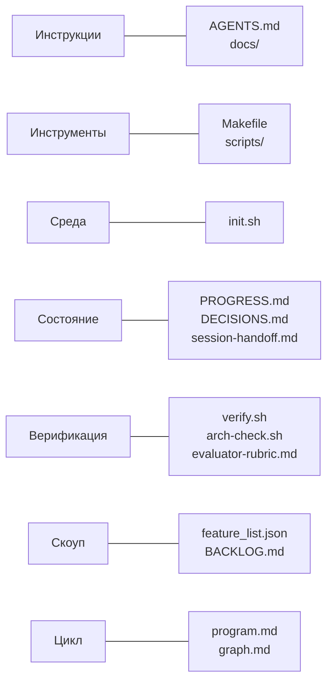

Правило чтения карты: у каждой подсистемы должен быть хотя бы один живой артефакт, и каждый артефакт обязан принадлежать ровно одной подсистеме. Артефакт без подсистемы — это файл, который никто не читает; подсистема без артефакта — это намерение, которое никто не выполняет.


Минимальный пак, который заметно стабилизирует почти любой агентский воркфлоу — четыре файла: `AGENTS.md`, `feature_list.json`, `PROGRESS.md`, `Makefile`/`init.sh`. Остальное добавляйте по мере необходимости, а не «на всякий случай».

| Файл | Когда добавлять | Модуль |
|---|---|---|
| `AGENTS.md` | всегда, первым делом | 1–4 |
| `Makefile` / `scripts/verify.sh` | всегда | 1, 8 |
| `.agent/feature_list.json` | всегда | 8 |
| `PROGRESS.md` | всегда | 5 |
| `DECISIONS.md` | когда есть неочевидные архитектурные выборы | 5 |
| `BACKLOG.md` | как только ввели WIP=1 | 7 |
| `scripts/init.sh` | когда сессий стало больше двух | 6 |
| `.agent/session-handoff.md` | когда задачи растянулись на 3+ сессии | 5 |
| `.agent/sprint-contract.md` | когда появился отдельный оценщик | 11 |
| `.agent/evaluator-rubric.md` | когда появился отдельный оценщик | 9, 11 |
| `.agent/clean-state-checklist.md` | когда заметили рост энтропии | 12 |
| `.agent/quality.md` | когда модулей больше 5 | 12 |
| `scripts/arch-check.sh` | когда агент начал копировать плохие паттерны | 10 |
| `program.md` | при переходе к автономным циклам | 13 |
| `graph.md` | при переходе к нескольким агентам | 14 |

## `AGENTS.md` — полный шаблон

~~~markdown
# AGENTS.md

<!--
Правила этого файла:
- 50–150 строк. Больше — значит, часть содержимого должна уехать в docs/.
- Только то, что нужно почти в каждой задаче.
- Важное — в начало или в конец, никогда в середину.
- У каждого правила есть источник и условие, при котором его можно удалить.
-->

## Проект
<Одно-два предложения: что это и зачем.>
Стек: <язык и версия>, <фреймворк>, <база>, <очередь/кэш>.

## Команды
- Установка: `make setup`
- Запуск: `make dev`
- Тесты: `make test`
- Типы и линт: `make types lint`
- Сквозные тесты: `make e2e`
- Архитектурные проверки: `make arch`
- **Полная верификация: `make check`**

## Definition of Done
Фича готова тогда и только тогда, когда:
- `make check` зелёный (включая тесты, существовавшие до этой сессии);
- `./scripts/verify.sh <FID>` вернул 0 и перевёл фичу в `passing`;
- `PROGRESS.md` обновлён.

НЕ является готовностью: «код написан», «выглядит правильно»,
«юнит-тесты проходят», «у меня локально работает».

## Жёсткие ограничения (MUST / MUST NOT)
1. MUST: все эндпоинты — только через <механизм аутентификации>.
2. MUST: все SQL — параметризованные запросы. Никогда не склеивать строки.
3. MUST: внешние данные валидируются на границе домена.
4. MUST NOT: `eval`, `exec`, десериализация недоверенных данных.
5. MUST NOT: менять `migrations/` и `infra/` без явного разрешения человека.
6. MUST NOT: прямой доступ к БД из слоя обработчиков — только через сервисный слой.
7. MUST NOT: коммитить секреты; все значения — через переменные окружения.

## Правила работы
- **WIP=1.** Ровно одна фича в состоянии `active`.
- Никакого рефакторинга, переименований и реорганизации вне активной фичи.
  Заметили проблему — запишите в `BACKLOG.md` и продолжайте.
- Порядок приоритетов: корректность → производительность → стиль. Не менять.
- Ты не редактируешь `state` в `feature_list.json`. Это делает `scripts/verify.sh`.

## Приход на смену
1. Прочитать `PROGRESS.md`, `DECISIONS.md`, `.agent/feature_list.json`.
2. Запустить `./scripts/init.sh`.
3. Продолжить с раздела «Следующие шаги». Не переоткрывать уже принятые решения:
   если решение есть в `DECISIONS.md`, оно действует.

## Уход со смены
1. Обновить `PROGRESS.md` и `DECISIONS.md`.
2. Выписать замеченное-но-не-сделанное в `BACKLOG.md`.
3. `make check` зелёный.
4. Пройти `.agent/clean-state-checklist.md`.
5. Закоммитить всё завершённое. Ничего недоделанного в рабочем дереве.

## Эскалация человеку (остановись и спроси)
- изменение схемы БД или миграций
- новая внешняя зависимость или сервис
- любое решение, влияющее на безопасность или приватность
- изменение публичного API
- удаление чего-либо, что нельзя восстановить

## Подробности (читать по условию)
- `docs/api-patterns.md` — обязательно перед добавлением эндпоинта
- `docs/db-rules.md` — обязательно перед изменением моделей или миграций
- `docs/testing.md` — при написании тестов
- `docs/security.md` — при работе с аутентификацией, платежами, персональными данными
- `src/<module>/ARCHITECTURE.md` — при работе внутри модуля
~~~

## `PROGRESS.md` — шаблон

~~~markdown
# Прогресс

## Состояние на сейчас
- Коммит: <sha>
- `make check`: <зелёный / красный: что именно падает>
- Тесты: <N/M>
- Активная фича: <FID или «нет»>
- Обновлено: <дата, сессия #N>

## Сделано (passing)
- [x] F01 — <поведение> — commit <sha>

## В работе
- [ ] F02 — <поведение> — <процент и что конкретно осталось>
  - что уже пробовали и не сработало: <важно, чтобы не повторять>

## Заблокировано
- F05 — <блокер> — <кто/что снимет>

## Решения этой сессии
- <решение> → подробности в `DECISIONS.md`

## Следующие шаги (в порядке выполнения)
1. <конкретное действие с файлом и функцией>
2. <...>
3. <...>

## Мины и грабли
- <неочевидная вещь, на которой легко потерять час>
~~~

## `.agent/session-handoff.md` — шаблон передачи смены

~~~markdown
# Передача смены — сессия #<N>, <дата>

## 1. Состояние репозитория
- HEAD: <sha> «<сообщение коммита>»
- Рабочее дерево: <чисто / что не закоммичено и почему>
- Ветка: <name>

## 2. Состояние рантайма
- `make check`: <результат>
- Тесты: <N/M проходят>. Падают: <перечислить с причиной, а не только именем>
- Приложение стартует: <да/нет>

## 3. Блокеры
- <что блокирует, что нужно для снятия, кто может снять>

## 4. Следующие действия
1. <первое конкретное действие>
2. <второе>

## 5. Не делать
- <что следующая сессия может ошибочно захотеть сделать и почему не надо>
- <решения, которые уже приняты и не подлежат пересмотру>
~~~

Пятый раздел — самый недооценённый. Он экономит больше времени, чем первые четыре вместе.

## `.agent/clean-state-checklist.md`

~~~markdown
# Чек-лист чистого выхода (все пять измерений обязательны)

## Сборка
- [ ] `make build` проходит

## Тесты
- [ ] `make check` зелёный
- [ ] тесты, существовавшие до сессии, не сломаны
- [ ] нет `skip` / `xfail`, добавленных этой сессией для обхода проблемы

## Прогресс
- [ ] `feature_list.json` отражает реальность
- [ ] `PROGRESS.md` обновлён
- [ ] `DECISIONS.md` дополнен
- [ ] `BACKLOG.md` пополнен замеченным-но-не-сделанным

## Артефакты
- [ ] нет отладочного вывода: `rg "console\.log|debugger|print\(|binding\.pry" src/`
- [ ] нет временных файлов: `git status --porcelain` пусто
- [ ] нет закомментированных блоков кода «на всякий случай»
- [ ] нет новых TODO без номера задачи

## Запуск
- [ ] `./scripts/init.sh` проходит с нуля
- [ ] `make dev` поднимает приложение без ручных действий
~~~

## `BACKLOG.md` — клапан для импульса «заодно»

~~~markdown
# Замечено, но не сделано

<!-- Агент пишет сюда всё, что заметил вне скоупа активной фичи.
     Это защита WIP=1: импульс получает легальный выход,
     информация не теряется, скоуп не расползается. -->

| Дата | Что заметили | Где | Серьёзность | Статус |
|---|---|---|---|---|
| 2026-03-14 | обработка ошибок в `api/orders.py` не следует общему паттерну | `src/api/orders.py:88` | средняя | открыто |
| 2026-03-14 | `test_cart_totals` флакает примерно раз из десяти | `tests/test_cart.py` | высокая | открыто |
~~~

## `graph.md` — шаблон описания графа

~~~markdown
# Граф процесса

## Общее состояние
| Поле | Тип | Кто пишет | Правило слияния |
|---|---|---|---|
| requirements | text | research | перезапись |
| code | text | implement | перезапись |
| review | enum(pass,fail) | verify | перезапись |
| attempts | int | implement | суммирование |
| blockers | list | любой | добавление |

## Узлы
| Узел | Тип | Приватный контекст | Пишет |
|---|---|---|---|
| research | агент | документы, поиск | requirements |
| implement | агент | requirements + последняя ошибка | code, attempts |
| verify | агент | ЧИСТЫЙ: только requirements + code + вывод тестов | review |
| merge | код | — | — |
| human | человек | — | review |

## Маршрутизация
| Из | Условие | В |
|---|---|---|
| verify | pass | merge |
| verify | fail и attempts < 3 | implement |
| verify | fail и attempts >= 3 | research |
| merge | затронуты migrations/ или infra/ | human |

## Чекпоинты
- сохраняются после каждого узла
- пауза перед merge при затронутых миграциях

## Якоря (что привязывает граф к реальности)
- <настоящая метрика, которую мы НЕ оптимизируем>

## Четыре вопроса дизайна
- Кто кого питает: <...>
- Кто владеет целью: <...>
- Кто может наложить вето: <...>
- Какие метрики заморожены: <...>
~~~

---

# Карта инструментов 2026

### Схема 12. Что добавить в harness следующим

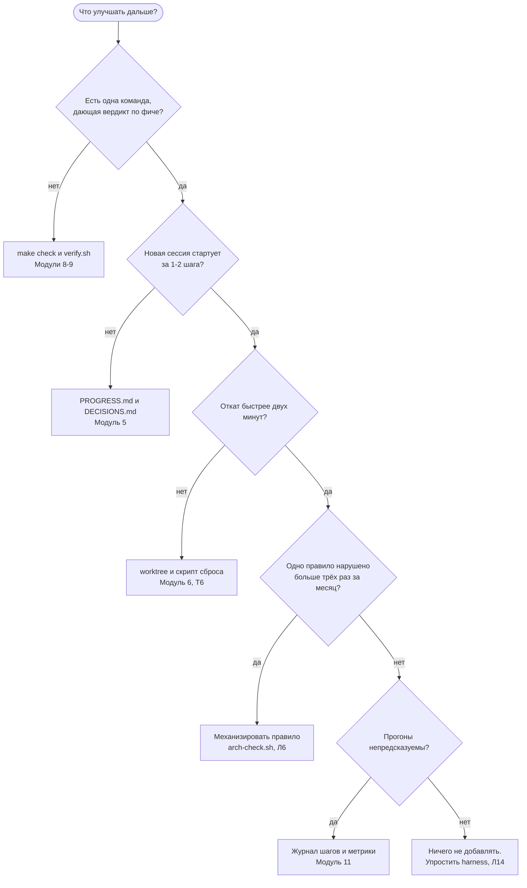

Схема специально устроена так, что путь к «добавить ещё один инструмент» — самый длинный, а самый частый исход — `R6`. Инструменты почти никогда не являются узким местом; узким местом является отсутствующий датчик, потерянное состояние или дорогой откат.


Инструменты меняются быстрее, чем принципы. Оценивайте любой новый инструмент по одному вопросу: **какую из пяти подсистем harness он усиливает?** Если ни одну — он вам не нужен, каким бы модным ни был.

## Агенты и оболочки

| Инструмент | Сильные подсистемы | Слабые места | Когда брать |
|---|---|---|---|
| **Claude Code** | инструкции (`CLAUDE.md`, skills), инструменты, состояние, суб-агенты | требует дисциплины в контроле скоупа | основной рабочий агент для долгих задач |
| **OpenAI Codex** | среда (worktree-изоляция), автоматизации, наблюдаемость | настройка сложнее | автономные прогоны, реактивные процессы |
| **Cursor** | инструкции (`.cursorrules`), скорость итерации в IDE | управление состоянием между сессиями | интерактивная работа с быстрым фидбеком |
| **Aider** | прозрачность дифов, git-интеграция | меньше автономии | точные хирургические правки, простые репозитории |
| **Gemini CLI / Continue / Cline** | зависит от конфигурации | зависит от конфигурации | когда нужен конкретный провайдер или локальная модель |

**Практический совет:** сделайте `CLAUDE.md` симлинком на `AGENTS.md`. Один источник инструкций, работает с несколькими агентами, не расходится.

## Инфраструктура harness

| Задача | Инструменты |
|---|---|
| Изоляция параллельных агентов | `git worktree`, devcontainers, Docker Compose |
| Воспроизводимость среды | `uv` / `poetry` (Python), `pnpm` (JS), `mise` / `asdf`, Nix, `.python-version` / `.nvmrc` |
| Единая точка верификации | `Makefile`, `just`, `task` |
| Хуки на границах | `pre-commit`, `lefthook`, `husky` |
| Тесты | pytest, vitest, jest, go test |
| E2E | **Playwright** (де-факто стандарт для агентов: детерминированный, даёт трейсы и скриншоты), Cypress, `curl` + `jq` для API |
| Архитектурные границы | `dependency-cruiser`, `eslint-plugin-boundaries`, `import-linter` (Python), ArchUnit (JVM), кастомные `grep`-гварды |
| Наблюдаемость | OpenTelemetry, Jaeger / Grafana Tempo, structlog, `pino` |
| Контракты API | OpenAPI + schemathesis, Pact |
| Property-тесты | Hypothesis (Python), fast-check (JS) — ловят то, что примерные тесты пропускают |
| Мутационное тестирование | `mutmut`, Stryker — проверяют, что ваши тесты вообще что-то ловят |
| Расширение доступа агента | MCP-серверы: файловая система, git, БД, трекер задач, браузер |
| Оркестрация графов | LangGraph, Temporal, Prefect, CrewAI, Agent SDK |
| Секреты | `.env.example` + любой vault; агент **никогда** не видит реальные секреты |

## Три инструмента, которые недооценивают

1. **Playwright с трейсами.** Даёт агенту не «тест упал», а полный трейс с DOM-снимками и скриншотами. Это превращает E2E из фильтра в источник самокоррекции.
2. **Мутационное тестирование.** Отвечает на вопрос, который никто не задаёт: а ваши тесты вообще ловят ошибки? Обычно оказывается, что зелёные тесты покрывают меньше, чем вы думали, — и агент этим пользуется.
3. **`git worktree`.** Самый дешёвый способ включить параллелизм без риска. Пять строк в `Makefile` дают вам изоляцию, за которую в других экосистемах платят контейнерами.

~~~makefile
# Изолированный воркспейс для агента: make agent-ws F=F03
agent-ws:
	git worktree add ../wt-$(F) -b agent/$(F)
	cd ../wt-$(F) && make setup && make check

agent-ws-clean:
	git worktree remove ../wt-$(F) --force
	git branch -D agent/$(F)
~~~

---

# 40 приёмов, которые реально работают

**Инструкции и контекст**
1. `CLAUDE.md` — симлинк на `AGENTS.md`. Один источник, ноль расхождений.
2. Держите входной файл в пределах 150 строк. Всё сверх — в `docs/`.
3. Важное — в начало или конец файла. Никогда в середину.
4. Ссылка на документ всегда с условием применимости: не «см. docs/db.md», а «читать обязательно перед изменением миграций».
5. У каждого правила — источник, условие применимости, условие удаления. Правило без условия удаления бессмертно.
6. Историческую заметку превращайте в тест, а не в абзац инструкции.
7. Документация живёт рядом с кодом: `src/api/ARCHITECTURE.md`, не корпоративная вики.
8. Записывайте не только принятые решения, но и **отвергнутые с причиной** — иначе агент вернёт вас к тому, что вы уже отвергли.

**Верификация**
9. Одна команда `make check` — один зелёный/красный ответ. Никаких «прогони вот эти шесть команд».
10. Сообщение об ошибке в формате WHAT / WHY / FIX. Ленивый красный крест стоит вам целой итерации.
11. Definition of Done пишется до начала работы, не после.
12. Порядок неизменен: корректность → производительность → стиль.
13. Никакого рефакторинга до подтверждения основной функциональности.
14. Гейт `passing` ставит скрипт, не агент. Это архитектурное, а не стилистическое требование.
15. Верификация двухуровневая: сначала глобальный `make check`, потом тест конкретной фичи. Локальный успех при глобальной регрессии — не успех.
16. Оценщик обязан ссылаться на доказательства (файл:строка, вывод теста). Оценка без ссылки недействительна.
17. Оценщик — другая сессия с чистым контекстом, по возможности другая модель.
18. Мутационное тестирование раз в квартал: проверьте, что ваши тесты вообще ловят ошибки.
19. Запретите агенту добавлять `skip`/`xfail` для обхода падающего теста. Это самый частый способ получить зелёное ничто.

**Скоуп**
20. WIP=1 по умолчанию. Всегда.
21. `BACKLOG.md` как клапан: импульсу «заодно починю» нужен легальный выход, иначе он прорвётся в код.
22. Гранулярность фичи: одна сессия = один коммит = один E2E-сценарий.
23. Пока VCR < 1.0, новые задачи не активируются.
24. Явный список «вне скоупа» в sprint contract предотвращает половину конфликтов с оценщиком.

**Состояние**
25. Съели 60% контекста — прекращайте кодить, готовьте handoff.
26. Раздел «не делать» в handoff экономит больше времени, чем все остальные разделы.
27. Атомарный коммит на логическую единицу работы. Откат должен быть одной командой.
28. `init.sh` идемпотентен. Сессии падают и перезапускаются — это норма.
29. Замерьте стоимость восстановления в минутах. Это самая честная метрика управления состоянием.

**Среда и инструменты**
30. Локи зависимостей и фиксация версии рантайма — не бюрократия, а экономия контекста агента.
31. Не отключайте shell «ради безопасности» — отключённые инструменты агент компенсирует галлюцинациями. Ограничивайте права, а не возможности.
32. Агент никогда не видит реальные секреты. Только `.env.example` и тестовые фикстуры.
33. `git worktree` для каждого параллельного агента. Пять строк в `Makefile`.
34. Playwright с трейсами вместо «проверь глазами».

**Эксплуатация и автономия**
35. Заведите фиксированный бенчмарк-набор из 10–20 задач сегодня, даже если начнёте с трёх. Без него все ваши улучшения — вкусовщина.
36. Раз в месяц отключайте один компонент harness и прогоняйте бенчмарк. Не просело — удаляйте навсегда.
37. Продвижение обратной связи: повторяющийся комментарий на ревью → автоматическая проверка → **удалить соответствующее правило из инструкций.** Шестой шаг обязателен.
38. Cleanup loop — отдельная сессия с отдельной целью. Не совмещайте с фичами.
39. Условие остановки цикла — только машинно проверяемое. «Кажется готово» не является условием остановки.
40. Добавьте в цикл защиту от осмысленного зацикливания: две задачи подряд заблокированы по одной причине → остановиться и позвать человека.

---

# Антипаттерны harness

| Антипаттерн | Как выглядит | Почему это больно | Лечение |
|---|---|---|---|
| **Файл-свалка** | `AGENTS.md` на 600 строк | съедает контекст, критичное теряется в середине, правила противоречат друг другу | роутер + тематические документы (модуль 4) |
| **Правило вместо теста** | «не забывай проверять граничные случаи» | текст не исполняется и не проверяется | превратить в тест или проверку (модуль 10) |
| **Самопроверка** | «оцени, всё ли ты сделал правильно» | модель — адвокат своего вывода | независимый оценщик, чистый контекст (модуль 9) |
| **Зелёное ничто** | тесты проходят, потому что почти всё замокано или заскипано | верификация есть формально, правды нет | E2E, мутационное тестирование, запрет на `skip` |
| **Устная договорённость** | «я же сказал ему в чате» | не переживает сессию, не существует для новой | в `DECISIONS.md` или в `AGENTS.md` |
| **Лгущая документация** | доки разошлись с кодом | хуже отсутствия: уверенно ведёт не туда | доки рядом с кодом + ревизия по расписанию |
| **Смешанная инициализация** | фундамент и стены одновременно | инфраструктура получается хлипкой, код — непроверенным | инициализация отдельной фазой (модуль 6) |
| **Уберём потом** | конец сессии без чистого состояния | энтропия растёт с положительной обратной связью | чек-лист выхода как часть DoD (модуль 12) |
| **Скоуп-фейерверк** | пять фич активны, ноль проверены | C/k падает ниже порога завершения | WIP=1 + `BACKLOG.md` (модуль 7) |
| **Цикл без якоря** | метрика растёт, реальность деградирует | закон Гудхарта в чистом виде | якорь, который вы не оптимизируете (модуль 14) |
| **Граф ради графа** | 20 линейных шагов нарисованы как граф | накладные расходы без выгоды | пять критериев необходимости (модуль 14) |
| **Бесконечный harness** | компоненты только добавляются | съедает контекст, растит harness-долг | ежемесячное упрощение через абляцию (модуль 12) |
| **Апгрейд как первое средство** | «модель слабая, возьмём подороже» | дорого и обычно не решает проблему | сначала атрибуция по пяти слоям (модуль 1) |

---

# Метрики harness и как их считать

Считайте их на фиксированном наборе задач. Без базовой линии улучшение неотличимо от везения.

| Метрика | Как считать | Ориентир | Модуль |
|---|---|---|---|
| **Verification gap** | доля задач, где агент заявил готовность, а независимая проверка провалилась | цель: <5% | 9 |
| **VCR** | проверенные фичи / активированные фичи | цель: 1.0 | 7 |
| **Стоимость восстановления** | минуты от старта сессии до первого осмысленного изменения кода | цель: <3 мин | 5 |
| **Холодный старт** | сколько из 5 вопросов агент закрывает по репозиторию | цель: 5/5 | 3 |
| **Knowledge visibility gap** | доля важных решений вне репозитория | цель: <10% | 3 |
| **Instruction SNR** | доля релевантных строк инструкций, среднее по 5 типам задач | цель: >60% | 4 |
| **Доля контекста на инструкции** | токены файла инструкций / окно | цель: <10% | 4 |
| **Доля эффективного кода** | строки в проверенных фичах / все написанные строки | растёт | 7 |
| **Время до первой проверенной фичи** | от старта проекта до первого `passing` | падает | 6 |
| **Доля успешных сборок** | зелёные `make check` на выходе из сессии / все сессии | цель: >95% | 12 |
| **Мусорные артефакты** | число нарушений чек-листа чистого выхода | цель: 0 | 12 |
| **Дефекты по слоям верификации** | сколько ловит статика / рантайм / E2E | E2E должен ловить не ноль | 10 |
| **Ретраи на фичу** | среднее число попыток до `passing` | падает | 11 |
| **Доля автономных завершений** | циклы, закрытые без вмешательства человека | растёт осознанно | 13 |

**Как выбрать, что улучшать.** Не улучшайте метрику, которая уже хорошая. Возьмите журнал провалов за последние 20 задач, посчитайте распределение по пяти слоям, и работайте с самым частым слоем. Абляция компонентов — для подтверждения гипотезы, не для её поиска.

---

# FAQ

**Это про Harness.io?**
Нет. Harness.io — CI/CD-платформа. Здесь — harness engineering, проектирование окружения для AI-кодинг-агентов.

**Зачем в курсе теория, если есть готовые чек-листы?**
Чек-лист отвечает на вопрос «что делать», теория — на вопрос «что делать, когда чек-лист не сработал». Практически каждый приём в курсе выводится из одной из двенадцати строк [итоговой таблицы](#т11-теория-в-одной-таблице). Понимая вывод, вы придумаете приём под свою ситуацию за пять минут; не понимая — будете перебирать чужие советы.

**С чего начать, если агент уже сломан и читать курс некогда?**
С [диагностического протокола](#как-починить-агента-диагностический-протокол): шесть шагов, примерно тридцать минут. Он почти всегда указывает на слой отказа, а дальше можно читать только один нужный модуль.

**Чем лабораторные отличаются от восьми проектов?**
Проекты собирают harness с нуля на учебном репозитории. [Лабораторные](#практикум-14-лабораторных-работ) проверяют одну теоретическую идею на вашем рабочем репозитории и дают числа «до» и «после». Если времени мало, четыре лабораторные — Л3, Л8, Л7, Л11 — закрывают самые дорогие классы отказов.

**У меня маленький проект. Мне точно всё это нужно?**
Нет. Сделайте четыре файла из [быстрого старта](#быстрый-старт-минимальный-harness-за-30-минут) и остановитесь. Добавляйте компоненты только когда конкретная боль повторилась дважды. Раздутый harness на маленьком проекте — тоже антипаттерн.

**Модель стала сильнее. Harness больше не нужен?**
Часть компонентов действительно устареет — именно поэтому в модуле 12 есть обязательная процедура упрощения. Но пять подсистем никуда не денутся: даже идеальная модель не может угадать неписаные конвенции вашей команды и не может узнать результат теста, который никто не запустил.

**Сколько времени занимает внедрение?**
Минимальный пак — 30 минут. Заметный эффект — в тот же день. Полный harness с наблюдаемостью и оценщиком — 1–2 недели работы, размазанные по обычным задачам. Главное — не строить всё сразу: каждый компонент добавляйте под конкретную зафиксированную боль.

**Агент всё равно игнорирует правила. Что делать?**
Проверьте по порядку: (1) правило в первых или последних строках файла или похоронено в середине? (2) файл не больше 150 строк? (3) правило исполняемо машинно или существует только как текст? Практически всегда ответ — превратить правило в проверку. Механизм надёжнее уговоров.

**Нужен ли отдельный оценщик, если есть тесты?**
Тесты закрывают то, что вы догадались проверить. Оценщик закрывает то, о чём вы не подумали: соответствие требованию, архитектурные отклонения, обработка ошибок, читаемость для следующей сессии. На простых задачах хватит тестов. На фичах, затрагивающих несколько слоёв, оценщик находит то, что тесты пропускают систематически.

**Можно ли доверять агенту коммитить в main?**
Технически можно, практически — только когда у вас есть: гейт `passing` на скрипте, E2E в `make check`, архитектурные проверки, независимый оценщик и узел человеческого согласования для миграций, инфраструктуры и безопасности. Начните с ветки и PR. Ваша пропускная способность на ревью — реальный потолок скорости, и её нельзя обойти добавлением агентов.

**Какую модель выбрать?**
Это последний вопрос, а не первый. Сначала соберите harness и фиксированный бенчмарк-набор. Потом сравните модели на нём и получите ответ для **вашего** проекта, а не для чужого лидерборда. Побочный эффект: у вас появится инструмент, чтобы честно оценивать каждую следующую модель.

---

# Все схемы одним списком

Четырнадцать схем курса, собранные в одном месте. Если вы возвращаетесь к материалу через месяц, читать стоит именно их: текст восстанавливается по картинке, а картинка по тексту — нет.

| Схема | Что показывает | Когда открывать |
|---|---|---|
| [1. Карта маршрута обучения](#схема-1-карта-маршрута-обучения) | Порядок прохождения курса и точки ветвления | Перед стартом |
| [2. Пять подсистем harness](#схема-2-пять-подсистем-harness-и-что-между-ними-течёт) | Что течёт между инструкциями, средой, состоянием и верификацией | Когда непонятно, где чинить |
| [3. Контур управления агентом](#схема-3-контур-управления-агентом) | Уставка, исполнитель, датчик, коррекция | Когда агент «делает что-то не то» |
| [4. Как падает надёжность прогона](#схема-4-как-падает-надёжность-прогона) | Зависимость успеха от длины цепочки шагов | Перед планированием автономии |
| [5. Дерево атрибуции слоя отказа](#схема-5-дерево-атрибуции-слоя-отказа) | Путь от симптома к слою и модулю | В момент инцидента |
| [6. Жизненный цикл фичи](#схема-6-жизненный-цикл-фичи) | Разрешённые переходы статусов и единственный путь в passing | При настройке списка фич |
| [7. Уровни верификации](#схема-7-уровни-верификации-и-их-слепые-зоны) | Что ловит и что пропускает каждый уровень проверок | Когда «тесты зелёные, а не работает» |
| [8. Жизненный цикл сессии](#схема-8-жизненный-цикл-сессии) | От инициализации до чистого выхода и обратно | При настройке непрерывности |
| [9. Анатомия автономного цикла](#схема-9-анатомия-автономного-цикла) | Генератор, верификатор, оценщик, убывающая мера | Перед первым ночным прогоном |
| [10. Граф процессов с анкерами](#схема-10-граф-процессов-с-анкерами) | Узлы, анкеры и возврат к глобальной цели | При переходе от цикла к графу |
| [11. Карта артефактов репозитория](#схема-11-карта-артефактов-репозитория) | Какой файл какой подсистеме служит | При сборке harness с нуля |
| [12. Что добавить следующим](#схема-12-что-добавить-в-harness-следующим) | Дерево приоритетов улучшений | Раз в спринт |
| [13. Что где проверяется](#схема-13-что-где-проверяется) | Уровни L0–L2 и как самотест держит их честными | Когда заводите тесты harness |
| [14. Дерево развития harness-инженера](#схема-14-дерево-развития-harness-инженера) | Какие навыки и инструменты учить следующими и в каком порядке | Когда закрыли базу и не знаете, куда расти |

**Как пользоваться схемами на практике.** Распечатайте или закрепите две: пятую — как дежурный алгоритм на время инцидента, и двенадцатую — как регулярный вопрос «а не пора ли вместо добавления что-нибудь удалить». Остальные нужны точечно и в конкретных ситуациях, перечисленных в правой колонке.

**Если схема расходится с вашим опытом.** Верьте опыту и правьте схему: она описывает типичный случай, а не закон природы. Но прежде чем править, проверьте, что расхождение воспроизводится дважды, — это то же правило нуля, что и в диагностическом протоколе.

---

# Глоссарий

**Harness** — всё за пределами весов модели: инструкции, инструменты, среда, состояние, обратная связь.
**Capability gap** — разрыв между результатами модели на бенчмарках и на ваших реальных задачах.
**Harness-induced failure** — провал, вызванный дефектом среды, а не недостатком способностей модели.
**Замкнутый контур** — цепочка «уставка → действие → измерение → коррекция»; без измерения контур разомкнут.
**Накопление ошибок** — падение вероятности успеха прогона как p в степени n при росте числа шагов.
**Точка восстановления** — зелёная проверка плюс коммит, обнуляющие накопленную цепочку риска.
**Закон Эшби** — разнообразие реакций harness должно быть не меньше разнообразия классов отказов.
**Закон Гудхарта** — метрика, ставшая целью, начинает накручиваться и перестаёт измерять.
**Антиметрика** — парная метрика, которая ломается при накрутке основной.
**SNR контекста** — доля релевантных задаче токенов от всех переданных.
**Бюджет внимания** — число правил, которые модель реально удерживает одновременно.
**Механизация правила** — перенос правила из текста в скрипт, тест или шаблон.
**Постусловие** — машинно-проверяемое утверждение, обязанное стать истинным после шага.
**Вариант цикла** — убывающая мера, гарантирующая завершаемость автономного прогона.
**MTBF** — среднее число шагов агента между застреваниями.
**MTTR** — время полного возврата к последнему рабочему состоянию.
**Радиус поражения** — объём кода, который портит один неудачный шаг.
**Закон Литтла** — при фиксированной пропускной способности рост WIP увеличивает время выполнения, а не выработку.
**Марковское состояние** — состояние в репозитории, достаточное для продолжения работы без истории диалога.
**Калибровка** — соответствие заявленной уверенности фактической частоте правоты.
**Упрощение harness** — регулярное удаление мёртвых и механизированных правил.
**Verification gap** — разрыв между уверенностью агента в завершении и фактической корректностью.
**Диагностическая петля** — прогон → провал → атрибуция к слою → починка слоя → прогон.
**Пять слоёв** — спецификация задачи, контекст, среда, верификационная обратная связь, состояние.
**Definition of Done** — набор машинно-проверяемых условий готовности.
**Cold-start test** — пять вопросов свежей сессии, отвечать только по содержимому репозитория.
**Knowledge visibility gap** — доля знаний о проекте, отсутствующих в репозитории.
**Discovery cost** — контекстный бюджет, уходящий на поиск нужной информации.
**Instruction bloat** — раздувание файла инструкций до уровня, где он вредит.
**Lost in the middle** — эффект худшего использования информации из середины длинного текста.
**Instruction SNR** — доля инструкций, релевантных текущей задаче.
**Progressive disclosure** — обзор сразу, детали по требованию.
**Routing file** — короткий входной файл, чья задача — направлять к деталям.
**Артефакты непрерывности** — файлы состояния, позволяющие новой сессии продолжить однозначно.
**Стоимость восстановления** — время до выхода новой сессии в рабочее состояние.
**Drift** — расхождение между пониманием агента и реальным состоянием репозитория.
**Контекстная тревожность** — преждевременное схождение при приближении к границе окна.
**Компакция** — суммирование ранней части диалога внутри сессии.
**Bootstrap contract** — условия, при которых свежая сессия может запуститься, проверяться, видеть прогресс и подхватить работу.
**WIP=1** — не больше одной задачи в состоянии active.
**VCR** — Verified Completion Rate, проверенные задачи / активированные.
**Scope surface** — граф единиц работы с зависимостями и состояниями.
**Гейт passing** — правило, по которому состояние `passing` ставит только скрипт верификации.
**Ограничение приоритета завершения** — корректность прежде производительности и стиля.
**Sprint contract** — договор о скоупе, стандартах и исключениях до начала работы.
**Рубрика оценщика** — структурированная схема оценки со ссылками на доказательства.
**Разделение генератора и оценщика** — исполнитель и судья не должны быть одной сущностью с одним контекстом.
**Чистое состояние** — сборка, тесты, прогресс, артефакты, запуск — все пять в порядке.
**Cleanup loop** — регулярная сессия снижения энтропии.
**Упрощение harness** — плановое удаление компонентов, ставших ненужными.
**Абляция компонентов** — удаление подсистемы при фиксированной модели для оценки её предельного вклада.
**Loop engineering** — проектирование системы, которая ставит задачи агенту вместо вас.
**Graph engineering** — организация нескольких агентов, циклов и оценщиков в явный граф.
**Anchors** — то, что привязывает цикл к реальности и не оптимизируется.
**Orchestration tax** — запустить агента дёшево, закрыть цикл дорого; ваше внимание последовательно.

---

# Источники

**Первичные материалы индустрии**
- OpenAI — Harness engineering: leveraging Codex in an agent-first world
- Anthropic — Effective harnesses for long-running agents
- Anthropic — Harness design for long-running application development
- Anthropic — Building Effective Agents (пять паттернов; различие workflow и агента)
- Addy Osmani — Loop Engineering; Agent Harness Engineering; The Orchestration Tax
- Andrej Karpathy — `autoresearch` (образцовый автономный цикл)
- Thoughtworks Technology Radar — Harness Engineering
- HumanLayer — Harness Engineering for Coding Agents
- Awesome Harness Engineering

**Академические и классические работы**
- Liu et al. (2023) — Lost in the Middle: How Language Models Use Long Contexts
- Guo et al. (ICML 2017) — On Calibration of Modern Neural Networks
- Lehman — Programs, Life Cycles, and Laws of Software Evolution
- Whittaker et al. — How Google Tests Software (тест-пирамида)
- Myers — The Art of Software Testing
- Claessen & Hughes — QuickCheck (property-based testing)
- Sigelman et al. — Dapper (распределённая трассировка)
- Google — Site Reliability Engineering
- Charity Majors et al. — Observability Engineering
- David Anderson — Kanban (WIP-лимиты)
- Steve McConnell — Rapid Development (расширение скоупа как причина провалов)
- Bertrand Meyer — Design by Contract
- Michael Nygard — Architecture Decision Records
- Robert Martin — Clean Code
- W. Ross Ashby — An Introduction to Cybernetics (закон необходимого разнообразия)
- Charles Goodhart (1975) — работа, из которой вырос «закон Гудхарта»
- John D. C. Little (1961) — доказательство соотношения L = λW
- C. A. R. Hoare (1969) — An Axiomatic Basis for Computer Programming (пред- и постусловия)
- Edsger Dijkstra — A Discipline of Programming (вариант цикла и завершаемость)
- Norbert Wiener — Cybernetics (замкнутый контур и обратная связь)
- Avizienis — N-version programming (независимая избыточность)
- Fred Brooks — The Mythical Man-Month (существенная и привнесённая сложность)
- Nancy Leveson — Engineering a Safer World (системный взгляд на причины отказов)

**Основа этого курса**
- [Learn Harness Engineering (walkinglabs)](https://walkinglabs.github.io/learn-harness-engineering/ru/) — курс, структура которого взята за основу: 14 лекций, 8 проектов, библиотека шаблонов.

Материал этого репозитория написан самостоятельно и переработан: добавлены сквозные шаблоны, скрипты, карта инструментов, каталог антипаттернов, таблица метрик и FAQ. За первоисточниками идей — по ссылкам выше.

---

# Полезные ресурсы и что учить дальше

Курс закончился, а область — нет. Этот раздел решает три задачи: дать проверенный список того, что читать и смотреть по harness engineering; показать, какие смежные навыки делают harness-инженера сильным; и предложить порядок, в котором это учить, чтобы не утонуть. Всё сгруппировано по приоритету, а не по алфавиту: сверху то, без чего вы будете переизобретать чужие грабли, снизу — то, что берут по мере необходимости.

Одно предупреждение сразу. Область молодая, и половина «руководств по агентам» в интернете — это переупакованный маркетинг. Ниже, в подразделе про фильтр качества, есть пять признаков материала, на который не стоит тратить вечер. Прогоняйте через них любую ссылку, включая ссылки из этого раздела: если через год они перестанут проходить фильтр, значит, устарели, и это нормально.

### Схема 14. Дерево развития harness-инженера

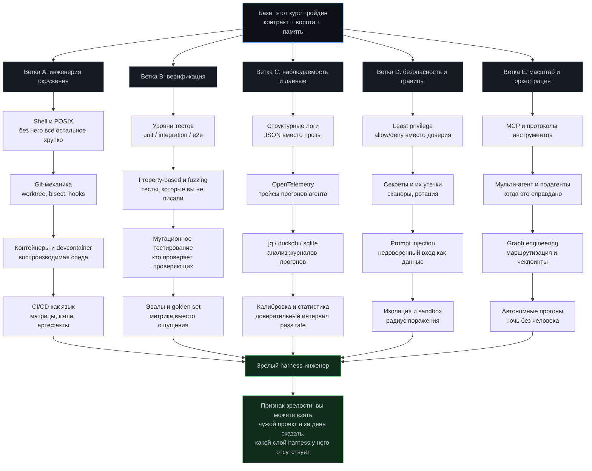

**Как читать схему.** Ветки независимы: можно тянуть A и B параллельно, а C и D подключать по мере того, как прогоны станут длиннее и опаснее. Внутри ветки порядок важен — перепрыгивать вредно. Типичная ошибка: человек берётся за мульти-агентную оркестрацию (E2), не умея писать надёжный `bash` (A1), и потом полгода отлаживает не агента, а свои скрипты.

**Минимальный набор, если времени нет совсем.** A1, A2, B1, D1. Четыре пункта закрывают процентов семьдесят реальных проблем: агент не может воспроизвести окружение, не умеет откатиться, не имеет быстрой проверки и имеет слишком много прав.

## Ресурс 1. Первоисточники по harness engineering

Это те материалы, из которых выросла сама терминология. Если читать только один блок из всего раздела — читайте этот. Порядок в таблице — рекомендованный порядок чтения, а не рейтинг.

| # | Материал | Что даёт | Время | Приоритет |
|---|---|---|---|---|
| 1 | OpenAI — *Harness engineering: leveraging Codex in an agent-first world* | Само определение: harness — это всё, кроме модели. Разделение «модель / обвязка / окружение» | 30 мин | обязательно |
| 2 | Anthropic — *Effective harnesses for long-running agents* | Практика длинных прогонов: контекст, компакция, чекпоинты, чистая передача | 40 мин | обязательно |
| 3 | Anthropic — *Building Effective Agents* | Пять паттернов и главный водораздел: workflow против агента. Лучший текст про «не усложняйте» | 30 мин | обязательно |
| 4 | Anthropic — *Harness design for long-running application development* | Как выглядит обвязка, когда задача идёт неделями, а не минутами | 30 мин | полезно |
| 5 | Anthropic — *Writing effective tools for agents* (и гайд по MCP-серверам) | Проектирование инструмента как API для не-человека: имена, ошибки, идемпотентность | 30 мин | полезно |
| 6 | Addy Osmani — *Loop Engineering*, *Agent Harness Engineering*, *The Orchestration Tax* | Инженерный взгляд снаружи вендоров, много честных чисел про накладные расходы оркестрации | 1 ч | полезно |
| 7 | Thoughtworks Technology Radar — карточка *Harness Engineering* | Одностраничная сверка: считает ли индустрия это практикой, а не хайпом | 10 мин | полезно |
| 8 | HumanLayer — *Harness Engineering for Coding Agents* | Взгляд со стороны продукта: где человек обязан остаться в цикле | 30 мин | полезно |
| 9 | Andrej Karpathy — репозиторий `autoresearch` | Образцовый автономный цикл, который можно прочитать целиком за вечер | 1–2 ч | по желанию |
| 10 | *Awesome Harness Engineering* (список ссылок сообщества) | Точка входа в новые материалы, когда этот раздел устареет | по вкусу | по желанию |

**Как искать.** Названия выше стабильнее URL: инженерные блоги переезжают. Ищите по точному заголовку в кавычках плюс имя автора или вендора. Официальные корни, с которых стоит начинать: `docs.anthropic.com` (и раздел инженерного блога), `platform.openai.com/docs`, `developers.openai.com`, `modelcontextprotocol.io`, `agents.md`, `addyosmani.com`, `www.thoughtworks.com/radar`.

**Что читать критически.** Любой вендорский материал описывает обвязку, удобную для его продукта. Полезное упражнение: после каждой статьи выпишите одну рекомендацию, которая не переносится на другой инструмент, и объясните себе, почему. Это быстро учит отделять принцип от реализации.

## Ресурс 2. Академические работы: девять статей, которые объясняют «почему»

Курс ссылается на них в теоретической части. Здесь — минимальный набор для чтения целиком, с указанием, какое именно решение в вашей обвязке становится очевидным после прочтения.

| Работа | Ключевая идея | Какое решение в harness обосновывает |
|---|---|---|
| Liu et al., 2023 — *Lost in the Middle* | Модель хуже использует середину длинного контекста | Правило первых экранов: критичное — в начало контракта, а не в середину |
| Guo et al., ICML 2017 — *On Calibration of Modern Neural Networks* | Уверенность модели систематически завышена | Требование числовой уверенности плюс правило эскалации ниже порога |
| Shannon, 1948 — *A Mathematical Theory of Communication* | Канал с шумом, избыточность, пропускная способность | Контекст как канал: почему дублирование инструкций иногда полезно, а иногда губительно |
| Ashby, 1956 — *An Introduction to Cybernetics* | Закон необходимого разнообразия | Почему у обвязки должно быть не меньше состояний, чем у сбоев, которые она ловит |
| Hoare, 1969 — *An Axiomatic Basis for Computer Programming* | Предусловие, постусловие, инвариант | Definition of Done как постусловие, а не как настроение |
| Dijkstra — *A Discipline of Programming* | Вариант цикла и доказательство завершаемости | Почему у автономного прогона обязан быть убывающий счётчик и стоп-условие |
| Lehman — *Laws of Software Evolution* | Система деградирует, если не бороться с энтропией | Регулярная ревизия контракта как обязательная работа, а не уборка «когда-нибудь» |
| Little, 1961 — *L = λW* | Связь очереди, интенсивности и времени пребывания | WIP=1 и почему пять задач параллельно замедляют каждую |
| Leveson — *Engineering a Safer World* | Безопасность — свойство системы, а не компонента | Почему «умная модель» не отменяет ворот и границ прав |

**Как читать статьи, если вы не из академии.** Схема на четыре прохода. Первый: аннотация, введение, выводы — двадцать минут, решаете, нужно ли дальше. Второй: рисунки и таблицы — часто вся суть там. Третий: метод, но без вывода формул. Четвёртый (редко нужен) — воспроизвести результат. Для восьми из девяти работ выше достаточно первых двух проходов.

@@RES@@

# Как пользоваться репозиторием

1. Пройдите [быстрый старт](#быстрый-старт-минимальный-harness-за-30-минут) на своём рабочем репозитории — 30 минут.
2. Замерьте четыре базовые метрики: verification gap, стоимость восстановления, холодный старт, VCR.
3. Читайте модули по одному и после каждого делайте соответствующий проект.
4. Ведите журнал провалов с атрибуцией по пяти слоям. Через 20 записей вы увидите своё реальное бутылочное горлышко.
5. Раз в месяц упрощайте harness через абляцию на фиксированном бенчмарк-наборе.

## Contributing

Пул-реквесты приветствуются. Особенно ценны:
- собственные замеры «до / после» с описанием методики;
- шаблоны и скрипты, проверенные в реальных проектах;
- разобранные кейсы провалов с атрибуцией к слою;
- уточнения и исправления по инструментам 2026 года — эта область меняется быстро.

Пожалуйста, не добавляйте цифры без ссылки на первоисточник и методику замера. Курс о том, как отличать измерения от впечатлений.

---

**Одна мысль, которую стоит забрать с собой.** Апгрейд модели — самый дорогой и обычно не самый эффективный способ починить агента. Сначала — упряжь.
