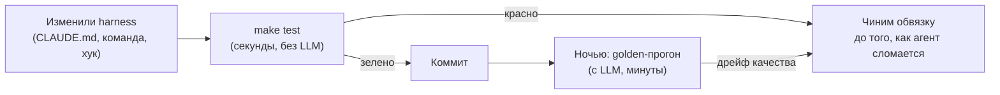

# Тесты harness

> Harness — это код. Код без тестов деградирует. Здесь лежит исполняемый набор
> тестов, который проверяет **не ваш продукт, а вашу обвязку для агента**:
> контракты, команды, ворота, хуки, бюджет контекста и золотые задачи.

Это часть курса [Harness 2026 на русском](../README.md).

---

## Зачем тестировать harness

Обычная ошибка: тестируют продукт и не тестируют то, чем продукт делается.
Проходит месяц — `CLAUDE.md` распух до 900 строк, половина слэш-команд ссылается
на несуществующие скрипты, хук `pre-commit` тихо отключили «на один раз», а
золотые задачи никто не прогонял с марта. Агент начинает «тупить», и команда
делает вывод «модель стала хуже». Модель не стала хуже. Сгнил harness.

Тесты в этом каталоге ловят именно такую гниль. Они дешёвые: полный прогон
занимает секунды и не требует ни одного сетевого вызова к модели.

---

## Быстрый старт

~~~bash
# из корня репозитория
bash tests/run_all.sh

# то же самое через Makefile
make -C tests test

# проверить не этот репозиторий, а свой проект
HARNESS_ROOT=~/work/my-project bash tests/run_all.sh

# строгий режим: предупреждения считаются провалами
ASSERT_STRICT=1 bash tests/run_all.sh

# только один набор
bash tests/test_02_context_budget.sh
~~~

Код возврата `0` — всё зелено, `1` — есть провалы. Больше ничего скрипты не
делают: ни сети, ни записи в ваш проект, ни `git`-операций.

---

## Что где лежит

~~~
tests/
├── README.md                     ← этот файл
├── Makefile                      ← make test / make lint / make quiz
├── run_all.sh                    ← раннер: запускает все test_*.sh
├── lib/
│   └── assert.sh                 ← библиотека ассертов (ноль зависимостей)
├── test_01_structure.sh          ← файлы и каталоги harness на месте
├── test_02_context_budget.sh     ← контракты не распухли
├── test_03_commands.sh           ← слэш-команды валидны и воспроизводимы
├── test_04_gates_and_hooks.sh    ← ворота реально закрываются
├── test_05_golden_tasks.sh       ← золотые задачи описаны и свежие
├── test_06_selftest.sh           ← мутационный самотест самих тестов
├── test_harness.py               ← та же логика на pytest (кому ближе Python)
├── fixtures/
│   ├── good-harness/             ← эталонная обвязка (тесты должны быть зелёные)
│   └── bad-harness/              ← сломанная обвязка (тесты обязаны падать)
├── golden/
│   ├── README.md                 ← как вести золотой набор
│   └── cases.yaml                ← 12 золотых задач с критериями приёмки
└── quiz/
    ├── questions.tsv             ← 40 вопросов на понимание курса
    └── quiz.sh                   ← интерактивный прогон в терминале
~~~

---

## Карта наборов

| Набор | Что ловит | Типичный симптом, который он предотвращает |
|---|---|---|
| `test_01_structure` | нет `CLAUDE.md`/`AGENTS.md`, нет `docs/`, нет `.claude/commands/` | «агент не знает, как запускать тесты» |
| `test_02_context_budget` | контракт распух, дубли инструкций, гигантские `README` в контексте | «агент игнорирует середину инструкций» |
| `test_03_commands` | команда без фронтматтера, без критерия приёмки, ссылается на несуществующий скрипт | «`/fix` работает по-разному у разных людей» |
| `test_04_gates_and_hooks` | ворота не падают на заведомо плохом входе, хук отключён | «CI зелёный, а на проде красный» |
| `test_05_golden_tasks` | золотой набор пуст, задачи без критериев, набор не обновлялся | «раньше работало лучше» без доказательств |
| `test_06_selftest` | сами тесты ничего не проверяют | «у нас 100 % тестов и ни одного бага» |

---

## Как добавить свой тест

Тест — это обычный `bash`-скрипт с именем `test_NN_имя.sh`. Раннер подхватит его
сам, ничего регистрировать не нужно.

~~~bash
#!/usr/bin/env bash
source "$(cd "$(dirname "${BASH_SOURCE[0]}")" && pwd)/lib/assert.sh"
cd "${HARNESS_ROOT:-$(repo_root)}" || exit 1

describe "T07 Мой первый тест harness"

assert_file_exists   "CLAUDE.md" "корневой контракт агента"
assert_max_lines     "CLAUDE.md" 150 "контракт остаётся коротким"
assert_contains      "CLAUDE.md" "^## Как запускать тесты" "есть раздел про тесты"
assert_cmd_fails     "grep -rn 'TODO(agent)' src/" "нет забытых агентских TODO"

finish
~~~

Полный список ассертов — в шапке [`lib/assert.sh`](lib/assert.sh):
`assert_file_exists`, `assert_dir_exists`, `assert_file_absent`,
`assert_executable`, `assert_not_empty`, `assert_contains`,
`assert_not_contains`, `assert_matches`, `assert_eq`, `assert_max_lines`,
`assert_max_bytes`, `assert_max_tokens_approx`, `assert_cmd_succeeds`,
`assert_cmd_fails`, `assert_json_valid`, `assert_yaml_frontmatter`,
`require_cmd`, `finish`.

---

## Правило, которое делает эти тесты не бесполезными

**У каждого теста есть мутация, на которой он обязан упасть.**

Тест, который никогда не падал, не тест, а украшение. Поэтому в наборе есть
`test_06_selftest.sh`: он прогоняет остальные наборы против `fixtures/bad-harness/`
и требует, чтобы они **упали**. Если сломанная обвязка проходит проверку —
красным становится самотест.

Это прямое применение антиметрики из курса: метрика «сколько тестов прошло»
без антиметрики «упал ли хоть один тест на заведомо плохом входе» — приглашение
для закона Гудхарта.

---

## Уровни проверок

| Уровень | Что | Скорость | Нужна ли модель |
|---|---|---|---|
| L0 · статика | структура, размеры, фронтматтер, ссылки | < 1 с | нет |
| L1 · ворота | линтер/типы/тесты реально падают на плохом входе | секунды | нет |
| L2 · золотые задачи | агент решает 12 эталонных задач | минуты | да |
| L3 · дрейф | сравнение сегодняшнего прогона с базовой линией | минуты | да |

Каталог `tests/` полностью покрывает L0 и L1 и описывает контракт для L2/L3.
L2/L3 намеренно не запускаются в обычном `make test`: они стоят денег и времени,
им место в ночном прогоне.

---

## CI

Рабочий процесс лежит в [`.github/workflows/harness-tests.yml`](../.github/workflows/harness-tests.yml).
Он запускает `tests/run_all.sh` на каждый push и pull request. Прогон занимает
меньше минуты и не требует секретов.

---

## Частые вопросы

**У меня нет `CLAUDE.md`, у меня `AGENTS.md` / `.cursorrules` / `GEMINI.md`.**
Тесты проверяют наличие *хотя бы одного* корневого контракта и не навязывают имя.
Список допустимых имён задаётся переменной `HARNESS_CONTRACTS`.

**Тесты падают на чужом проекте.**
Так и задумано: это чек-лист зрелости обвязки, а не проверка «всё ли у вас хорошо».
Начните с `test_01`, закройте его, идите дальше. Провал — это список задач.

**Можно ли гонять это на Windows.**
Через WSL или Git Bash — да. Есть pytest-версия `test_harness.py`, если bash недоступен.

**Почему нет `bats` / `shunit2`.**
Ноль зависимостей — тоже свойство harness. Библиотека ассертов занимает 200 строк,
её можно прочитать целиком за пять минут, и она не сломается при обновлении.
