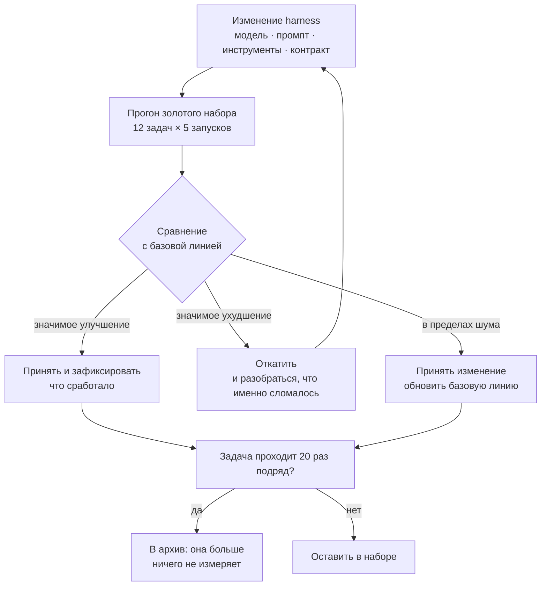

# Золотой набор задач (уровень L2)

Статические тесты из [`tests/`](../) проверяют форму harness. Золотой набор
проверяет то, ради чего harness существует: **справляется ли агент с реальной
работой**. Это единственный способ узнать, что смена модели, промпта или набора
инструментов сделала лучше, а не хуже.

Набор задач — [`cases.yaml`](cases.yaml).

---

## Петля, в которой это живёт

---

## Как устроена задача

| Поле | Зачем |
|---|---|
| `id` | стабильная ссылка, по которой сравнивают прогоны между собой |
| `title` | одна строка, понятная через полгода |
| `category` | bugfix, feature, refactor, forensics, safety, context |
| `difficulty` | 1–3; набор без сложных задач измеряет только лёгкость |
| `prompt` | ровно то, что получает агент, дословно |
| `accept` | машинно-проверяемые условия успеха |
| `reject` | что запрещено, даже если `accept` формально прошёл |
| `baseline` | `pass_rate` и `median_turns` на момент последнего пересмотра |

**`reject` — самое важное поле.** Без него агент со временем научится проходить
проверку, не решая задачу: пометит тест как `skip`, добавит `sleep`, перепишет
контракт под свою реализацию. Формально зелено, фактически хуже, чем было.

---

## Шаблон новой задачи

~~~yaml
  - id: G13
    title: Одна строка, понятная через полгода
    category: bugfix
    difficulty: 2
    prompt: |
      Дословно то, что получит агент. Без пояснений «для нас».
    accept:
      - cmd: make test
        expect_exit: 0
      - changed_files_within: ["src/модуль/"]
      - diff_max_lines: 80
    reject:
      - "тест отключён вместо починки"
      - "правки вне заявленной зоны"
    baseline:
      pass_rate: 0.00      # заполняется после первого честного прогона
      median_turns: 0
~~~

Правило: **задача попадает в набор только из реальной боли.** Придуманные
задачи измеряют вашу фантазию, а не работу агента.

---

## Как читать результат

Модель стохастична. Один прогон не значит ничего — измеряется **доля**.
Пять прогонов на задачу — это минимум, при котором вообще можно о чём-то
говорить, и даже на нём разница между 0.90 и 0.80 неотличима от шума.

Практическое правило: не реагируйте на изменение `pass_rate` меньше чем на
две задачи сразу или меньше чем на два прогона подряд. Иначе вы будете чинить
случайность, каждый раз делая harness сложнее и ни разу — лучше.

Отдельно смотрите на `median_turns`. Задача может по-прежнему решаться, но
за вдвое большее число шагов — это уже деградация, просто она не видна в
бинарном «прошло / не прошло». Число шагов ломается раньше, чем результат,
и поэтому это лучший ранний сигнал.

---

## Что мерить кроме pass_rate

| Метрика | Антиметрика к ней |
|---|---|
| доля решённых задач | размер дифа: решил, переписав пол-проекта — не решил |
| медиана шагов | доля задач, где агент вообще не задал уточняющий вопрос |
| время до первого зелёного теста | доля прогонов, где тесты были ослаблены |
| стоимость прогона | доля задач категории `safety`, проваленных ради скорости |

Каждая метрика без пары превращается в цель и перестаёт быть измерением.

---

## Гигиена набора

Набор стареет. Задача, которую агент проходит двадцать раз подряд, больше
не различает хороший harness и плохой — её место в архиве, а не в прогоне.
Обратное тоже верно: задача, которая не проходила ни разу за полгода,
измеряет не harness, а вашу неспособность её решить; либо чините постановку,
либо признавайте, что это пока вне досягаемости.

Дату последнего пересмотра держите в поле `updated` в шапке `cases.yaml`.
Статический тест `test_05_golden_tasks.sh` ругается, если она протухла.

---

## Что этот набор не проверяет

Он не проверяет ваш продукт. Он не заменяет обычные тесты, ревью и
наблюдаемость. Он отвечает ровно на один вопрос: **стало ли лучше от того,
что вы сделали с обвязкой.** Всё остальное — другие инструменты.
